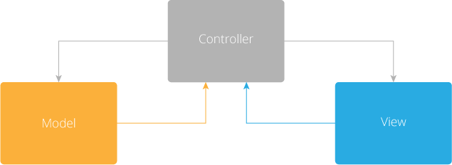
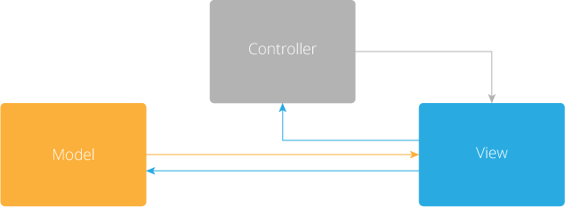
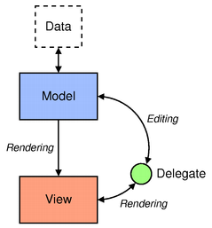
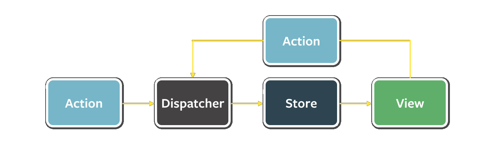

[TOC]

## 单向数据流模式

### 背景

在实现界面相关应用时,通常会采用MVC这种架构模式,如果从数据流向来看,如下图所示:




MVC后来逐渐发展出MVVM架构模式,使用了双向绑定技术,从数据流向来看类似如下:




譬如Qt的Model/View框架数据流是这样的:



随着前端框架的发展,facebook在其Flux框架中提出了单向数据流架构模式(Unidirectional Data Flow),试图以清晰的职责划分来降低界面开发复杂度.

### 单向数据流模式

在Flux框架中,数据流动是单向的,如下图所示:


当用户操作`View`造成数据变化(突变)时,其数据流如下:



这里解释以下Flux框架的要素:

- `Store`:可以理解为模型
- `View`:常规的视图概念
- `Action`:表示动作
- `Dispatcher`:动作分发


`View`通过读取`Store`信息构建/刷新显示界面,当用户触发动作时,`View`构造`Action`发送给全局唯一的`Dispatcher`,然后`Dispatcher`向所有能够响应`Action`的`Store`发送`Action`,待`Store`处理完成后,开始构建/刷新`View`.

其强调单向数据流,即要严格按照上述顺序操作,`View`不能直接修改`Store`,必须发送`Action`给`Dispatcher`,`Store`也不会主动刷新`View`.

通过上述心智模型,来分离关注点,确保单一职责,清晰应用程序运行流程.

### 基于Qt的样例

假设有一整数列表,希望能够实现的应用具备如下功能:

1. 针对单个整数进行递增、递减操作
2. 可以新增项到整数列表

那么定义的`Action`如下:

```C++
constexpr char* ActionAdd = "add";
constexpr char* ActionInc = "inc";
constexpr char* ActionDec = "dec";
```

首先看一下`Dispatcher`的实现(dispatcher.hpp):

```C++
#pragma once
#include <QtCore/QObject>
#include <QtCore/QVariant>
#include <QtCore/QMap>

class Dispatcher:public QObject
{
    Q_OBJECT
public:
    explicit Dispatcher(QObject* parent)
        :QObject{ parent } {};

public slots:
    Q_INVOKABLE void dispatch(QString action, QMap<QString, QVariant> args) {
        emit dispatched(action, args);
    }
signals:
    void dispatched(QString action, QMap<QString,QVariant> args);
};
```

这里以`QMap<QString, QVariant>`作为载体来应对各种`Action`的`payload`,提供信号和槽供其它类使用.

然后提供`ActionCreator`作为辅助类(action.hpp):

```C++
#pragma once

#include "dispatcher.hpp"

constexpr char* ActionAdd = "add";
constexpr char* ActionInc = "inc";
constexpr char* ActionDec = "dec";

class ActionCreator
{
    Dispatcher* m_dispatcher = nullptr;
public:
    explicit ActionCreator(Dispatcher* dispatcher)
        :m_dispatcher{ dispatcher } {};

    inline void add() {
        m_dispatcher->dispatch("add", {});
    }

    inline void inc(int id) {
        QMap<QString, QVariant> args;
        args["id"] = id;
        m_dispatcher->dispatch("inc", args);
    }

    inline void dec(int id) {
        QMap<QString, QVariant> args;
        args["id"] = id;
        m_dispatcher->dispatch("dec", args);
    }
};
```

然后提供`Store`实现(store.hpp):

```C++
#pragma once
#include <vector>
#include "action.hpp"

struct StoreItem
{
    int id;
    int value;
};

class Store:public QObject
{
    Q_OBJECT
public:
    explicit Store(QObject* parent)
        :QObject{ parent } {};

    StoreItem* getItemID(int id) noexcept {
        for (auto& item : items) {
            if (item.id == id) {
                return &item;
            }
        }
        return nullptr;
    }
public slots:
    void onDispatched(QString action, QMap<QString, QVariant> args) {
        if (action == ActionAdd)
        {
            items.emplace_back(StoreItem{ nextId++,0 });
        }
        else if (action == ActionInc)
        {
            auto id = args["id"].toInt();
            getItemID(id)->value++;
        }
        else if (action == ActionDec)
        {
            auto id = args["id"].toInt();
            getItemID(id)->value--;
        }
    }
public:
    std::vector<StoreItem> items{};
    int nextId = 1;
};
```

之后首先为`StoreItem`提供视图(view.hpp):

```C++
#pragma once

#include <QtWidgets/QWidget>
#include <QtWidgets/QPushButton>
#include <QtWidgets/QLabel>


struct StoreItem;
class  Dispatcher;
class  Store;
class CounterItemView :public QWidget
{
public:
    explicit CounterItemView(QWidget* parent);

    void bind(Dispatcher* dispatcher) {
        m_dispatcher = dispatcher;
    }
    void refresh(StoreItem* item);
private:
    QPushButton* m_incBtn = nullptr;
    QPushButton* m_decBtn = nullptr;
    QLabel* m_valueLabel = nullptr;
    Dispatcher* m_dispatcher = nullptr;
};

//view.cpp
CounterItemView::CounterItemView(QWidget* parent)
    :QWidget{parent}
{
    m_incBtn = new QPushButton("+");
    m_decBtn = new QPushButton("-");
    m_valueLabel = new QLabel();

    auto layout = new QHBoxLayout;
    layout->addWidget(m_decBtn);
    layout->addWidget(m_valueLabel);
    layout->addWidget(m_incBtn);
    setLayout(layout);

    QObject::connect(m_decBtn, &QPushButton::clicked, [=]() {
        if (!m_dispatcher) return;
        auto id = m_valueLabel->property("id").toInt();
        ActionCreator{ m_dispatcher }.dec(id);
        });

    QObject::connect(m_incBtn, &QPushButton::clicked, [=]() {
        if (!m_dispatcher) return;
        auto id = m_valueLabel->property("id").toInt();
        ActionCreator{ m_dispatcher }.inc(id);
        });
}

void CounterItemView::refresh(StoreItem* item)
{
    m_valueLabel->setText(QString::number(item->value));
    m_valueLabel->setProperty("id", item->id);
}
```

将其组装为最终的`View`,即`CounterView`(view.hpp):

```C++
class QVBoxLayout;
class CounterView :public QWidget
{
public:
    explicit CounterView(QWidget* parent);

    void bind(Dispatcher* dispatcher, Store* store)
    {
        m_dispatcher = dispatcher;
        m_store = store;
    }

    void refresh();
private:
    Dispatcher* m_dispatcher = nullptr;
    Store* m_store = nullptr;
    std::vector<CounterItemView*> m_itemViews;
    QVBoxLayout* m_layout = nullptr;
    QPushButton* m_addBtn = nullptr;
};
//view.cpp
CounterView::CounterView(QWidget* parent)
    :QWidget{parent}
{
    m_addBtn = new QPushButton("add");

    auto layout = new QHBoxLayout;
    m_layout = new QVBoxLayout;
    layout->addWidget(m_addBtn);
    layout->addLayout(m_layout);
    setLayout(layout);

    QObject::connect(m_addBtn, &QPushButton::clicked, [=]() {
        if (!m_dispatcher) return;
        ActionCreator{ m_dispatcher }.add();
        });
}

void CounterView::refresh()
{
    auto m = m_itemViews.size();
    auto n = m_store->items.size();
    //已创建的要刷新
    for (auto i = 0ul; i < std::min(m,n); i++) {
        m_itemViews.at(i)->refresh(&(m_store->items.at(i)));
    }
    //不使用的要隐藏
    for (auto i = n; i < m; i++)
    {
        m_itemViews.at(i)->setVisible(false);
    }
    //没有的要创建
    for (auto i = m; i < n; i++)
    {
        auto view = new CounterItemView{nullptr};
        view->bind(m_dispatcher);
        view->refresh(&(m_store->items.at(i)));
        m_layout->addWidget(view);
        m_itemViews.push_back(view);
    }
}
```

最后,将这些部分组装成应用程序(main.cpp):

```C++
#include <QtWidgets/QApplication>
#include "dispatcher.hpp"
#include "store.hpp"
#include "view.hpp"

int main(int argc, char **argv)
{
    QApplication app(argc, argv);

    Dispatcher dispatcher{nullptr};
    Store store{ &dispatcher };
    CounterView view{nullptr};
    view.bind(&dispatcher, &store);

    //首先有action触发调整store
    QObject::connect(&dispatcher, &Dispatcher::dispatched, &store, &Store::onDispatched);
    //然后手动刷新视图
    QObject::connect(&dispatcher, &Dispatcher::dispatched,
        [&](QString action, QMap<QString, QVariant> args) {
            view.refresh();
        });

    view.show();
    return app.exec();
}
```

### 总结

在复杂的交互场景下,单向数据流模式相比其它模式来讲是比较清晰的,值得学习和应用.当然在真实使用场景下会有一些其它问题,可以自行搜索`Flux`、`React`来看一下这些库如何解决问题.当然C++也有对应实现,后续可以再聊.

- [FLUX: QT QUICK WITH UNIDIRECTIONAL DATA FLOW](http://cpp-rendering.io/flux-qt-quick-with-unidirectional-data-flow/)
- [The Case for Unidirectional Data Flow](https://www.exclamationlabs.com/blog/the-case-for-unidirectional-data-flow/)

可以运行的示例请**阅读原文**来访问github上的代码示例.

