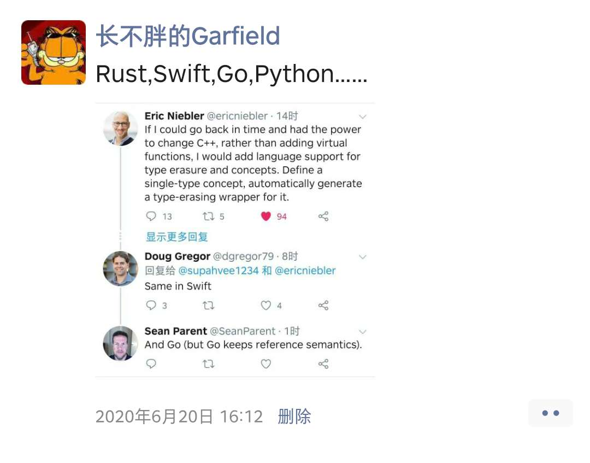

[TOC]

## 基于`concept`的编程方法

### 背景

9月4日周五,C++20标准草案投票一致通过,C++语言又一次迎来重大更新,这次新的语言标准迎来了`The Big Four`：

- `Concepts`
- `Ranges library`
- `Coroutines`
- `Modules`

于9月13日开始的CppCon2020必然会围绕C++20展开一系列讨论. 而在这里,并不会讨论具体的C++语言特性,而是从一种视角出发,来审视在各个编程语言中都已经存在,但是在C++中被特别**强调**的一种编程方法-基于`concept`的编程.

参阅下图,让我们从C++这种最艰辛的语言开始,再审视`Python`、最终了解下`Go`的解决方式.



### 什么是`concept`

在C++中,`concept`是为模板服务的特性,用来对模板参数施加语义约束.譬如要实现通用的`hash`算法,就要求模板参数能够计算出`hash`值,类型为`std::size_t`,即`Hashable`,在C++20中写法类似如下:

```C++
// Declaration of the concept "Hashable", which is satisfied by
// any type 'T' such that for values 'a' of type 'T',
// the expression std::hash<T>{}(a) compiles and its result is convertible to std::size_t
template<typename T>
concept Hashable = requires(T a) {
    { std::hash<T>{}(a) } -> std::convertible_to<std::size_t>;
};
```

那么,对于非模板的实现,则可能需要继承如下基类:

```C++
class Hashable
{
public:
    virtual ~Hashable() = default;
    virtual std::size_t hash() const noexcept = 0;//计算出hash值
};
```

总结来讲,`concept`表达某种概念,如果某种事物满足这种概念,就意味着可以对其进行一些操作.对于面向对象这种编程范式来,就是满足某种`interface`的要求.

### 以可绘制概念为示例场景

在Sean Parent的[Inheritance Is The Base Class of Evil](https://sean-parent.stlab.cc/papers-and-presentations/#inheritance-is-the-base-class-of-evil)中展示了一个示例场景,假设有一个`document`,其中包含各种对象,要对`document`进行绘制,则希望存储于`document`上的对象都是可以绘制的,即满足可绘制要求.

这里为了简化起见,要求所有可绘制对象都可以输出其自身信息到标准输出中.

### 采用C++的实现

总所周知,这种需求场景是以多态的方式解决的,这里有两种实现方式:继承、无继承. 至于静态多态的方式,虽然更适合来表示`concept`,但是无法解决`document`存储的问题,这里就不描述了.

#### 继承实现

定义基类`object_t`,约束好接口,由此确定所需要的`concept`:

```c++
class object_t
{
public:
    virtual ~object_t() = default;
    virtual void draw(std::ostream &, std::size_t) const = 0;
};
```

接下来实现`document`:

```C++
using document_t = std::vector<std::shared_ptr<object_t>>;

void draw(document_t const &doc, std::ostream &os, std::size_t position)
{
    os << std::string(position, ' ') << "<document>" << std::endl;
    for (const auto &e : doc)
    {
        e->draw(os, position + 2);
    }
    os << std::string(position, ' ') << "</document>" << std::endl;
}
```

然后其它类型就可以继承自`object_t`,来满足`concept`的要求:

```C++
class my_class_t : public object_t
{
public:
    my_class_t() = default;
    void draw(std::ostream &os, std::size_t position) const override
    {
        os << std::string(position, ' ') << "my_class_t" << std::endl;
    }
};
```

使用方式如下:

```C++
int main(int argc, char **argv)
{
    document_t document;
    document.emplace_back(std::make_shared<my_class_t>());
    draw(document, std::cout, 0);
    return 0;
}
```

输出结果为:

```bash
<document>
  my_class_t
</document>
```

#### 无继承实现

无继承实现要复杂点儿,利用到类型擦除技术.

首先以模板函数约定`concept`:

```C++
template <typename T>
void draw(const T &obj, std::ostream &os, std::size_t position)
{
    os << std::string(position, ' ') << obj << std::endl;
}
```

然后使用虚函数提供`concept`约束:

```C++
struct concept_t
{
    virtual ~concept_t() = default;
    virtual void drawImpl(std::ostream &, std::size_t) const = 0;
};
```

然后利用模板技术擦除掉类型:

```C++
template <typename T>
struct model : concept_t
{
    T data_;

    model(T x) : data_{std::move(x)} {};

    void drawImpl(std::ostream &os, std::size_t position) const override
    {
        draw(data_, os, position);
    }
};
```

将`concept_t`和`model`包装成`object_t`:

```C++
class object_t
{
public:
    template <typename T>
    object_t(T x) : self_(std::make_shared<model<T>>(std::move(x)))
    {
    }

    friend void draw(const object_t &obj, std::ostream &os, std::size_t position)
    {
        obj.self_->drawImpl(os, position);
    }

private:
    struct concept_t
    {
        virtual ~concept_t() = default;
        virtual void drawImpl(std::ostream &, std::size_t) const = 0;
    };

    template <typename T>
    struct model : concept_t
    {
        T data_;

        model(T x) : data_{std::move(x)} {};

        void drawImpl(std::ostream &os, std::size_t position) const override
        {
            draw(data_, os, position);
        }
    };

    std::shared_ptr<const concept_t> self_;
};
```

接下来就可以实现`document`:

```C++
using document_t = std::vector<object_t>;
void draw(document_t const &doc, std::ostream &os, std::size_t position)
{
    os << std::string(position, ' ') << "<document>" << std::endl;
    for (const auto &e : doc)
    {
        draw(e, os, position + 2);
    }
    os << std::string(position, ' ') << "</document>" << std::endl;
}
```

定义特定类型`my_class_t`,并提供`draw`实现:

```C++
class my_class_t
{
public:
    my_class_t() = default;
};

void draw(const my_class_t &, std::ostream &os, std::size_t position)
{
    os << std::string(position, ' ') << "my_class_t" << std::endl;
}
```

以如下方式使用:

```C++
int main(int argc, char **argv)
{
    document_t document;
    document.emplace_back(std::string("hello"));
    document.emplace_back(my_class_t());
    draw(document, std::cout, 0);
    return 0;
}
```

输出结果为:

```bash
<document>
  hello
  my_class_t
</document>
```

### 采用`Python`的实现

`Python`作为动态解释型语言,其定义和实现某种`concept`要更为灵活,方法更多.

#### 利用`abc`继承实现

如果习惯使用面向对象编程,`Python`也提供了基类和虚函数的方式,首先定义`Drawable`:

```python
from abc import ABC, abstractmethod

class Drawable(ABC):
    @abstractmethod
    def draw(self, os, position):
        pass
```

这里可以直接使用`List`来作为`document`:

```C++
from typing import List
import sys

def draw(document: List[Drawable], os=sys.stdout, position=0):
    print(f"{' '*position}<document>", file=os)
    for e in document:
        e.draw(os, position+2)
    print(f"{' '*position}</document>", file=os)
```

然后实现自定义类型:

```C++
class MyClass(Drawable):

    def draw(self, os, position):
        print(f"{' '*position}MyClass", file=os)
```

使用方式如下:

```python

if __name__ == "__main__":
    document = [
        MyClass()
    ]
    draw(document)
```

#### 利用`Protocols`实现

`Python`也可以利用`Protocols`实现类似于C++无继承方式的效果.

首先定义`Drawable`这种`Protocol`:

```python
from typing import Protocol
class Drawable(Protocol):
    def draw(self, os, positon) -> None:
        pass
```

然后以类似的方式实现`document`:

```python
from typing import Iterable
import sys

def draw(document: Iterable[Drawable], os=sys.stdout, position=0):
    print(f"{' '*position}<document>", file=os)
    for e in document:
        e.draw(os, position+2)
    print(f"{' '*position}</document>", file=os)
```

之后实现自定义类型:

```python
class MyClass:
    def draw(self, os, position) -> None:
        print(f"{' '*position}MyClass", file=os)
```

使用方式如下:

```python
if __name__ == "__main__":
    document = [
        MyClass()
    ]
    draw(document)
```

可以看到`MyClass`并没有继承自`Drawable`,只是实现了`Drawable`要求的函数.

#### 基于语言特性的实现

`Python`是一种动态解释型语言,即在运行过程中如果调用某函数,会根据函数签名查询,查到就执行,完全不需要约束.

直接实现`document`如下:

```python
from typing import Any, Iterable
import sys
def draw(document: Iterable[Any], os=sys.stdout, position=0):
    print(f"{' '*position}<document>", file=os)
    for e in document:
        e.draw(os, position+2)
    print(f"{' '*position}</document>", file=os)
```

然后实现自定义类型:

```python
class MyClass:

    def draw(self, os, position) -> None:
        print(f"{' '*position}MyClass", file=os)
```

使用方式与之前相同:

```python
if __name__ == "__main__":
    document = [
        MyClass()
    ]
    draw(document)
```

### 采用`Go`的实现

`Go`作为没什么历史包袱的语言,其解决方案更为简洁,因为语言提供了`interface`这种东西,无需继承,完全的`duck typing`.

首先使用`interface`定义`drawable`:

```go
import (
	"io"
)

type drawable interface {
	draw(os io.Writer, position uint)
}
```

这时的`document`可以用切片实现:

```go
import (
	"fmt"
	"io"
	"strings"
)
func draw(document []drawable, os io.Writer, position uint) {
	prefix := strings.Repeat(" ", int(position))
	fmt.Fprintf(os, "%v<document>\n", prefix)
	for _, e := range document {
		e.draw(os, position+2)
	}
	fmt.Fprintf(os, "%v</document>\n", prefix)
}
```

然后实现自定义类型及`draw`接口:

```go
type MyClass struct {
}

func (v MyClass) draw(os io.Writer, position uint) {
	prefix := strings.Repeat(" ", int(position))
	fmt.Fprintf(os, "%vMyClass\n", prefix)
}
```

使用方式如下:

```go
func main() {
	var document []drawable
	document = append(document, MyClass{})
	draw(document, os.Stdout, 0)
}
```

### 总结

或许有人会说这不就是种基于接口的编程方法么,如果你使用的是存粹的面向对象语言,这样理解也没什么问题.但是从上述几种语言的实现可以看到,这是一种看待问题的方式,我们定义某种概念,而对于所面对的事物,只要事物符合某种概念,就可以针对其进行操作,不需要改变这些事物(使其继承自某些接口).

这种技术在一些场景下会非常有用.而这种思考方式也同样值得学习,譬如游戏行业经常使用的`ECS`架构模式,则是以某种事物具备什么样的数据就具备何种能力的方式来组织的.

