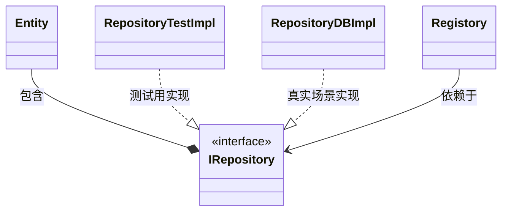
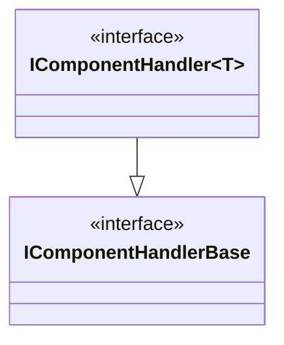
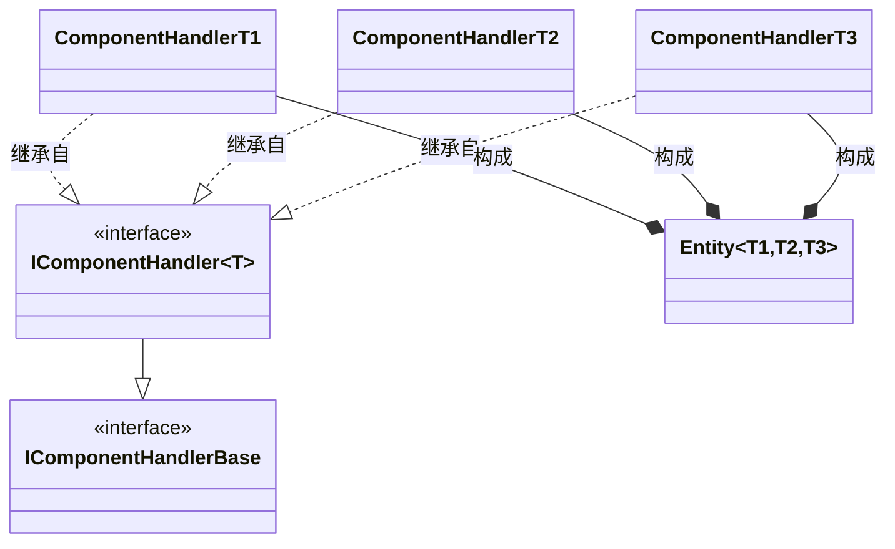
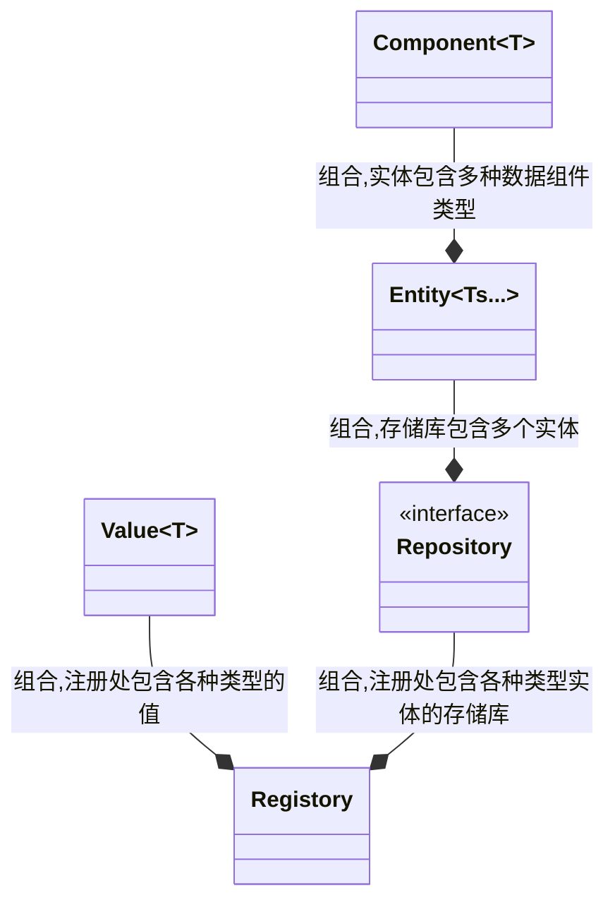
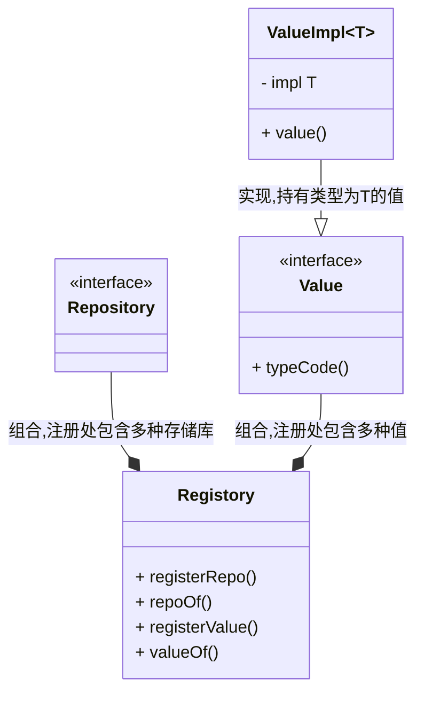
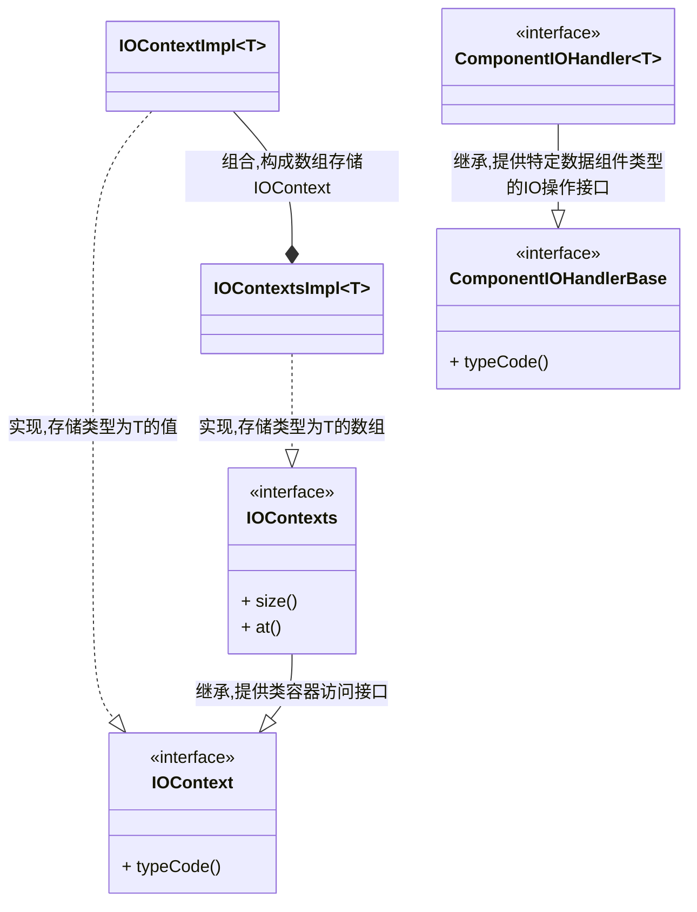
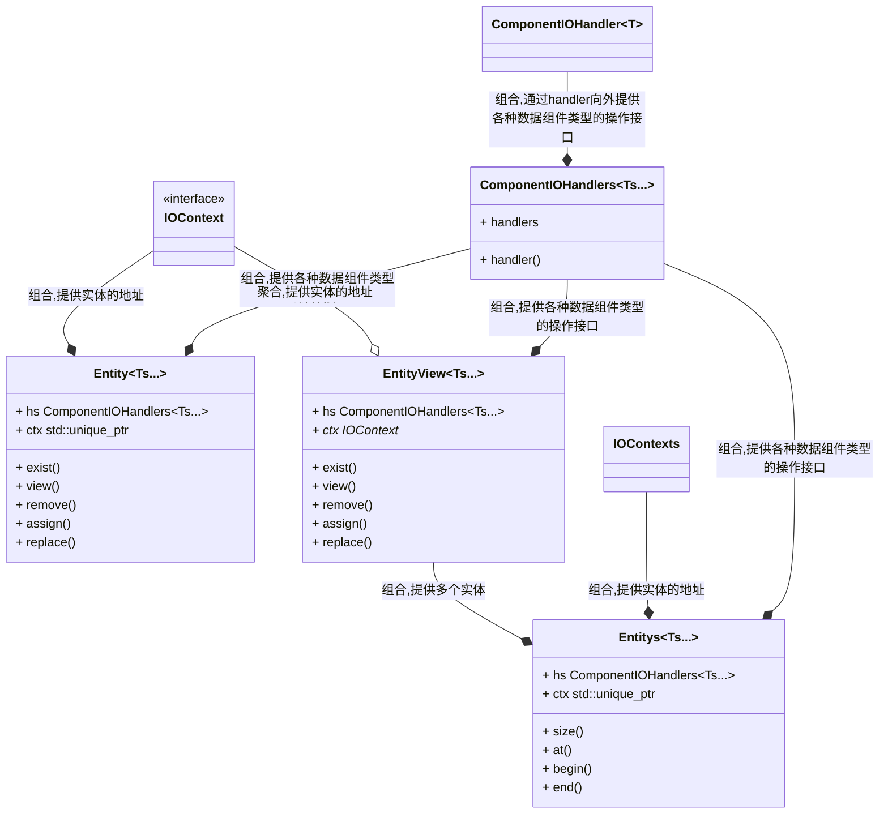
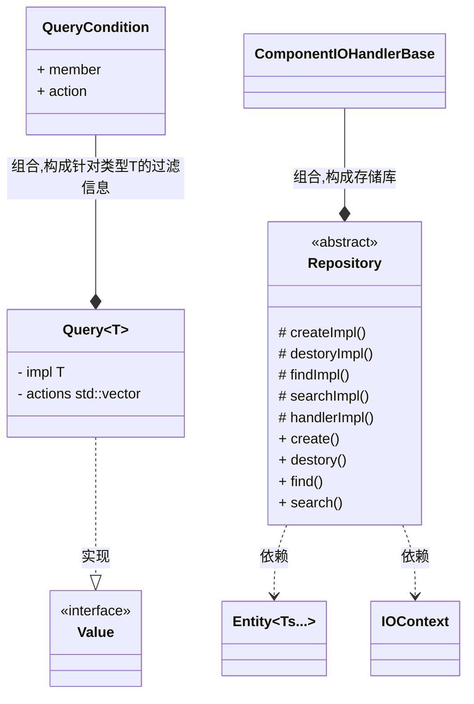
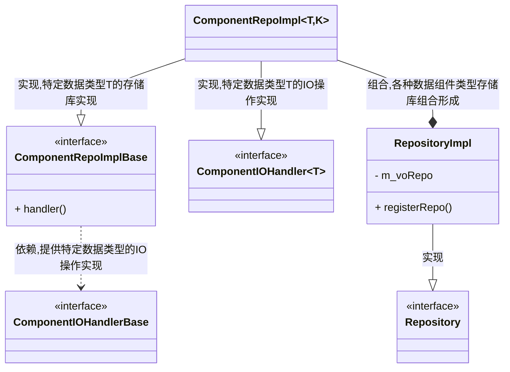

[TOC]

## `Registory-Repository-Entity-Component`结构设计与实现

领域驱动设计中包含如下要素,用来构成应用程序组件的基本结构:

| 概念                  | 作用                                                         |
| --------------------- | ------------------------------------------------------------ |
| 值对象(`ValueObject`) | 表达没有唯一标识符的业务数据类                               |
| 实体(`Entity`)        | 具有唯一标识符的业务类                                       |
| 仓储(`Repository`)    | 处理实体的持久化<br>(通过依赖倒置使组件不依赖于具体的数据库等) |
| 服务(`Service`)       | 实现业务逻辑(注意针对单个`Entity`的业务逻辑以其成员函数实现) |

在`Entity-Component-System`架构模式中,也有类似概念,可以简单地认为`Component`对应值对象、`Entity`由`Component`构成,对应与实体、`System`对应于服务. 鉴于某个组件可能需要访问仓储以及其它服务(日志等),又有`Unit of Work`模式来包含仓储、日志等接口,来驱动整个组件的应用级别服务.

为了便于理解,**`RREC`**与这些概念的对应关系如下:

| 概念                | 对应于                                                   |
| ------------------- | -------------------------------------------------------- |
| 数据组件`Component` | 领域驱动设计中的值对象<br>更接近`ECS`中`Component`的概念 |
| 实体`Entity`        | 领域驱动设计中的实体<br>更接近`ECS`中`Entity`的概念      |
| 存储库`Repository`  | 领域驱动设计中的仓储                                     |
| 注册处`Registory`   | `Unit of Work`                                           |

### 要解决什么问题？

通常我们会为每一种实体类做编码实现,引入了存储库模式之后工作就变得繁重起来了.针对每一种实体类,要实现如下数个类:



由于引入了新的实体类`Entity`,需要提取接口`IRepository`,然后提供两种实现分别为测试场景和真实场景服务,同时又需要修改`Registory`,使得组件可以访问.

不仅如此,让我们再深入`Entity`内部,如果认为`Entity`有`Component`构成,而每个`Entity`的`Component`又不尽相同,依然有大量的`Component`需要定义,而`Entity`也会随着`Component`的变化而变化.

总结来讲,在实现领域驱动设计或者其它良好实践的场景下,由于常规实现存在扩展性、复用性等设计问题,可能会导致重复编写一些非常类似的代码,修改引起其它位置发生变化,不能充分利用之前的代码等情况.

**`RREC`**结构试图利用C++的一些技术,并结合`ECS`的组合式设计,使开发者在遵循一定规范的情况下,专注于`Component`类型及其数据库读写的实现,而避免实现实体类、存储库接口、测试用存储库及真实场景的存储库,也能够不修改注册处,同时可以尽可能地利用之前的代码,并兼顾性能需求.

### 基本逻辑

这里将实体`Entity`视为纯粹的`Component`组合,包含实体自带的标识符,譬如如下实体类:

```C++
class Node
{
public:
    virtual int id() const noexcept;//标识符为int
};
```

将`id`提取为`IDComponent`,实体访问`ID`转换为如下形式:

```C++
struct IDComponent{
    int id;
};
//从实体上获取ID组件然后得到其中的id信息
auto id = entity.view<IDComponent>().id;
```

假设实体类型为`E`,数据组件类型为`T`,则任何实体表达方式均为E<T~1~，T~2~，T~3~,...>.对应的C++代码为:

```C++
template<typename... Ts>
struct Entity{
  //implement  
};
```

这种设计下,不会再提供新的实体类,而是以模板形式获取具备某些数据组件的实体,从而进行操作.

基于上述思考,我们对于可扩展性的设计就集中在数据组件`Component`上,即通过类型来扩展,通过为不同类型的数据组件实现相应的基本操作,然后来向上提供组合性.这里以数据组件的`CRUD`操作为例,其原型为:

```C++
class IComponent{
public:
    //检查是否存在
	virtual bool exist() const noexcept = 0;
    //获取
    virtual Component get() const = 0;
    //删除
    virtual bool remove() noexcept = 0;
    //创建
    virtual bool create(Component const&) noexcept = 0 ;
    //更新
    virtual void update(Component const&) noexcept = 0;
};
```

为了正常工作,首先要抽取基类,然后为每种类型提供其接口定义(接口参数不一样,无法公用基类):



这时针对某种实体类`Entity<T1,T2,T2>`,则可以由`IComponentHandler<T>`组合而成:



针对特定的数据组件类型`T`,如果实体需要访问它包含的`T`信息,则从`IComponentHandlerBase`基类将其转换成`IComponentHandler<T>`就能读该类型进行`CRUD`操作了,C++代码如下:

```C++
template<typename T>
void demo(IComponentHandlerBase* handler){
    //转换为目标类型的handler
    auto h = static_cast<IComponentHandler<T>*>(handler);
    if(h->exist()){//检查是否存在
        T v = h->get();//获取对应值
	}
}
```

可组合的`Entity`实现形式类似如下:

```C++
template<typename... Ts>
struct Entity
{
    //存储不同类型的handler
    std::array<IComponentHandlerBase*,sizeof...(Ts)> handlers;
    
    //根据类型拿到该类型的handler
    template<typename T>
    IComponentHandler<T>* handler() const noexcept{
        constexpr auto i = getIndex<T,Ts...>();
        return static_cast<IComponentHandler<T>*>(std::get<i>(handlers));
    }
    
    //根据类型调用handler来实现`是否存在`方法
    template<typename T>
    bool exist() const noexcept{
        return handler<T>()->exist();
    }
};
```

对于存储库来讲,只要能够根据数据组件类型获取其`handler`,就能够拼出目标实体类来,以创建方法为例:

```C++
class IRepository
{
protected:
    //根据类型列表填充handler列表
    virtual void createImpl(std::vector<std::size_t> typeIds,IComponentHandlerBase** handlerPtr) = 0;
public:
    //根据类型列表获取类型id列表
    template<typename... Ts>
    std::vector<std::size_t> typeCodes(){
        std::array<std::size_t,sizeof...(Ts)> results{
          typeid(T).hash_code()...  
        };
        return {results.begin(),results.end()};
    }
    
	template<typename... Ts>
    Entity<Ts...> create(){
        Entity<Ts...> result;
        //调用接口得到handlers
        createImpl(typeCodes(),&(result.handlers.data());
		return result;
    }
};
```

基本的实现逻辑就是如此,通过基于类型的扩展技术,进行组合式设计,就可以达到预期效果,下面将各个部分拆分来讲解一下设计和实现.

### 预期效果演示

假设我们有种实体类包含`double`、`int`、`std::string`三种数据组件类型(注意只是演示使用,真实场景下请自定义数据组件类型,不要直接使用基本类型),下列代码演示如何输出存储库中实体的信息:

```C++
void reportRepo(Repository* repo)
{
    //从存储库中获取所有实体(要具备访问double、int、std::string数据组件类型的接口)
    auto entitys = repo->search<double, int, std::string>();
    for (auto& e : entitys)
    {
        //view<T>用来获取实体上数据组件类型T的信息
        std::cout << "int:" << e.view<int>() << "\n";
        std::cout << "double:" << e.view<double>() << "\n";
        std::cout << "string:" << e.view<std::string>() << "\n";
    }
}
```

针对这种实体,希望能够提供默认的内存存储库实现,来方便开发和测试,代码演示如下:

```C++
void repoImplDemo()
{
    //为实体创建内存存储库
    RepositoryImpl repo;
    //内存形式的存储库采用为每种数据组件提供一个存储库的方式,
    //需要注册后才能使用
    repo.registerRepo(std::make_unique<ComponentRepoImpl<int>>());
    repo.registerRepo(std::make_unique<ComponentRepoImpl<double>>());
    repo.registerRepo(std::make_unique<ComponentRepoImpl<std::string>>());
    //如果实体包含新的数据组件类型,采用类似的语句注册即可

    {//创建实体,并设置int、double两个数据组件的值
        auto e = repo.create<int, double>();
        e.assign<int>(1024);
        e.assign<double>(3.1415926);
    }
    {//查找到存储库里的第一个实体,修改其std::string数据组件值为double的字符串形式
        auto e = repo.find<double, std::string>();
        e.assign<std::string>(std::to_string(e.view<double>()));
    }
	
    //调用之前的存储库输出函数
    reportRepo(&repo);
}
```

可以看到,针对新的实体类型,可以不实现实体类、存储库接口、内存形式的存储库,如果没有新数据组件类型,真实场景下的存储库也无需操作即可支持.

### **`RREC`**结构设计

`RREC`整体设计类图如下:



要求如下:

- 可以向注册处`Registory`注册各种类型的值、各种类型实体的存储库,而无需改动注册处接口及实现.
- 存储库`Repository`由多个实体组合而成,可以从存储库中获取具有各种数据组件类型的实体
- 实体`Entity<Ts...>`有多种数据组件组合而成,可以针对实体的某种数据组件进行增删改查操作

下面来看一下每一部分的设计.

#### 注册处`Registory`设计

为了让注册处能够支持存储不同类型实体的存储库,提供了抽象接口类`Repository`;同样为了支持存储不同类型的值,提供了抽象接口类`Value`:



通过提供模板类`ValueImpl<T>`,用户可以使用注册处对应的接口直接保存类型为`T`的值到注册处.

#### 数据组件`Component<T>`设计

在C++中,对象由两部分组成:类型和地址,编译器根据地址按照某种类型来进行操作. 针对实体的特定数据组件类型,能够确定的是希望如何操作这种数据组件类型,常规情况下,会希望有如下操作:

| 接口      | 释义                               |
| --------- | ---------------------------------- |
| `exist`   | 检测实体是否包含这种类型的数据组件 |
| `view`    | 获取实体的这种数据组件             |
| `remove`  | 从实体上移除这种数据组件           |
| `assign`  | 向实体添加这种数据组件             |
| `replace` | 将实体上的数据组件值进行替换       |

可以把这些操作提取成接口,通过实现接口来满足需求.由于单个实体对应了多种数据组件,即实体的地址唯一,类型可变,这里就需要将类型和地址拆分开来,类似如下:

```C++
//存储实体地址
class EntityAddress{};

//特定类型数据组件的操作接口
class ComponentHandler
{
public:
    //传入地址来驱动函数操作
    virtual bool exist(EntityAddress* addr) const noexcept = 0;
};
```

这里将实体地址和实体上组件的操作接口拆分为`IOContext`和`ComponentIOHandlerBase`,类如如下:



注意除了`IOContext`还有`IOContexts`,由于实体的地址管理需要使用智能指针,涉及到堆内存分配,出于性能考虑,不直接使用智能指针数组`std::vector<std::unique_ptr<IOContext>>`来存储多个实体,而是使用`std::unique_ptr<IOContexts>`,并为其提供类似于容器的访问接口,由此来减少内存分配动作.

 `IOContext`和`ComponentIOHandlerBase`组合使用即可得到实体的多种类型数据组件操作,例如:

```C++
template<typename T>
class Entity{
    std::unique_ptr<IOContext> ctx;
    ComponentIOHandler<T>*     h = nullptr;
public:  	
    Entity(ComponentIOHandlerBase* handler,std::unique_ptr<IOContext>&& context)
        :h(static_cast<ComponentIOHandler<T>*>(h)),ctx(std::move(context))
    {
         //获取类型的code,用来验证类型是否匹配
         auto typeCode = HashedTypeCode<T>();
#if debug //调试模式下验证传递的handler是否为该数据组件类型的handler
         assert(typeCode == handler->typeCode());
#endif            
	}
    
    //获取T类型的数据组件值
    T   view() const {
        return h->view(ctx.get());
    }
};
```

#### 实体`Entity<Ts...>`设计

由上述可知,实体的设计就是组合`IOContext`和`ComponentIOHandler<T>`,类图如下:



这里提供了两种实体:`Entity<Ts...>`,`EntityView<Ts...>`,区别在于`EntityView<Ts...>`不管理实体的生命周期,使用时需特别注意.

#### 存储库`Repository`设计

从上述内容可以看到,现在存储库要解决的核心问题是提供`ComponentIOHandlerBase`和`IOContext`/`IOContexts`.

首先来看一下存储库所需的接口:

| 接口      | 释义             |
| --------- | ---------------- |
| `create`  | 创建实体         |
| `destory` | 销毁实体         |
| `find`    | 根据条件查找单个 |
| `search`  | 根据条件查找多个 |

其中`create`需要一个`Argument`类型来存储各种不同的参数,用来创建实体;而`destory`、`find`、`search`均需要一些条件表达来传递给存储库实现进行过滤.针对`Argument`类型直接使用之前的`Value`及`ValueImpl<T>`即可.对于条件表达则需要进行设计.

前文对实体进行过分析,认为实体是由不同的数据组件构成,那么如果想要过滤想要的实体,应该也是根据一些数据组件进行过滤,可能的过滤条件为针对数据组件某些成员进行匹配或者排除.例如:

```C++
struct RelationShip{
    long long parent;
    long long owner;
};

void findExample(){
    RelationShip o{1,2};
    //要求查找的对象父为1
    find(o,"parent","==");
    //要求查找的对象父为1且owner不是2
    find(o,"parent","==","owner","!=");
    //要求owner不为2
    search(o,"owner","!=");
}

```

这里提取出`Query<T>`类来表达过滤条件,这样存储库类图如下:



这里的`Query<T>`作为参数传递给`Repository`的接口,并没有直接依赖关系.

#### 基于内存的默认`Repository-Component`实现设计



### `RREC`结构实现技术

出于易于理解和维护的考虑,这里大量使用了继承来消除类型,同时提供类型的`Code`来供开发检测传入信息是否正确.因而实现时利用到的技术归结为如下几点:

- 编译期编程技术(字符串常量、哈希值计算、类型名获取等)
- 类型擦除技术
- 类模板及其特化
- `NVI`:non-virtual  interface 模式
- 基于类型的编译期编程

以下以一些示例来说明其技术使用方法和部分实现方法.

#### 编译期编程技术

在参考实现中提供了以下涉及编译期编程技术的内容:

1. 编译期哈希值计算:`fnv1a_hash`
2. 编译期字符串常量:`HashedStringLiteral`
3. 编译期类型名获取:`HashedTypeName`

##### 编译期哈希值计算

位于`prefab/HashedTypeInfo.hpp`中,以下是使用示例:

```C++
constexpr auto doubleHash = prefab::fnv1a_hash("double");//char[N]形式
const    char* str = "double>>>>";
constexpr auto subLiteralHash = prefab::fnv1a_hash(6,str);//长度+指针形式
```

当然`prefab::hash`在运行期也可以使用:

```C++
void example(std::string cmd)
{
    auto hash = prefab::fnv1a_hash(cmd.data());
    switch(hash):
    {
        case prefab::fnv1a_hash("copy"):
        //...
        break;
    }
}
```

##### 编译期字符串常量

位于`prefab/HashedTypeInfo.hpp`中,自带哈希值计算,以下是使用示例:

```C++
constexpr auto literal = prefab::HashedStringLiteral("liff.engineer@gmail.com");

//可以直接作为参数传递,包含一个指针、两个std::size_t,用来快速判断,同时能够提供足够的信息
void example(prefab::HashedStringLiteral code){
    if(code == literal){
       	//...
	}
}
```

##### 编译期类型名获取

位于`prefab/HashedTypeInfo.hpp`中,类型名返回的是`prefab::HashedStringLiteral`:

```C++
constexpr auto doubleCode = prefab::HashedTypeName_v<double>;
static_assert(doubleCode == prefab::HashedStringLiteral("double"),"must be equal");
```

在任何需要类型名的地方直接使用`prefab::hashedTypeName_v<T>`,即可得到.

#### 类型擦除技术

注册处希望能够存储任意类型的值,这就是类型擦除技术的应用场景,其目的在于能够存储任意类型的值,并在需要时将其恢复出来,例如注册处的用法:

```C++
struct Object{};

void registoryUser(Registory& registory){
    //注册值
    registory.registerValue<Object>(Object{});
    
    //根据类型获取
    auto o = registory.valueOf<Object>();//如果类型不一致则抛出异常
}
```

实现方式并不复杂,在`prefab/Value.hpp`中可以找到写法,首先定义基类,并提供`typeCode()`方法以供后续判断类型:

```C++
class Value {
    public:
    virtual ~Value() = default;
    virtual HashedStringLiteral typeCode() const noexcept = 0;
};
```

然后实现类模板:

```C++
template<typename T>
class ValueImpl :public Value
{
    T impl;
public:
    explicit ValueImpl(T&& v) :impl(std::move(v)) {};

    HashedStringLiteral typeCode() const noexcept override {
        return HashedTypeName_v<T>;
    }

    const T& value() const noexcept {
        return impl;
    }

    T& value() noexcept {
        return impl;
    }
};
```

注意`ValueImpl`继承自`Value`,也就是说任何`ValueImpl<T>`,构造完成后都可以存储为`Value*`:

```C++
template<typename T,typename... Args>
std::unique_ptr<Value> make_value(Args&& args...){
    return std::make_unique<ValueImpl<T>>(std::forward<Args>(args)...);
}
```

也可以安全地将`Value*`转换回来,并取出其中的值:

```C++
template<typename T>
T   as(Value* v){
    if(v == nullptr || v->typeCode()!= prefab::HashedTypeName_v<T>){
        throw std::invalid_argument("invalid argument");
	}
    return static_cast<ValueImpl<T>*>(v)->value();
}
```

#### 类模板及特化

在类型擦除中已经演示了一种类模板的写法,不过在使用中你可能会碰到一些问题,譬如:

```C++
void whatHappend(){
    int v = 1024;
    auto result = ValueImpl(v);//无法通过编译 
}
```

注意`ValueImpl<T>`的构造函数定义为:

```C++
explicit ValueImpl(T&& v) :impl(std::move(v)) {};
```

即你必须传递右值给构造函数,否则无法通过编译,这里可以用如下方式使其通过编译:

```C++
auto result = ValueImpl(std::move(v)); 
```

但是如果这段代码要在很多地方使用,要求每个人都这么写肯定不友好,所以可以利用模板特化为特定类型定制实现:

```C++
template<>
class ValueImpl<int> :public Value
{
    int impl;
public:
    explicit ValueImpl(int  v) :impl(v) {};

    HashedStringLiteral typeCode() const noexcept override {
        return HashedTypeName_v<int>;
    }

    int value() const noexcept {
        return impl;
    }

    int value() noexcept {
        return impl;
    }
};
```

这种技术在为特定数据组件类型提供定制操作接口时非常有用,在`prefab/IO.hpp`中定义的`ComponentIOHandler<T>`如下:

```C++
template<typename T>
class ComponentIOHandler :public ComponentIOHandlerBase
{
public:
    //实现typeCode
    HashedStringLiteral typeCode() const noexcept override {
        return HashedTypeName_v<T>;
    }
public:
    //针对数据组件类型T的可用操作
    virtual bool exist(const IOContext*) const noexcept = 0;
    virtual T    view(const IOContext*) const = 0;
    virtual bool remove(IOContext*) noexcept = 0;
    virtual bool assign(IOContext*, T const&) noexcept = 0;
    virtual T    replace(IOContext*, T const&) noexcept = 0;
};
```

那么如果类型`T`在业务上来讲不能修改呢? 譬如`ConstAddress`类型:

```C++
struct ConstAddress{
    int zipcode;
};
```

这时利用模板特化可以将其接口修改为:

```C++
class ComponentIOHandler<ConstAddress> :public ComponentIOHandlerBase
{
public:
    //实现typeCode
    HashedStringLiteral typeCode() const noexcept override {
        return HashedTypeName_v<ConstAddress>;
    }
public:
    //针对数据组件类型T的可用操作
    virtual bool exist(const IOContext*) const noexcept = 0;
    virtual ConstAddress    view(const IOContext*) const = 0;
};
```

这样针对类型`ConstAddress`,是没有修改方法可用的.

这种技术还可以用在某些场景下,譬如你觉得直接查看数据组件`T`可能会有效率问题,希望只访问它的某个成员,可以做如下操作:

```C++
class ComponentIOHandler<ConstAddress> :public ComponentIOHandlerBase
{
    //...
public:
    //针对数据组件类型T的可用操作
    virtual bool exist(const IOContext*) const noexcept = 0;
    virtual ConstAddress    view(const IOContext*) const = 0;
    
    //针对ConstAddress,要求派生类均实现zipcode方法
    virtual int  zipcode(const IOContext*) const = 0;
};
```

#### `NVI`:non-virtual  interface 模式

这种模式应用在`Repository`的接口定义上,为了满足里氏替换原则,需要派生类实现的接口均为私有,从而避免出于所谓复用目的的继承,并调整了基类的公开实现.

```C++
class Repository
{
protected:
    //查找handler
    virtual ComponentIOHandlerBase* handlerImpl(HashedStringLiteral type) const noexcept = 0;
public:
    virtual ~Repository() = default;

    //创建实体,指定的component列表产生什么影响由存储库实现者决定
    template<typename... Args>
    Entity<ComponentIOHandlers<Args...>> create(Value* argument = nullptr) noexcept {
        Entity<ComponentIOHandlers<Args...>> result;
        auto codes = CodesOf<Args...>();
        result.hs = handlerOf<Args...>();//调用handlerImpl组合出hs
        result.ctx = std::move(createImpl(codes.data(), codes.size(), argument));
        return result;
    }    
```

#### 基于类型的编译期编程

之前使用类型擦除技术,将所有的`ComponentIOHandler`全部转换成了`ComponentIOHandlerBase`,那么如何恢复出来呢? 

```C++
template<typename... Ts>
std::tuple<ComponentIOHandler<T>*...> 
	handlesOf(std::array<ComponentIOHandlerBase*,sizeof...(Ts)>){
    //TODO 如何实现?
}
```

在`prefab/Entity.hpp`中提供了`prefab::for_each`方法,能够遍历`std::tuple`,并执行操作:

```C++
template<typename T>
void print(T v){
    std::cout<<v<<"\n";
}

void printTuple(std::tuple<int,double,bool> v){
    prefab::for_each(v,print);
}
```

即,可以遍历`std::tuple<ComponentIOHandler<T>*...>`根据类型来获取`handler`并初始化:

```C++
template<typename T>
void fillHandler(ComponentIOHandler<T>*& h){
    //获取原始handler
    auto handler = handlerImpl(HashedTypeName_v<T>);
    //转换并填充
    h = static_cast<ComponentIOHandler<T>*>(handler);
}

template<typename... Ts>
void fillHandlers(std::tuple<ComponentIOHandler<T>*...>& results)
	prefab::for_each(results,[&](auto& v){
        this->fillHandler(v);//类型自动推导
    });
}
```

通过类似的技术,从而能够形成各种需要的实体类`Entity<Ts....>`.

### 性能考量

由于使用了虚接口,不可避免地会造成一部分性能影响,这里已经尽可能减少相关影响了,譬如`IOContexts`.经过代码验证,由于使用了模板技术,在开启优化的情况下基本上是常规的虚函数调用损耗,譬如如下代码:

```C++
auto e = repo.create<std::string>();
e.assign<std::string>("liff.engineer@gmail.com");
```

第2行的的`assign<std::string>`在`RelWithDebInfo`下调试会直接跳转到相应虚函数实现位置,即虽然封装了接口,编译器进行了充分优化,没有多余的函数调用损耗.

### 示例

```C++
using namespace prefab;

void reportRepo(Repository* repo)
{
    auto entitys = repo->search<double, int, std::string>();
    for (auto& e : entitys)
    {
        std::cout << "int:" << e.view<int>() << "\n";
        std::cout << "double:" << e.view<double>() << "\n";
        std::cout << "string:" << e.view<std::string>() << "\n";
    }
}

void repoImplDemo()
{
    RepositoryImpl repo;
    repo.registerRepo(std::make_unique<ComponentRepoImpl<int>>());
    repo.registerRepo(std::make_unique<ComponentRepoImpl<double>>());
    repo.registerRepo(std::make_unique<ComponentRepoImpl<std::string>>());

    {
        auto e = repo.create<int, double>();
        e.assign<int>(1024);
        e.assign<double>(3.1415926);
    }
    {
        auto e = repo.find<double, std::string>();
        e.assign<std::string>(std::to_string(e.view<double>()));
    }

    reportRepo(&repo);
}
```

### 实现规格说明


 