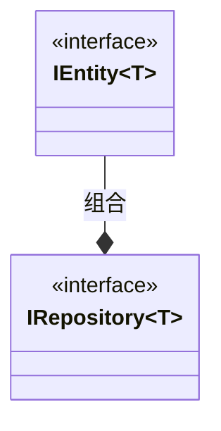
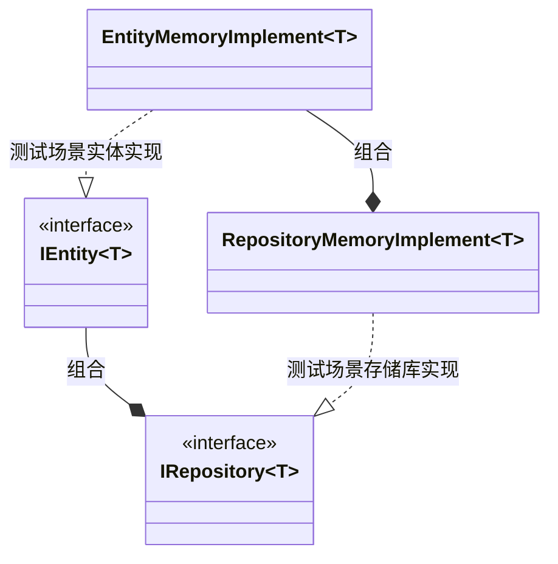
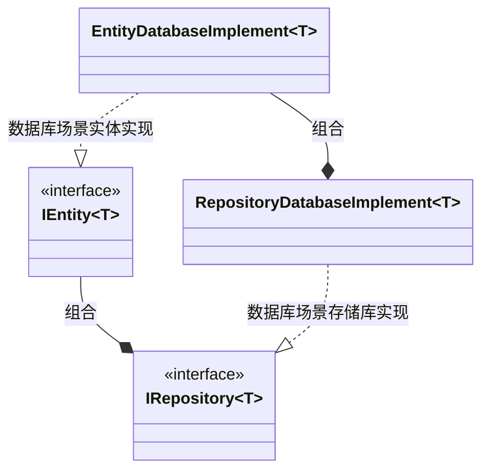

[TOC]

## 一种应付复杂业务场景的组合式设计结构

在某些复杂的业务场景下,开发者需要应对非常多的业务类,每种业务类均有较多的属性或者属性集,这些业务类又需要持久化到硬盘或者数据库,从领域驱动设计对于要素的拆分(值对象`ValueObject`、实体`Entity`、存储库`Repository`),可以形成如下类图:



针对每种业务类`T`,需要提取实体类接口`IEntity<T>`,同时提供持久化接口`IRepository<T>`. 为了支持测试和方便开发,首先会考虑提供内存版实现:



之后将开发完成的组件提供数据库适配,类关系图如下:



如果你有`n`种业务类型,就需要`n*(2+2+2)`,共`n*6`个类.当然这是极限场景的情况,实际上`Java`等语言都提供了`ORM`,而且实体类也不一定需要提取接口,针对每种实体类可能会提供属性系统来使得实体类退化成普通的值对象.

上述设计基本上就是整洁架构或者说六边形架构倡导的方式.使用存储库接口`IRepository`进行依赖倒置,并与特定数据源解耦. 由于其复杂性,在C++中采用相应方式工作量大,重复劳动也多,应用困难.那么有没有方法既能享受这种结构带来的益处,又无需付出太多编码成本呢?

### 解决思路

在游戏行业常用的`Entity-Component-System`架构模式中,同样有实体`Entity`概念,只不过值对象`ValueObject`在这里被称为`Component`,而且游戏通常是在内存中运行的,对于持久化需求不多,因而没有存储库`Repository`概念.但是`ECS`架构有一种观察问题的视角,这里的实体通常只是一个`ID`,它认为实体就是由各种数据组件`Component`组合而成,业务逻辑处理放在`System`中,由此来解决类膨胀问题.

我们可以这样理解,之前为业务提供实体类,包含了唯一标识符、数据、业务逻辑,在`ECS`中被拆分成三部分:`Entity`、`Component`、`System`.这种组合式设计既能够充分利用已有的数据定义和业务逻辑,添加也非常容易,能够很方便地组合出新的业务类型,应对业务类膨胀和新的需求.

那么在设计中是否可以利用这样的思路,把实体视为值对象的组合,以数据组件`Component`为最小单元进行设计,实体和存储库均在其上构建.通过C++语言强大的基于类型编程能力设计出组合式的结构来,增加复用可能性,减少代码量?


### 结构设计

这里将设计结构拆分为三大要素:数据组件`Component`、实体`Entity`、存储库`Repository`.

首先看一下数据组件的通用操作:

| 接口      | 释义                     |
| --------- | ------------------------ |
| `exist`   | 实体是否存在这种数据组件 |
| `view`    | 从实体上获取数据组件     |
| `assign`  | 为实体增加这种数据组件   |
| `remove`  | 从实体移除这种数据组件   |
| `replace` | 更新实体上的这种数据组件 |

实体的增删改查操作,其中改查被分解成对多种数据组件的操作,基本上是组件接口按照类型的组合,不在赘述.而增删查则在存储库上,这里看以下存储库的操作:

| 接口      | 释义             |
| --------- | ---------------- |
| `create`  | 创建实体         |
| `destory` | 删除实体         |
| `find`    | 根据条件查找单个 |
| `search`  | 根据条件筛选多个 |

### 操作示例

假设有个实体包含`int`、`double`、`std::string`等数据组件(注意能够基于类型扩展,这里只是为演示方便,正常设计不是如此).通常创建和过滤可能会使用参数集,我们将其也是为组件,只不过是虚拟的,这里提供了`Value`和`Require`两种类来表示参数集组件和过滤条件.

提供的虚拟组件为`All`:

```C++
//虚拟数据组件,可以用来作为创建参数,整合查看,过滤参数
struct All
{
    int iv;
    double dv;
    std::string sv;
};
```

首先使用演示用的内存版实现`Repository`,并注册以上各种数据组件:

```C++
//演示用内存版实现,内部以long long为ID类型
Repository repo;

//注册三种数据组件仓库
repo.registerComponentRepo<int>();
repo.registerComponentRepo<double>();
repo.registerComponentRepo<std::string>();
//注册虚拟组件,能够查看,作为创建参数,也能够作为过滤参数
repo.registerVirualComponent<All>();
```

然后创建实体并添加各种数据组件:

```C++
//创建实体1
auto e1 = repo.create<int, double, std::string>();
e1.assign<std::string>("liff.engineer@gmail.com");
e1.assign<double>(3.1415926);
e1.assign<int>(1018);
```

也可以利用`All`作为创建参数来创建并添加数据组件:

```C++
//以参数创建
auto e2 = repo.create<All>(All{1024, 1.717, "liff.developer@glodon.com"});
```

`All`可以作为过滤参数来进行过滤,譬如要求实体满足`All`的`sv`成员变量包含`liff.engineer`,返回查找到的第一个:

```C++
//根据要求查找第一个

//构造过滤参数
auto findReq = Require(All{0, 0.0, "liff.engineer"}).remark("sv"_hashed, "contain"_hashed);
//由于过滤参数类型为All,需要添加All作为find的模板参数
auto e = repo.find<All>(findReq);
if (!e) //判断是否有效(即找到了没有)
    return;
//查看虚拟组件All
auto allCopy = e.view<All>();
```

然后是根据条件查找多个:

```C++
std::vector<std::string> results;
auto searchReq = Require(All{0, 0.0, "liff"}).remark("sv"_hashed, "contain"_hashed);
for (auto e : repo.search<All, std::string>(searchReq))
{
    results.emplace_back(e.view<std::string>());
}
```


需要申明的是,`int`、`double`、`std::string`、`all`均属于示例代码中的定义而不是`Repository`实现中自带的,即支持开发者任意扩展新的数据组件类型.

### 扩展方式

针对数据组件类型,并不都是包含所有操作方法的,因而第一种扩展场景就是调整数据组件的操作接口.

#### 调整数据组件操作接口

譬如上述示例`All`的操作接口只有查看,那么调整`All`操作接口的方式是特化`IComponent`:

```C++
//这个需要写在应用程序公共部分
template <>
class prefab::IComponent<All> : public prefab::IComponentBase
{
public:
    HashedStringLiteral typeCode() const noexcept override
    {
        return HashedTypeNameOf<All>();
    }

public:
    //只提供查看方法
    virtual All view() const = 0;
};
```

如果你希望为借由某种虚拟组件触发动作,而不是数据访问,类似如下:

```C++
template <>
class prefab::IComponent<Action> : public prefab::IComponentBase
{
public:
    HashedStringLiteral typeCode() const noexcept override
    {
        return HashedTypeNameOf<Action>();
    }

public:
    virtual void execute()  = 0;
};
```

使用方式如下:

```C++
//查找ID为0的实体
auto findReq = Require(long long(0)}).remark(""_hashed, "=="_hashed);
auto e = repo.find<Action>(findReq);

//获取Action组件,然后执行其execute方法
e->component<Action>()->execute();
```

那么需要如何实现特化出来的`prefab::IComponent<All>`呢?

#### 调整数据组件操作实现

假设希望访问`double`组件时返回字符串,通过上述方式将`view`接口调整为`std::string view() const `后,采用如下方式实现:

```C++
//内存版实现内部用的map
template<>
class prefab::Component<double> :public prefab::IComponent<double>
{
    long long m_key;
    std::map<long long, double>* m_repo = nullptr;
public:
    explicit Component(std::map<long long, double>* repo, long long key)
        :m_repo{ repo }, m_key(key)
        {};

    //...
    
    //调整view的实现,从map获取double后转换为字符串
    std::string    view() const  override {
        return std::to_string(m_repo->at(m_key));
    }
    //...
};
```

虚拟组件也是采用类似方式,不过演示的实现对其要求不太一样.

#### 虚拟组件的操作实现

`All`虚拟组件同时提供了查看、创建、筛选支持,首先看以下查看支持:

```C++
template <>
class prefab::VirtualComponent<All> : public prefab::IComponent<All>
{
    prefab::Repository *m_repo = nullptr;
    long long m_key = 0;

public:
    //注意1,虚拟数据组件在演示中使用存储库来构造,而不是特定数据组件类型的map
    explicit VirtualComponent(prefab::Repository *repo, long long key)
        : prefab::IComponent<All>(), m_repo(repo), m_key(key){};

    //..
    template <typename T>
    prefab::ValueImpl<std::map<long long, T>> *repoOf() const noexcept
    {
        auto typeCode = prefab::HashedTypeNameOf<T>();
        auto base = m_repo->m_voRepos.at(typeCode).get();
        auto impl = static_cast<prefab::ValueImpl<std::map<long long, T>> *>(base);
        return impl;
    }

    template <typename T>
    T valueOf() const noexcept
    {
        return repoOf<T>()->value().at(m_key);
    }
	
    //查看接口
    All view() const noexcept override
    {
        All result;
        result.iv = valueOf<int>();
        result.dv = valueOf<double>();
        result.sv = valueOf<std::string>();
        return result;
    }

    void assign(All const &o) noexcept
    {
        repoOf<int>()->value()[m_key] = o.iv;
        repoOf<double>()->value()[m_key] = o.dv;
        repoOf<std::string>()->value()[m_key] = o.sv;
    }

    static void write(IComponentBase *handler, Value const &argument) noexcept
    {
        static_cast<prefab::VirtualComponent<All> *>(handler)->assign(argument.as<All>());
    }
};
```

那么为了支持创建,还要在其上实现静态方法`write`,用来在创建完实体后根据参数初始化:

```C++
template <>
class prefab::VirtualComponent<All> : public prefab::IComponent<All>
{
public:
    //...
	
    //实现赋值接口给write用
    void assign(All const &o) noexcept
    {
        repoOf<int>()->value()[m_key] = o.iv;
        repoOf<double>()->value()[m_key] = o.dv;
        repoOf<std::string>()->value()[m_key] = o.sv;
    }

    //注意2,handler就是本类型的实例,argument存储的就是`All`这种数据类型的值,通过as<All>()取出
    static void write(IComponentBase *handler, Value const &argument) noexcept
    {
        static_cast<prefab::VirtualComponent<All> *>(handler)->assign(argument.as<All>());
    }
};
```

#### 根据过滤参数过滤的实现支持

上述是`All`的查看、初始化实体支持实现方式,使能过滤则使用的是`VirtualComponentHandler`,依然用特化实现:

```C++
template <>
struct prefab::VirtualComponentHandler<All>
{
    static bool accept(Repository *repo, long long id, Require const &req) noexcept
    {
        if (req.remark("sv") != prefab::HashedStringLiteral("contain"))
            return false;
        prefab::VirtualComponent<All> e{repo, id};
        return e.valueOf<std::string>().find(req.as<All>().sv) != std::string::npos;
    }
};
```

注意函数签名要保持一致,这是演示`Repository`实现时约定的,可以看到首先判断条件是不是要求`sv`成员被包含,然后构造`Component`操作来检测对应值是否包含相应的字符串.

### 效果检视

从以上展示可以看出,通过这种基于数据组件的设计,辅助以C++的模板等技术,确实可以减少前文所述的类膨胀和重复代码问题,同时灵活性也不输于手工设计的类.这套解决方案可以:

1. 能够实现通用的内存版存储库和实体操作,开发者只需要设计数据组件,以及部分虚拟组件
2. 支持开发者为特定数据组件类型定制操作接口,可以结合虚拟组件用来封装服务接口
3. 支持开发者添加虚拟数据组件,用来满足数据聚合需求,以及处理一些只读性数据
4. 以类似逻辑支持创建、过滤参数,在表达数据库查询语句方面也能够支持

### 总结

可以看到,C++语言具备的特性使得很多畅想能够实现,随着语言发展,会有更多强大好用的库供开发者使用;基于类型的组合式设计具有非常强大的表达能力,在进行软件设计的时候可以考虑采用类似思路.


