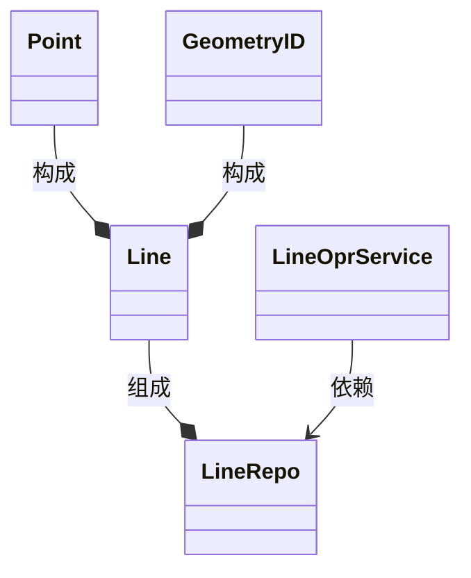
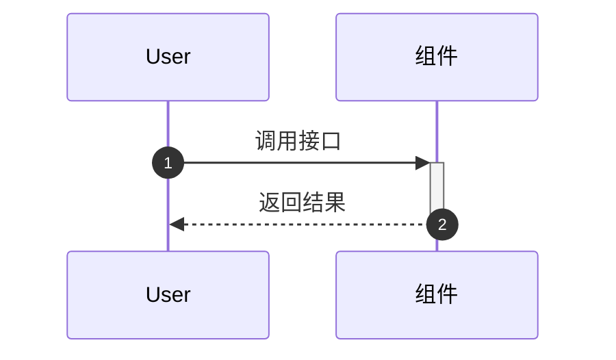
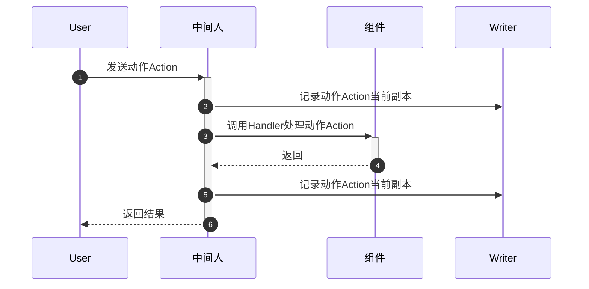
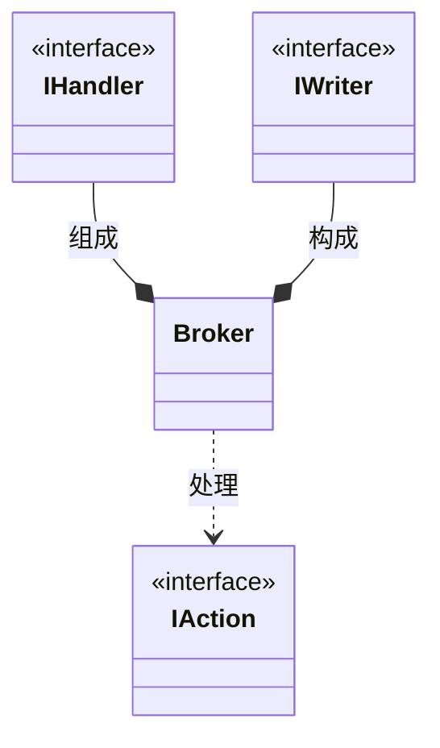
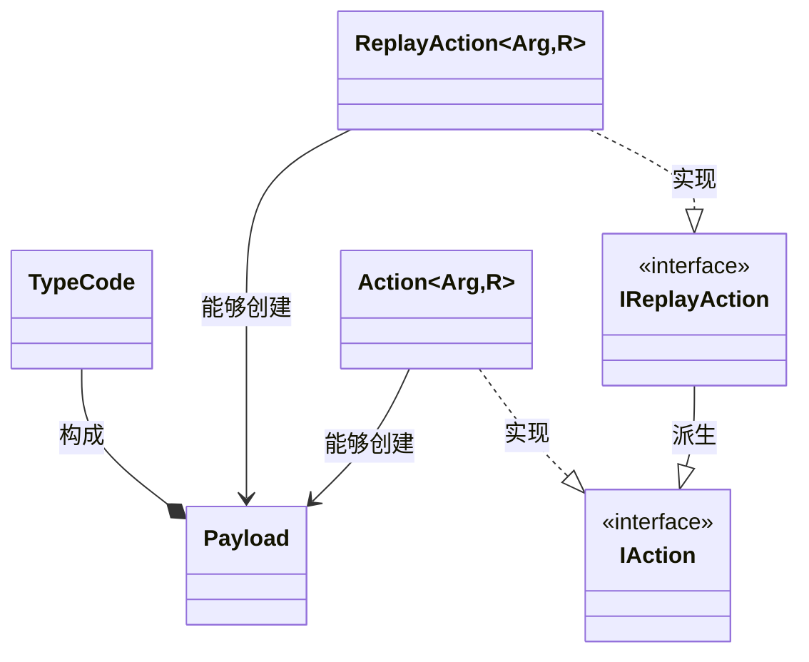

# 一种软件操作记录与回放方案及实现

不仅仅大型桌面应用程序,现在的软件复杂度越来越高,需要很多手段来调试、测试、诊断软件行为.这里基于单向数据流架构的思想,提供一种软件操作记录与回放的方案,以此来支持如下场景:

-  以操作软件的方式收集测试用例,能够支持单元、功能、集成等不同层次的测试需求;
-  操作软件形成的日志能够回放执行,用来验证软件行为、观察用户操作;
-  支持操作参数及结果、耗时等信息的扩展记录.

## 基本假设

无论是在整个软件、子系统、模块、类等各个层级,均可以将其组成部分视为组件,包含:

- 状态
- 接口:根据是否修改组件状态,分为`非突变`接口、`突变`接口

接口包含输入参数和返回结果,参数与结果均可以通过某些方式转换为普通的数据(领域驱动设计中的值对象、`C++`中普通的结构体),如何转换可以去思考一下,这里不做赘述.

那么,就可以将其转换为状态机形式:组件具有状态,响应某些事件/动作,就会切换到新的状态.`非突变`接口不会修改组件状态,只是希望从组件上读取一些信息;`突变`接口向组件发送动作,组件做出响应,并返回结果(可能为状态的一部分信息).

也就是说,至少在很多场景下,可以将组件的接口转换为状态机方式,通过记录事件/动作,就能够获取操作信息;这些事件/动作按照原始顺序回放,就可以将组件切换到目标状态.

下面以示例展示一下上述假设.

## 一个简化的绘图场景

假设要实现一个组件,具备如下功能:

1. 创建二维线
2. 移动二维线
3. 删除二维线
4. 读取现有的二维线信息

那么组件被拆分出如下几部分:

| 类                         | 说明                        |
| -------------------------- | --------------------------- |
| 几何对象`ID`:`GeometryID`  | 线的标识符,用来区分不同的线 |
| 二维点`Point`              |                             |
| 线对象`Line`               | 由标识符、起点、终点组成    |
| 线对象存储库`LineRepo`     | 存储线对象                  |
| 线操作服务`LineOprService` | 该组件的操作接口            |



简单实现如下:

```C++
struct GeometryId {
    int v;
};

bool operator==(GeometryId const& lhs, GeometryId const& rhs) {
    return lhs.v == rhs.v;
}

bool operator!=(GeometryId const& lhs, GeometryId const& rhs) {
    return lhs.v != rhs.v;
}


struct Point {
    double x;
    double y;

    void move(Point v) {
        x += v.x;
        y += v.y;
    }
};
struct Line {
    GeometryId id;
    Point  pt1;
    Point  pt2;
};

class LineRepo
{
    std::vector<Line> m_objects;
    GeometryId nextId(int* restart = nullptr) {
        static int id = 0;
        if (restart) {
            id = *restart;
        }
        return GeometryId{ id++ };
    }
public:
    LineRepo() = default;

    void reboot() {
        int restart = -1;
        nextId(&restart);
        m_objects.clear();
    }

    GeometryId create(Point pt1, Point pt2) {
        Line result;
        result.id = nextId();
        result.pt1 = pt1;
        result.pt2 = pt2;
        m_objects.emplace_back(std::move(result));
        return m_objects.back().id;
    }

    void destory(GeometryId id) {
        m_objects.erase(std::remove_if(m_objects.begin(), m_objects.end(),
            [&](auto& obj) {
                return obj.id == id;
            }), m_objects.end());
    }

    Line* find(GeometryId id) noexcept {
        for (auto& obj : m_objects) {
            if (obj.id == id) {
                return std::addressof(obj);
            }
        }
        return nullptr;
    }
};


struct LineOprService
{
    LineRepo* repo;

    Line* create(Point p1, Point p2) {
        return repo->find(repo->create(p1, p2));
    }

    void  destory(Line* line) {
        if (line) {
            return repo->destory(line->id);
        }
    }

    void  move(Line* line, Point v) {
        line->pt1.move(v);
        line->pt2.move(v);
    }
};
```

对于这样一个组件,状态信息对应于`LineRepo`,操作接口是`LineOprService`,接口为以下几个:

- 创建线
- 删除线
- 移动线

可以将上述接口转换为动作,其中线的指针`Line*`可以被替换为`GeometryID`,两者等价:

```C++
struct CreateLine {
    Point p1;
    Point p2;
};

struct DestoryLine {
    GeometryId id;
};

struct MoveLine {
    GeometryId id;
    Point v;
};
```

由此,接口形态被转换为状态机形式:

```C++
struct LineOprProxy
{
    LineRepo* repo;
	
    //处理创建线动作,并返回创建结果
    void on(CreateLine const& e, GeometryId& result) {
        result = repo->create(e.p1, e.p2);
    }
	
    //处理删除线动作
    void on(DestoryLine const& e) {
        repo->destory(e.id);
    }
	
    //处理移动线动作
    void on(MoveLine const& e) {
        auto line = repo->find(e.id);
        if (line) {
            line->pt1.move(e.v);
            line->pt2.move(e.v);
        }
    }
};
```

这里引入一个中间人角色,组件使用者通过发送动作给中间人,中间人再调用组件来处理,从而建立了统一的流程:

```mermaid
sequenceDiagram
	participant User as 组件使用者
	participant Broker as 中间人
	participant Impl as 组件
	
	autonumber 
	
	User -->+ Broker:发送动作
	Broker -->+ Impl:调用组件动作响应函数
	Impl ->>- Broker:填充动作中的结果并返回
	Broker ->>- User:返回
	
```

由此,中间人可以从中观察、记录、回放所有组件接收到的动作,以及它反馈的结果,辅助以序列化方案,即可形成操作的记录与回放.

## 设计方案

这里拆分出如下角色:

| 角色                   | 作用                   |
| ---------------------- | ---------------------- |
| 组件使用者`User`       | 使用组件完成操作       |
| 中间人`Broker`         | 提供通用的组件操作接口 |
| 组件                   | 具体的实现方           |
| 序列化模块`Serializer` | 用来记录信息           |

以及以下概念:

| 概念          | 说明                         |
| ------------- | ---------------------------- |
| 动作`Action`  | 用来表达并触发某操作         |
| 负载`Payload` | 存储动作所需的参数及结果     |
| `Handler`     | 响应动作,以完成操作,写回结果 |
| `Writer`      | 记录实现                     |

那么原有比较简单直接的操作流程如下:



被调整为如下流程:



整体的类及关系如下:



下面根据这几个部分分别阐述其设计和实现方案.

## 动作`Action`的设计和实现

动作`Action`由参数和可选的结果构成,它要处理的场景和要求比较复杂:

- 参数、结果的生命周期均可能由其管理;
- 通用实现,能够所有的`Action`;
- 性能,避免不必要的内存申请.

但是在处理过程中,可以提供负载`Payload`概念,来存储参数指针、可选结果指针,这样能降低其它场景的处理复杂度.

| 类                                | 说明                                    |
| --------------------------------- | --------------------------------------- |
| 类型标识符`TypeCode`              | 用来区分不同的类型                      |
| 负载`Payload`                     | 存储参数、结果的指针形式,供其它场景使用 |
| 动作基类`IAction`                 | 动作实现的接口约束,包含存储、动作响应   |
| 动作实现`Action<Arg,R>`           | 包含参数、结果                          |
| 回放动作实现`ReplayAction<Arg,R>` | 包含参数、预期结果、实际结果            |

类关系如下:




### 类型标识符`TypeCode`

类型标识符对应类为`TypeCode`,实现为编译期常量,且附带编译期计算的哈希值用来提升性能表现:

```C++
struct TypeCode{
    const char* literal{nullptr};
    std::size_t hash{0};
};
```

提供`TypeCodeOf<...Ts>()`函数来获取标识符:

```C++
template<typename... Ts>
constexpr TypeCode TypeCodeOf() noexcept{
    //实现
}
```

关于如何实现可以查阅之前的文章,或文章尾部的源代码链接,或自行搜索编译期类型获取、编译期字符串哈希值计算等实现.

### 负载`Payload`

由于要表达各种类型的指针,这里以`void*`和类型标识符`TypeCode`来进行通用的存储和表达:

```C++
struct Payload {
	const void* arg{ nullptr };
	void* result{ nullptr };
	TypeCode    code{ TypeCodeOf<void,void>() };
};
```

并为其提供了两种构造函数:

```C++
struct Payload {
	//...
    
    template<typename Arg,typename R>
	explicit Payload(const Arg& arg, R& r);
    
    template<typename Arg>
	explicit Payload(const Arg& arg); 
};
```

开发者一旦通过`code`确认了具体类型,则可以使用`static_cast`安全地转换回目标指针,例如:

```C++
template<typename Arg,typename R,typename F>
auto createHandler(F fn){
    return [=](Payload o){
        if(o.code == TypeCodeOf<Arg,R>()){
            fn(*static_cast<const Arg*>(o.arg),*static_cast<R*>(o.r));
        }
    };
}

//动作响应函数
void handler(int arg,double& result);

auto demoCreate(){
    //创建动作响应函数
    return createHandler<int,double>(handler);
}
```

### 动作基类`IAction`及实现`Action<Arg,R>`

动作需要完成两大核心需求:触发`Handler`来处理;记录.因而其接口实现为:

```C++
struct IAction {
	virtual ~IAction() = default;

	virtual void exec(IHandler& op) = 0;
	virtual void write(IWriter& writer, IWriter::When when) const = 0;
};
```

关于`IHandler`及`IWriter`的设计见后续.

当动作触发时,参数`Arg`调用方已经提供好了,而`R`可能由调用方提供,或者需要中间人`Broker`构造默认的.因此,对于`Action`实现,只需要存储指针即可:

```C++
template<typename Arg, typename Result>
struct Action final : IAction {
	const Arg* arg;
	Result* r;
};
```

无结果的版本需要提供偏特化实现:

```C++
template<typename Arg>
struct Action<Arg, void> final :IAction {
	const Arg* arg;
};   
```

### 回放动作基类`IReplayAction`及实现`ReplayAction<Arg,R>`

回放动作需要自己持有参数和结果,而且用于回放过程,需要存储预期结果以及实际结果,并提供验证接口对比是否一致:

```C++
struct IReplayAction : IAction {
	virtual bool verify() const = 0;
};
```

其实现也比较简单:

```C++
template<typename Arg, typename Result>
struct ReplayAction final :IReplayAction {
    Arg arg{};
    Result expect{};
    Result actual{};
};

//偏特化版本
template<typename Arg>
struct ReplayAction<Arg, void> final :IReplayAction {
    Arg arg{};
};
```

如果开发者需要自行定义验证实现,则可以通过特化技术来处理.

## `Handler`的设计和实现

响应函数`Handler`的表达非常简单,因为其逻辑就是一个函数调用,它只需要处理负载:

```c++
class IHandler {
public:
    virtual ~IHandler() = default;

    template<typename Arg, typename R>
    void run(const Arg& arg, R& r) {
        return runImpl(Payload(arg, r));
    }

    template<typename Arg>
    void run(const Arg& arg) {
        return runImpl(Payload(arg));
    }
protected:
    virtual void runImpl(Payload payload) = 0;
};
```

这里使用`NVI`惯用法,要求派生类提供`runImpl`实现.

真实场景下,`IHandler`通常是函数族,它有两种表达形式:仿函数、类,因而提供两种默认实现,以避免开发者派生:

```C++
template<typename T>
class CallableHandler final :public Handler<CallableHandler<T>>
{
    T m_obj;
public:
    explicit CallableHandler(T v)
        :m_obj(std::move(v)) {};

    template<typename Arg, typename R>
    CallableHandler& inject() {
        //...
        return *this;
    }

    template<typename Arg>
    CallableHandler& inject() {
       	//...
        return *this;
    }
};

template<typename T>
class DispatchHandler final :public Handler<DispatchHandler<T>>
{
    T m_obj;
public:
    explicit DispatchHandler(T v)
        :m_obj(std::move(v)) {};

    template<typename Arg, typename R>
    DispatchHandler& inject() {
        //...
        return *this;
    }

    template<typename Arg>
    DispatchHandler& inject() {
        //...
        return *this;
    }
};
```

这里开发者可以使用`inject`函数以及参数、结果类型将类的成员方法注入,以支持某种动作的响应,为了方便创建,提供以下辅助函数:

```C++
template<typename F>
auto MakeCallableHandler(F&& fn) noexcept {
    return CallableHandler<std::decay_t<F>>(std::forward<F>(fn));
}

template<typename T>
auto MakeDispatchHandler(T&& v) noexcept {
    return DispatchHandler<std::decay_t<T>>(std::forward<T>(v));
}
```

使用方法如下:

```C++
auto handler = MakeDispatchHandler(
    	LineOprProxy{ uow.broker,uow.repo }//响应函数族的类形式实例
	)
    .inject<CreateLine, GeometryId>()//响应函数1
    .inject<DestoryLine>()//响应函数2
    .inject<MoveLine>();//响应函数3
```

## 序列化接口`IWriter`

对于记录场景来说,它只关注如何记录动作`Action`,因而不考虑如何读取,其定义为:

```C++
struct IWriter {
    virtual ~IWriter() = default;

    enum class When {
        enter, //动作开始处理前
        leave, //动作处理完成后
    };

    virtual void push(Payload const& o,When when) = 0;
};
```

## 中间人`Broker`的设计与实现

中间人`Broker`的构成也并不复杂,它需要以下内容:

- 响应函数
- 序列化接口

```C++
class Broker final
{
public:
    Broker() = default;
    explicit Broker(std::shared_ptr<IWriter> writer)
        :m_writer(writer) {};
    
    void setWriter(std::shared_ptr<IWriter> writer) {
        m_writer = writer;
    }

    std::shared_ptr<IHandler> registerHandler(
        std::shared_ptr<IHandler>&& handler) noexcept;

    template<typename T>
    std::shared_ptr<IHandler> registerHandler(T&& v) noexcept;
private:
    //响应函数集合
    std::vector<std::shared_ptr<IHandler>> m_handlers;
    //序列化实现
    std::shared_ptr<IWriter>  m_writer;
};
```

然后提供多种形式的分发接口`dispatch`:

```C++
template<typename Arg, typename Result>
void dispatch(const Arg& arg, Result& r);

template<typename Result, typename Arg>
Result dispatch(const Arg& arg);

template<typename Arg>
void dispatch(const Arg& arg);
```

而执行回放的接口需要专门提供:

```C++
void replay(IAction& action);
```

## 参考示例

首先提供新的操作接口类`LineOprProxy`来替代之前的`LineOprService`,所有接口调用均实现为发送动作到中间人:

```C++
struct LineOprProxy
{
    abc::Broker* broker;//中间人
    LineRepo* repo;

    Line* create(Point p1, Point p2) {
        auto id = broker->dispatch<GeometryId>(CreateLine{ p1,p2 });
        return repo->find(id);
    }

    void  destory(Line* line) {
        if (line) {
            broker->dispatch(DestoryLine{ line->id });
        }
    }

    void  move(Line* line, Point v) {
        if (line) {
            broker->dispatch(MoveLine{ line->id,v });
        }
    }
};
```

这样,组件运行就需要`LineRepo`和`Broker`了,因而提供工作单元`UnitOfWork`来表达:

```C++
struct Uow {
    abc::Broker* broker;
    LineRepo* repo;
};
```

在初始化工作单元`Uow`时,将响应函数族注册到中间人`Broker`:

```C++
//调整后的响应函数版本服务
struct LineOprSevice
{
    LineRepo* repo;

    void on(CreateLine const& e, GeometryId& result);
    void on(DestoryLine const& e);
    void on(MoveLine const& e);
};

void InitUow(Uow uow)
{
    //注册响应函数集
    uow.broker->registerHandler(
        abc::MakeDispatchHandler(LineOprSevice{uow.repo })
        .inject<CreateLine, GeometryId>()
        .inject<DestoryLine>()
        .inject<MoveLine>()
    );
}
```

然后提供`SomeActions`来操作一下组件:

```C++
void SomeActions(Uow uow)
{
    LineOprProxy opr{ uow.broker,uow.repo };

    std::vector<GeometryId> keys;
    {
        auto line = opr.create(Point{ 1,1 }, Point{ 0,0 });
        opr.move(line, Point{ 10,0 });
        keys.push_back(line->id);
    }
    {
        auto line = opr.create(Point{ 100,1 }, Point{ 0,40 });
        opr.move(line, Point{ -10,-5 });
    }

    for (auto& key : keys) {
        opr.destory(uow.repo->find(key));
    }
}
```

最终拼接出来的流程如下:

```C++
int main(int argc, char** argv) {
    LineRepo     repo;
    abc::Broker broker;

    //模块运行
    Uow  uow{ &broker,&repo };
    InitUow(uow);
    SomeActions(uow);
    return 0;
}
```

不过由于没有提供序列化相关处理,上述执行动作并没有存储起来,限于篇幅,请查阅文章尾部的源代码,其最终样例片段如下:

```C++
int main(int argc, char** argv) {
    LineRepo     repo;
    abc::Broker broker;

    //注册动作记录模块
    auto writer = std::make_shared<JsonWriter>();
    registerWriters(*writer);
    broker.setWriter(writer);

    //模块运行
    Uow  uow{ &broker,&repo };
    InitUow(uow);
    SomeActions(uow);

    //保存模块运行过程执行的动作
    auto json = writer->dump();
    SaveAndLoadEventHandler().on(writer->result(), "actions.json");


    //从动作记录中读取
    JsonReader reader;
    registerReaders(reader);
    auto actions = reader.read(writer->result());

    //禁止动作记录,并回放动作
    //这时回放结果应该是不匹配的
    broker.setWriter(nullptr);
    for (auto& action : actions) {
        broker.replay(*action);
    }

    //为了正确回放,需要将状态重置
    repo.reboot();
    for (auto& action : actions) {
        broker.replay(*action);
    }
    return 0;
}
```

`actions.json`内容如下:

```json
[
    {
        "argument": {
            "p1": {
                "x": 1.0,
                "y": 1.0
            },
            "p2": {
                "x": 0.0,
                "y": 0.0
            }
        },
        "code": "struct abc::TypeCode __cdecl abc::Code<struct CreateLine,struct GeometryId>(void) noexcept",
        "result": {
            "__entity_identify_type__": "struct GeometryId",
            "v": 0
        }
    },
    {
        "argument": {
            "id": {
                "__entity_identify_type__": "struct GeometryId",
                "v": 0
            },
            "v": {
                "x": 10.0,
                "y": 0.0
            }
        },
        "code": "struct abc::TypeCode __cdecl abc::Code<struct MoveLine>(void) noexcept"
    },
    {
        "argument": {
            "p1": {
                "x": 100.0,
                "y": 1.0
            },
            "p2": {
                "x": 0.0,
                "y": 40.0
            }
        },
        "code": "struct abc::TypeCode __cdecl abc::Code<struct CreateLine,struct GeometryId>(void) noexcept",
        "result": {
            "__entity_identify_type__": "struct GeometryId",
            "v": 1
        }
    },
    {
        "argument": {
            "id": {
                "__entity_identify_type__": "struct GeometryId",
                "v": 1
            },
            "v": {
                "x": -10.0,
                "y": -5.0
            }
        },
        "code": "struct abc::TypeCode __cdecl abc::Code<struct MoveLine>(void) noexcept"
    },
    {
        "argument": {
            "id": {
                "__entity_identify_type__": "struct GeometryId",
                "v": 0
            }
        },
        "code": "struct abc::TypeCode __cdecl abc::Code<struct DestoryLine>(void) noexcept"
    }
]
```

## 总结

上述方案,虽然通过各种`C++`技术提供了通用实现,依然需要付出一些额外的成本才能实现这种效果,需要设计者去衡量.

当然,如果能够感受到单向数据流架构的魅力所在,并且采用相应方案,这些成本对开发者来讲不值一提.

源代码链接:[https://github.com/liff-engineer/articles/tree/master/patterns/20210913](https://github.com/liff-engineer/articles/tree/master/patterns/20210913).


