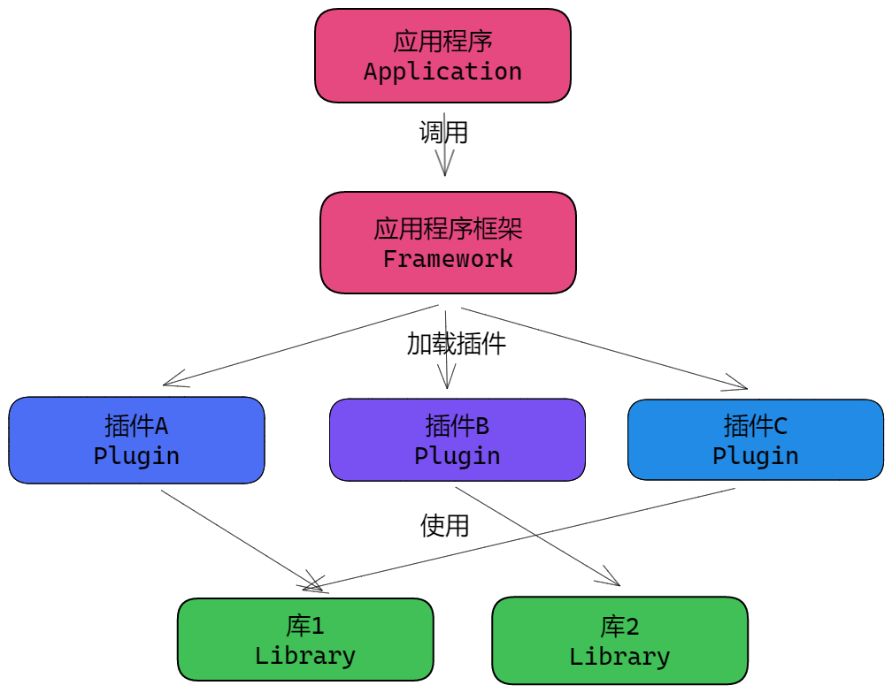
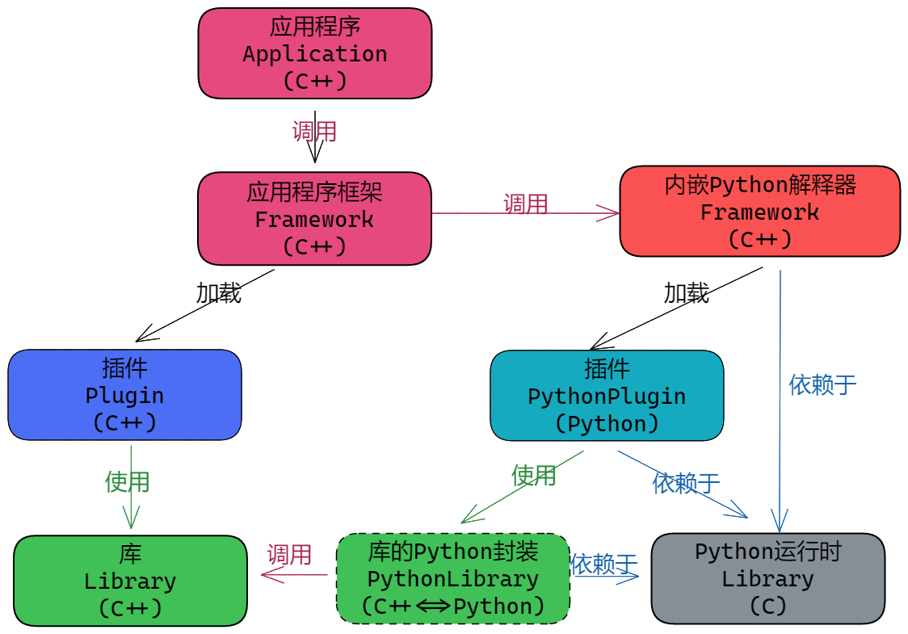
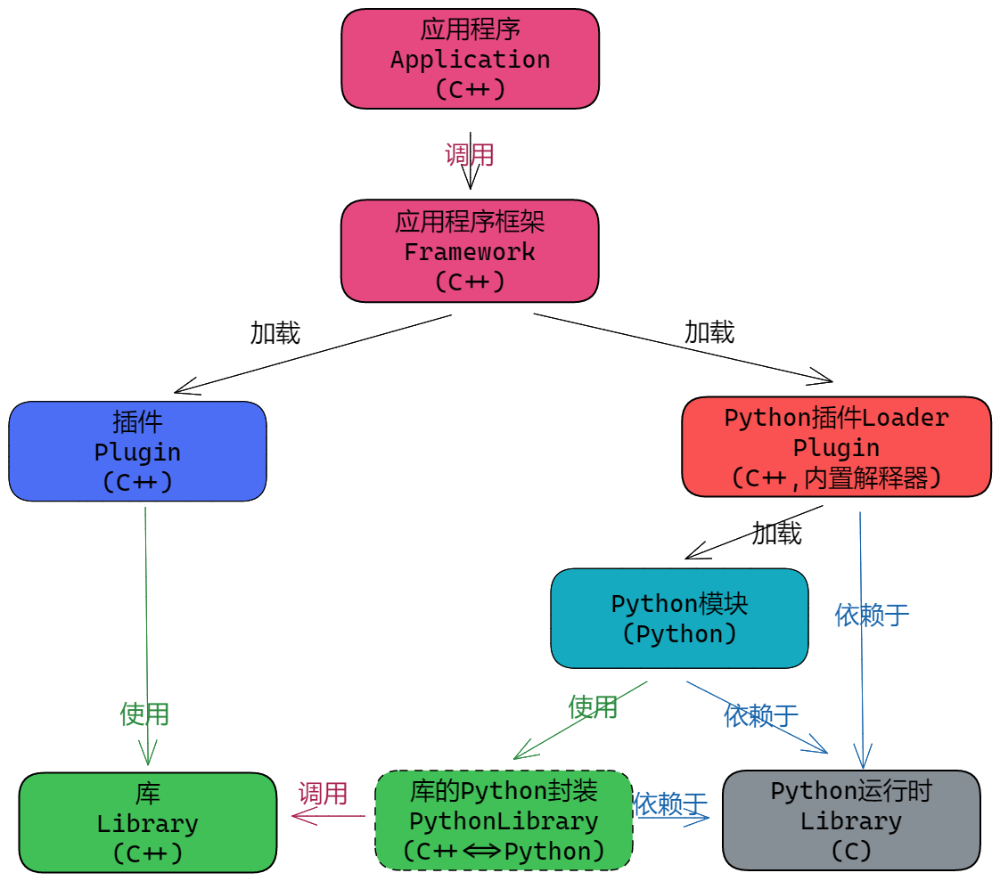
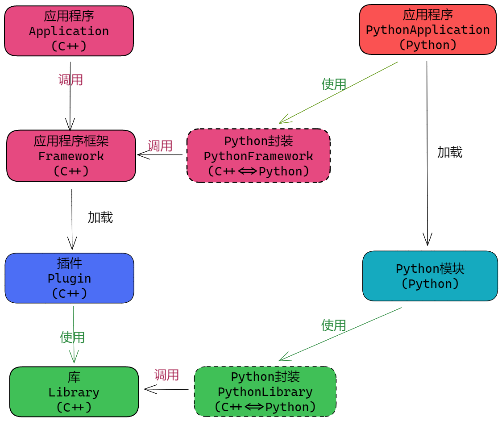
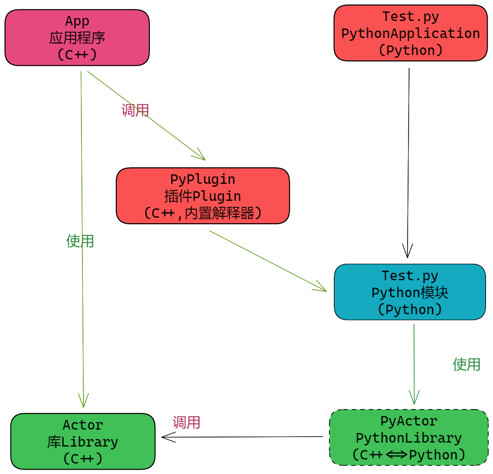

[TOC]

# `C++`应用程序与`Python`插件

之前介绍过`C++`与脚本语言的混合编程,譬如:

- 采用`pybind11`封装`C++`库供`Python`使用;
- 怎么在`C++`应用中嵌入`lua`.

这里更进一步,如何为插件架构的`C++`应用程序开发`Python`插件.

## 插件架构的构成结构

对于插件架构,应用程序需要加载插件来扩展其界面和功能,因而它需要包含如下要素:

- 库`library`：提供界面、算法等操作；
- 控制框架`framework`：提供插件管理、功能逻辑流程、扩展点；
- 应用程序`application`：构成独立应用。

插件`plugin`与这些要素的关系如下:




如果要为`C++`应用提供`Python`插件支持,则需要为以下要素提供`Python`支持:

- 库`library`：提供`Python`封装供插件使用；
- 控制框架`framework`：提供加载和管理`Python`插件的能力与功能；

从而形成如下结构：



考虑到`Python`本身就是解释型语言,所谓插件只是加载不同的`.py`文件;将应用程序框架中加载`Python`插件的部分实现为`C++`插件,然后在`Python`端自行定义加载逻辑,从而形成如下结构:



然而,这种实现结构在调试时比较麻烦,需要`IDE`支持(Visual Studio即支持混合调试).可以将应用程序框架进行`Python`接口封装,从而使得应用程序完全可以以`Python`编写,以此来降低调试等工作流程的复杂度.结构如下:



## 实现示例

这里实现一个示例,定义了一个接口`IActor`及其工厂`ActorFactory`:

- 插件提供`IActor`实现并将其注册到`ActorFactory`中;
- 应用程序加载插件,然后遍历`ActorFactory`,构建`IActor`实例并运行.

出于简化实现,这里不提供应用程序框架,直接使用应用程序编写实现.示例构成如下:

| 工程       | 说明                                                         |
| ---------- | ------------------------------------------------------------ |
| `Actor`    | 提供接口和工厂定义,供插件扩展,供应用程序使用                 |
| `PyActor`  | 为`Actor`提供`Python`接口,使得开发者可以用`Python`实现插件   |
| `PyPlugin` | `C++`插件,能够加载`Python`模块                               |
| `App`      | `C++`应用程序,加载`PyPlugin`插件,然后使用`Actor`实现业务逻辑 |
| `Test.py`  | `Python`插件,向`Actor`工厂注册`Python`端实现的`Actor`        |
| `Test.py`  | `Python`应用程序,使用`Actor`实现业务逻辑                     |



`C++`应用程序调用流程如下:

```mermaid
sequenceDiagram
	participant App
	participant PyPlugin
	participant Test.py
	participant PyActor
	participant Actor
	
	App ->> PyPlugin: 加载插件
	PyPlugin ->> Test.py :调用插件初始化函数
	Test.py ->> PyActor: 注册IActor实现类到工厂
	PyActor ->> Actor:Python转发到C++
	App ->>Actor:遍历工厂构造Actor并运行
```

`Python`应用程序调用流程如下:

```mermaid
sequenceDiagram
	participant App  as 应用程序<br>Test.py
	participant Test.py
    participant PyActor
	participant Actor 
	
	App ->> Test.py :调用初始化函数
	Test.py ->> PyActor: 注册Actor实现到工厂
	PyActor->> Actor:Python转发到C++
	App ->> PyActor:遍历工厂构造Actor并运行
```

示例实现中,`Actor`工厂内建了`1`个实现:

```c++
class InnerTestActor final:public IActor {
public:
    void Launch() override {
        std::cout << "InnerTestActor::Launch\n";
    }
};
```

在`Test.py`中注册了`3`个实现:

```python
from PyActor import IActor, Factory, gFactory


class TestActor(IActor):
    def __init__(self):
        super().__init__()

    def Launch(self):
        print("TestActor::Launch")


class AActor(IActor):
    def __init__(self):
        super().__init__()

    def Launch(self):
        print("测试用Actor")


class AAActor(IActor):
    def __init__(self):
        super().__init__()

    def Launch(self):
        print("测试用Actor(AAActor)")


def initialize():
    obj: Factory = gFactory()
    obj.Register("Test", TestActor)
    obj.Register("AActor", AActor)
    obj.Register("AAActor", AAActor)
```

在`App`中,使用逻辑如下:

```C++
auto factory = abc::gActorFactory();
//输出所有Actor的code
std::cout << "ActorFactory:\n";
for (auto&& code : factory->Codes()) {
    std::cout << "\tCode:" << code << "\n";
}
std::cout << "<|>\n";
std::cout << "Create And Run:\n"; //构造并运行
for (auto&& code : factory->Codes()) {
    std::cout << "\tCode(" << code << "):\n";
    auto result = factory->Make(code);
    if (result) {
        result->Launch();
    }
    std::cout << "<|>\n";
}
```

`App.exe`运行效果如下:

```bash
 .\App.exe
ActorFactory:
        Code:InnerTestActor
        Code:AActor
        Code:Test
        Code:AAActor
<|>
Create And Run:
        Code(InnerTestActor):
InnerTestActor::Launch
<|>
        Code(AActor):
测试用Actor
<|>
        Code(Test):
TestActor::Launch
<|>
        Code(AAActor):
测试用Actor(AAActor)
<|>
```

在`Test.py`中,使用逻辑如下:

```python
if __name__ == "__main__":
    initialize() #插件初始化
    
    # 输出所有Actor的code
    obj: Factory = gFactory()
    print(obj.Codes())
	
    ##尝试构建并运行
    actor: IActor = obj.Make("Test")
    if actor:
        actor.Launch()
    else:
        print("Invalid S")
    invalid: IActor = obj.Make("AActor")
    if invalid:
        invalid.Launch()
    else:
        print("Yes!")
    print("Invalid")
```

`Test.py`运行效果如下:

```bash
 python .\Test.py
['InnerTestActor', 'AActor', 'Test', 'AAActor']
TestActor::Launch
测试用Actor
Invalid
```

## 注意事项

### 注意区分运行环境

插件的实现逻辑就是加扩展点,然后由应用程序框架调用,所以不存在插件主动运行的情况,都是应用程序触发插件中某些逻辑的运行.

也就是说,加载了`Python`插件,如果在`Python`端还有逻辑要运行,一定要保证解释器不被释放掉.

一些应用程序会提供一个`Shell`,即`REPL`环境,供用户输入`Python`脚本并执行,这种情况下,要主动调用内置解释器执行.

### 生命周期问题

 `Python`语言有`GC`,且底层使用的是引用计数,而`C++`要手动管理,当底层的对象必须是`std::unique_ptr`时,会导致生命周期管理不匹配,从而引发崩溃等问题.

在示例中对其有一些解决方案展示,可以参考.注意请阅读`pybind11`等封装库对于生命周期的处理.

### 联合调试

多语言时调试会比较麻烦,这里可以查阅`Visual Studio`相关文档,来进行处理.
