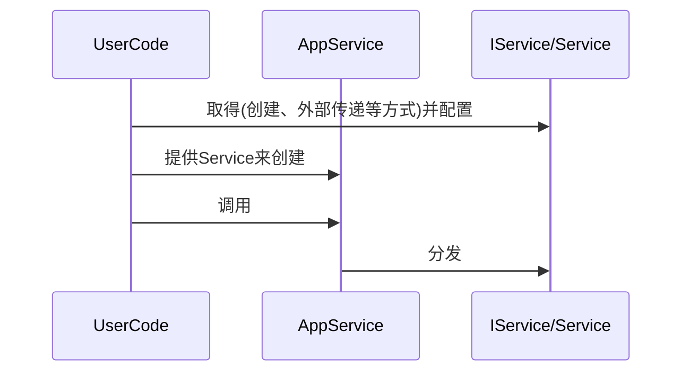

[TOC]


# 辅助生命周期管理的聚合类

当设计同时追求复用性、扩展性、易用性时，情况会变得复杂：

- 为了复用，会根据职责拆分成较小的类，以方便组合；
- 为了扩展，通常会要求为可能的场景预留接口，造成接口膨胀；
- 为了易用，开发者面对的类型、接口又要尽可能简单。

这时需要综合运用一些设计模式，譬如组合、策略、`Facade` 等等，从而带来生命周期管理的复杂性，它可能涉及到 `N` 个接口类，并考虑以下场景：

- 关联个数：可选、`1`个、`1`到`n`个；
- 管理模式：组合、聚合；
- 外部接口：读写、增删。

为了简化类似场景的生命周期管理，这里提供一个聚合类实现 `Aggregator`，以期支持上述不同场景，来简化实现。

## 示例场景

假设要实现一系列复杂的应用场景，开发者需要基于一些的服务接口 `IService`，来组合成应用服务 `AppService`，即包含如下内容：

- 服务接口 `IService`：基于职责的服务拆分，可复用、扩展、替换；
- 服务接口实现 `Service`：不同的 `IService`实现，并提供有差异的配置接口；
- 应用服务 `AppService`：由 `IService` 构成，以完成特定业务逻辑；
- 用户代码 `UserCode`：使用 `Service`构造 `AppService`，驱动其完成功能。

这些内容之间的交互如下：



这里的 `AppService`可能以如下方式持有`IService`:

-  仅持有指针 `IService*`，不管理生命周期；
-  持有共享指针 `std::shared_ptr<IService>`，共同管理生命周期；
-  持有独占指针 `std::unique_ptr<IService>`，管理生命周期。

## 示例场景应对方案

提供聚合类 `Aggregator`来完成生命周期管理，使得`AppService`仅持有`IService*`和聚合类实例：

1.  用户代码创建聚合类，并将所需 `IService` 根据场景存储其上，然后保存 `IService` 指针； 
2.  使用聚合类和保存的`IService`指针，构造 `AppService`；
3.  用户代码使用 `AppService`。

譬如原来的`AppService`：

```C++
class AppService{
public:
    //不同服务的读写接口
    void setService1(IService1* s);
    IService1* service1();
    
    void setService2(std::shared_ptr<IService2> s);
    IService2* service2();
    
    void setService3(std::unique_ptr<IService3> s);
    IService3* service3();    
private:
    IService1* m_s1;
    std::shared_ptr<IService2> m_s2;
    std::unique_ptr<IService3> m_s3;
};
```

调整为:

```C++
class AppService{
public:
	struct Services{
        IService1* s1;
        IService2* s2;
        IService3* s3;  
        //从聚合类读取服务接口,或者外部创建好提供给AppService
        static Services Create(Aggregator const& aggr);
    };
public:
    AppService(Aggregator&& aggr)
        :m_serviceAggregator(std::move(aggr))
    {
            m_services = Services::Create(m_serviceAggregator);
    }
    
    //获取服务
    Services getService(); 
private:
    Aggregator m_serviceAggregator;
    Services m_services;
};
```

## 对聚合类的设计要求

1. 支持存储不同类型的类实例，且个数不限制；
2. 支持多种形态：值、裸指针、`std::shared_ptr`、`std::unique_ptr`等；
3. 支持插入、删除、遍历操作。

## 设计与实现

聚合类 `Aggregator`提供如下四个接口：

| 接口                                 | 说明                  |
| ------------------------------------ | --------------------- |
| `emplace<T>(Args&&... args) -> T*`   | 原地构造类型`T`的实例 |
| `erase<T>() -> std::size_t`          | 移除类型`T`的实例     |
| `erase(const T* obj) -> std::size_t` | 移除`obj`             |
| `visit<T>(Fn&& fn)`                  | 遍历所有类型`T`的实例 |

它的设计分为以下部分：

1. 存储规格
2. 存储实现
3. 接口实现

定义接口`IEntry`，以及类型`T`的派生接口类`Entry<T>`：

```C++
struct IEntry {
    virtual const char* code() const noexcept = 0;
};

template<typename T>
struct Entry :public IEntry {
    virtual T* get() noexcept = 0;
    const char* code() const noexcept final { return typeid(T).name(); }
};
```

不同的类实例形态均派生自`Entry<T>`，考虑到并无差异，这里统一实现为`Value<T,Holder>`：

```C++
template<typename T, typename Holder>
struct Value final :Entry<T> {
public:
    template<typename... Args>
    explicit Value(T* (*op)(Holder&), Args&&... args)
    	:m_obj(std::forward<Args>(args)...), m_op(op) {};
    T* get() noexcept override { return m_op(m_obj); }
private:
    Holder m_obj;
    T* (*m_op)(Holder&);
};
```

对于具体的`Holder`需要提供获取`T*`的函数，这里以类型萃取实现：

```C++
template<typename T, typename U, typename E = void>
struct HolderTrait {
    using type = std::conditional_t<std::is_base_of_v<T, U>, U, T>;
    static T* get(type& obj) { return &obj; }
};
```

其中`HolderTrait::type`即为具体的`Holder`,而`HolderTrait::get`则可以从中获取`T*`.

只要偏特化`HolderTrait`即可提供对应的存储形式支持：

```C++
template<typename T, typename U>
struct HolderTrait<T, std::unique_ptr<U>, std::enable_if_t<std::is_base_of_v<T, U>>> {
    using type = std::unique_ptr<U>;
    static T* get(type& obj) { return obj.get(); }
};
```

在 `Aggregator` 中以`std::vector<std::unique_ptr<IEntry>>` 存储，基于此可以实现插入、遍历、删除等操作，以遍历为例：

```C++
template<typename T, typename Fn>
void visit(Fn&& fn) const noexcept {
    static auto code = typeid(T).name();
    for (auto& e : m_entrys) {
        if (!e || std::strcmp(e->code(), code) != 0)
            continue;
        if (auto vp = dynamic_cast<Entry<T>*>(e.get())) {
            fn(vp->get());
        }
    }
}
```

插入的实现可参考源码，这里不再赘述。

## 示例

基于`Aggregator`实现`ServiceAggregator`，这样可以根据实际情况选择是否开放某些操作：

```C++
class ServiceAggregator :private Aggregator {
public:
    using Aggregator::emplace;
    using Aggregator::erase;
    using Aggregator::visit;
};
```

可以以各种方式创建类实例：

```C++
ServiceAggregator hub{};
//构造并存储类实例
auto v = hub.emplace<std::string>("liff.engineer@gmail.com");
//存储独占指针
hub.emplace<std::string>(std::make_unique<std::string>("unique_ptr"));
//存储共享指针
hub.emplace<std::string>(std::make_shared<std::string>("shared_ptr"));
//构造并存储类实例
hub.emplace<std::string>(v->begin(),v->end());
//存储裸指针
hub.emplace<std::string>(v);
```

然后可以遍历：

```C++
void print(const ServiceAggregator& hub) {
    //注意可能为空,visit实现不排除这种情况
    hub.visit<std::string>([](std::string* obj) {
        if (obj) {
            std::cout << *obj << "\n";
        }
        });
}
```

接口类和派生类也同样支持：

```C++
class ITask {
public:
    virtual ~ITask() = default;
    virtual void run() = 0;
};

class Task :public ITask {
public:
    void run() override {
        std::cout << "Task::run()\n";
    }
};

int main() {
    ServiceAggregator hub{};
    hub.emplace<ITask>(std::make_unique<Task>());
    hub.emplace<ITask>(Task{});

    auto result = hub.erase<ITask>();
    return 0;
}
```
