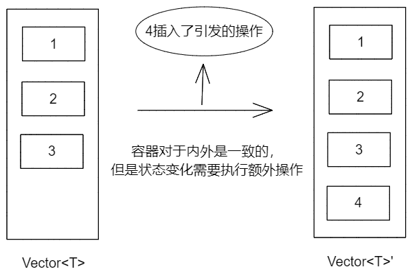
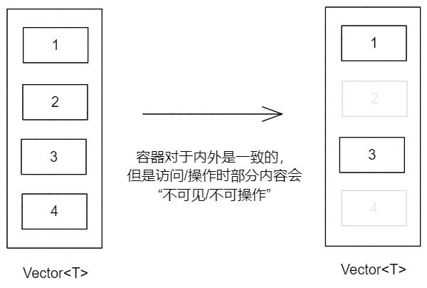
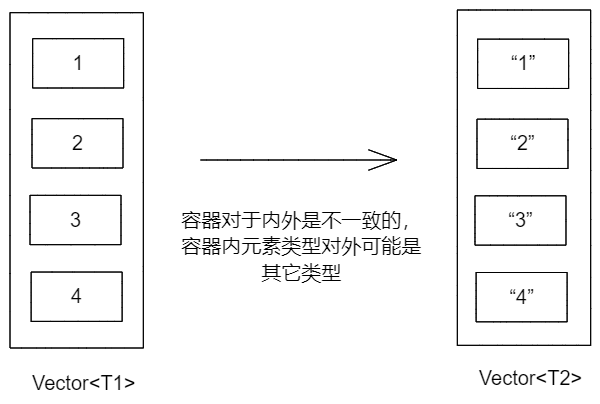

[TOC]

# 类内部容器的外部`API`设计

用 `C++` 就不可避免地重度使用 `STL`的容器与算法，当开发者在类中使用了容器，同时需要向外提供 `API` 供其他类使用时，怎么设计 `API` 就不再是个简单的话题了；这里将对其进行分析，总结出几种典型场景，以及可以采用的 `API`设计方式。

## 需求场景

### 场景1：使用者不能直接修改内部数据

假设设计的类要接收并记录字符串输入，同时统计特定字符串出现次数：

```c++
class Inputer{
public:
    //使用者如何暴露text写入、读取的api？
    //以及如何获取次数信息？
private:
    std::vector<std::string> m_texts;
    std::map<std::string,int> m_counts;
};
```

由于容器内容之间有关联，直接暴露容器来修改是不合适的，通常会导致读写接口风格不同。

 ### 场景2：使用者只能操作部分数据

假设设计的类存储了一些字符串，但是只有部分满足特定需求的字符串（譬如长度大于`3`）使用者能够访问：

```C++
class  DomainLiterals{
public:
private:
    std::vector<std::string> m_literals;
};
```

这时的数据写入和读取不对称倒是其次，主要是 `m_literals` 无法直接以引用等形式返回给使用者，需要提供多个接口来满足要求，譬如：

```C++
class DomainLiterals{
public:
  	int count(int i);//读取个数
    std::string* get(int i);//获取某一个
};
```

### 场景3：使用者访问的不是内部存储的原始数据

  假设设计的实体派生自统一的基类，在存储库里以基类形式存储，但是使用时要访问派生类型的内容：

```C++
class IEntity{};
class Text:public IEntity{};
class Line:public IEntity{};

class Repository{
public:
    //如何获取或查询Text
    //如何获取或查询Line
private:
    std::vector<std::unique_ptr<IEntity>> m_entitys;
};
```

## 需求分析

既然采用了容器，需求场景又是向外暴露容器操作，可以从内部实现形态到外部操作形态来入手，看一下上述场景（为方便表示，以下假设内部容器都是`std::vector`，其它容器情况类似）。

对于场景`1`来讲，其特点是在对容器操作的同时，还会触发其它操作，以保证业务上的一致性，如下：



对于场景`2`来讲，其特点是容器真实存储的，和外部能够操作的内容不一致，是经过筛选的，如下：



对于场景`3`来讲，其特点是容器内部存储的内容，和外部看到的内容不一样，呈现某种关系，如下：



而这三种场景可能会互相混合，形成新的场景来，总的来说，向外暴露容器的 `API`，可以从以下方面考虑：

- 是否需要执行除容器外的其它操作；
- 容器元素是否会被过滤；
- 容器是否需要转换：元素类型，或者容器本身；

## 对`API`的期望

虽然面向对象的设计思路和`STL`容器本身的设计思想发生了碰撞，但是对于使用者来讲，`API`设计能够保持一致性的话，使用体验会更好；另外，考虑到这些类本身可能就是类似容器的，如果能够和`STL`容器`API`风格一致，则能够带来质的提升。

譬如上述场景，为类型提供元素容器视图`View`，`View`本身是`STL`容器风格：

```C++
template<typename Container>
class View{
public:
    //只读迭代器支持
    auto begin() const noexcept;
    auto end() const noexcept;
    //读写迭代器支持
	auto begin() noexcept;
    auto end() noexcept;
    
    //特定逻辑接口
    template<typename T>
    bool contains(const T& v) const;
};

class MyClass{
public:
    //只读视图
    View<const Container> xxxView() const noexcept;
    
    //读写视图
    View<Container> xxxView() noexcept;    
};
```

这样，`MyClass`使用时只需要通过`xxxView`等获取类似`STL`容器的操作接口，即可完全以`STL`风格书写业务逻辑。

## 典型场景及设计

### 关键技术

考虑到在`C++20`之前主要是采用迭代器来操作容器，可以基于迭代器来实现容器视图`ContainerView`，具体的迭代器实现技术及辅助库可以参考之前的文章《存储库模式与迭代器》、《体验更好的`容器-like`类`API`设计与实现》，这里只是简要说明。

1. 如何在容器写入时执行其它操作？

   为容器元素类型`T`提供代理类`Writer<T>`，在完成写入动作后，执行其它操作；同时容器`ContainerView`提供的迭代器实际上提供的是`Writer<T>`，而非原始的`T`。

2. 容器遍历时如何根据条件跳过某些元素？

   重写迭代器的`operator++()`、`operator++(int)`等前进或后退实现，来跳过某些不符合条件的元素。

3. 如何为某种元素类型的容器提供映射元素类型的容器？

   如果只涉及到迭代器，它的`operator*()`、`operator->()`就是访问迭代器指向的元素的，将其返回值修改为预期元素类型即可；如果涉及到容器修改，可以为`ContainerView`提供接口，将元素类型进行转换。

4. 如何基于某容器创建其它类型容器的视图?

   综合上述方式，提供新的容器视图，通常可以存储原始容器的指针，通过接口模拟，迭代器调整来实现目标容器视图所需行为及接口。

另外简单说一下情况`1`中提到的代理类`Writer<T>`，通过操作符重载等技术，可以截取到赋值操作从而执行其它操作：

```C++
class Writer<T>{
public:
    Writer(T& v,std::function<void(T& v)> notifyer)
        :vp(&v),m_notifyer(notifyer){};
    
    //用来直接赋值
    template<typename U>
    Writer& operator=(U&& v){
        *vp = std::forward<U>(v);
        m_notifyer(*vp);//通知变化
    }
private:
    T* vp;
    std::function<void(T& v)> m_notifyer;
};
```

### 使用者可以直接读取内部容器内容

只需要返回容器的`const Container&`即可：

```C++
class MyClass{
public:
    const std::vector<T>& View() const noexcept{
        return m_values;
    }
private:
    std::vector<T> m_values;
};
```

### 使用者写入容器时需要附加操作

附加操作可以用类似`std::function<void(const T& v)>`的函数表达，从而可以设计出如下的读写容器视图：

```C++
//以下假设容器为std::vector
template<typename Container>
class ContainerView{
public:
    template<typename T>
    class Writer{
    public:
        //写入代理类
    private:
        ContainerView* m_view;
    };
    
    //迭代器实现
    class Iterator{
        
    };
  	
    template<typename... Args>
    void emplace_back(Args&&... args){
        m_container->emplace_back(std::forward<Args>(args)...);
        //通知写入
        m_notifyer(m_container->back());
    }
    
    auto begin(){
        return Iterator(m_container->begin(),this);
    }
    auto end(){
        return Iterator(m_container->end(),this);
    }
private:
    Container* m_container;
    std::function<void(const T& v)> m_notifyer;
};
```

然后类型可以返回容器视图:

```C++
class MyClass{
public:
    //只读视图，直接返回即可
    const std::vector<T>& View() const {
        return m_values;
    }
    
    //读写视图，需要提供写入后操作
    ContainerView<std::vector<T>> View() {
        return {this,[&](auto& v)->bool{ AfterElementWrite(v); }};
    }    
private:
    void AfterElementWrite(const T& v);//写入后操作
    std::vector<T> m_values;
};
```

开发者就可以获取到`View`，使用容器视图提供的接口和迭代器进行读写操作了。

### 使用者读取容器时需要跳过部分内容

在实现容器视图对应的迭代器时，执行跳过方法，来移动迭代器：

```C++
template<typename Container>
class ContainerView{
public:
    //迭代器实现
    struct Iterator{
	public:
        Iterator& operator++(){
            do {
                //执行迭代器步进;
            } while (m_view->accept(*this));//判断是否可以接受
            return *this;
        }
	private:
        ContainerView* m_view;
    };
    
    auto begin(){
        return Iterator(m_container->begin(),this);
    }
    auto end(){
        return Iterator(m_container->end(),this);
    }
private:
    template<typename Iterator>
    bool accept(const Iterator& it){
         //是否迭代结束，或不满足过滤器要求
         return (it != m_container->end() && !m_filter(*it));
    }
    Container* m_container;
    std::function<bool(const T& v)> m_filter;
};
```

然后在类型中返回视图：

```C++
class MyClass{
public:
    ContainerView<const std::vector<T>> View() const {
        return {this,[&](auto& v)->bool{
            //跳过函数
            return true;
        }};
    }
private:
    std::vector<T> m_values;
};
```

### 使用者使用的是容器元素的映射类型

这种实现需要考虑两个不同的情况：

1. 映射类型可以从原始类型获取，无需专门存储；
2. 映射类型是经过原始类型运算而成，迭代过程需要专门存储。

对于不需要存储的情况，则非常简单，实现一个`Policy`，负责映射：

```C++
struct MapPolicy{
    static  U& As(T& v){
		//映射实现
    }
    static  U* As(T* v){
		//映射实现
    }    
};
```

在迭代器实现中使用`Policy`来转换元素类型:

```C++
struct Iterator{
	decltype(auto) operator*(){
        //获取原始的元素引用
        auto& v = ;//
        //转换
        return Policy::As(v);
    }
	
    decltype(auto) operator*(){
        //获取原始的元素指针
        auto vp = ;//
        //转换
        return Policy::As(vp);
    }    
};
```

而对于需要存储的情况，则写入场景比较复杂，可能要混合`Writer<T>`来实现写入，还是需要定义`Policy`：

```C++
//这个映射比较简单，因为要创建U,所以不需要区分引用和指针两种情况
struct MapPolicy{
    static  U As(const T& v){
		//映射实现
    }
};
```

然后在迭代器中使用：

```C++
struct Iterator{
  	U& operator*(){
        return m_v;
    }
    U* operator->(){
        return &m_v;
    }
    
    Iterator& operator++(){
        //步进,然后读取元素元素值
        auto& v = ;//
        //更新当前迭代器指向的值
        m_v =  MapPolicy::As(v);
    }
private:
    U m_v;
};
```

###  接口类与实现类

在设计时还有一种方式是接口类与实现类，即接口只定义约束，具体如何实现在实现类中，这种情况下接口类是不知道实现类所用容器的。

针对这种情况，可以采用`Java`风格的迭代器：

```C++
class IIterator{
public:
    virtual bool hasNext() const noexcept = 0;
};

template<typename T>
class Iterator:public IIterator{
public:
    virtual T& next() = 0;
    virtual const T& next() const = 0;    
};
```

接口类则根据对应场景提供创建迭代器的方法,例如：

```C++
class IInterface{
protected:
    virtual std::unique_ptr<Iterator<Text>> createTextIterator() = 0;
    virtual std::unique_ptr<const Iterator<Text>> createTextIterator() const = 0;    
};
```

然后容器视图根据`Iterator<T>`来实现:

```C++
template<typename Visitor>
class ContainerView{
public:
    //基于接口的迭代器实现
    struct Iterator{
    };
    
    auto begin(){
        return Iterator{m_visitor.get()};
    };
    auto end(){
        return Iterator{nullptr};
    };
private:
    std::unique_ptr<Visitor> m_visitor;
};
```

这样,接口类上依然可以提供元素容器视图:

```C++
class IInterface{
public:
    //创建读写视图
    ContainerView<Iterator<Text>> View() {
        return {createTextIterator()};
    }
    
    //创建只读视图
    ContainerView<const Iterator<Text>> View() const {
        return {createTextIterator()};
    }
protected:
    virtual std::unique_ptr<Iterator<Text>> createTextIterator() = 0;
    virtual std::unique_ptr<const Iterator<Text>> createTextIterator() const = 0;    
};
```

## 其它

出于时间关系，上述内容主要描述的是设计思路和部分伪代码，并未提供源码，后续酌情补上。

可以看到，通过综合运用模板等技术，能够提供一致且符合`C++`开发者习惯的`API`设计；不足之处在于对实现者的技术要求较高，如果能够整理一下需求场景，提供相应的模板类等辅助开发，则会大大降低难度。
