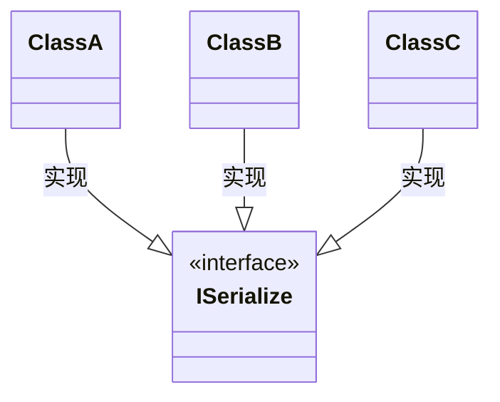

# 如何利用类模板进行可扩展设计

之前有小伙伴要设计序列化实现方案,鉴于项目重度依赖`Qt`,他选用`QDataStream`来实现,即针对每一种类型`T`,只需要提供如下两个函数:

```C++
QDataStream& operator<<(QDataStream&,T const&);
QDataStream& operator>>(QDataStream&,T &);
```

由于`Qt`自身的类型均已提供了相应实现,这个方案明显节省了大量重复代码.不过面临一个问题,如何处理现有大量的非`Qt`类型? 这些类型以`Java`的风格实现,派生自统一的基类,已经有了序列化实现.类图类似如下:



从这个场景可以看到,使用面向对象思路来进行可扩展设计面临的困境,如果类型之间没有逻辑上的派生关系,基本上就要为每种不想关的类型提供序列化适配了.

那么是否有方案可以解决这个问题呢?首先我们来看一下在`STL`中是如何为自定义类型设计`hash`扩展的.

### 可扩展的`hash`设计

如果使用接口来解决可扩展问题,那么设计类似如下:

```C++
class IHashable
{
public:
    virtual ~IHashable()=default;
    virtual std::size_t hash() const noexcept = 0;
};
```

在C++中不是这样的设计思路,因为那些"C++专家"们倾向于编译期扩展,即通过类模板实现:

```C++
template<typename T>
struct Hash;

template<typename T>
std::size_t hash(T const& v){
    return Hash<T>::hash(v);
}
```

这时,如果新增了某种类型,只需要使用类模板特化即可:

```C++
struct Object{
    int id;
};

template<>
struct Hash<Object>{
  static std::size_t hash(Object const& o){
      return o.id;
  }  
};
```

而针对`C++`中类容器类型,则可以通过类似技术批量实现,例如`std::pair<>`:

```C++
template<typename T,typename U>
struct Hash<std::pair<T,U>>{
    static std::size_t hash(std::pair<T,U> const& o){
        //注意只为演示,多key的hash算法请google搜索C++ hash combine
        return Hash<T>::hash(o.first)+Hash<U>::hash(o.second);
    }
}
```

这样任何类型只需要提供`Hash`类模板特化,其构成的`std::pair`都可以计算出哈希值.

那么派生类型该如何处理呢? 目前类模板只有一个模板参数,只能特化,那就只能为每个派生类型均进行类特化实现了,如果想要为某一系列复合特征的类型提供处理,那就需要用到`SFINAE`及类模板偏特化技术了.

### 使用`SFINAE`及类模板偏特化

`SFINAE`相对难懂,幸好我们面临的场景不复杂,这里首先来个开胃小菜来感受一下.

在`STL`中提供了`std::to_string`方法,能够将数值类型转换为字符串,如果我们想要某个`asString`函数,能够转换各种类型为字符串:

```C++
template<typename T>
std::string asString(T const& v);
```

对于数值类型实现如下:

```C++
template<typename T>
std::string asString(T const& v){
    return std::to_string(v);
}
```

但是对于`std::string`,是不能调用`std::to_string`的,可以选择直接返回,即:

```C++
std::string asString(std::string const& v){
    return v;
}
```

而很明显,模板函数版本的是能够覆盖这个实现的,编译会报错,如何处理呢? 我们可以判断类型`T`是否为`std::string`从而采用不同实现:

```C++
//T为std::string的版本
template<typename T>
std::enable_if_t<std::is_same_v<T,std::string>,std::string> asString(T const& v){
    return v;
}
//T不是std::string的版本
template<typename T>
std::enable_if_t<!std::is_same_v<T,std::string>,std::string> asString(T const& v){
    return std::to_string(v);
}
```

这就是`SFINAE`的一个简单场景实现.这对于我们的派生类型已经足够了.现在来看了一看之前的`Hash`如何实现.

首先为`Hash`添加一个新的模板参数,作用是支持使用`SFINAE`进行偏特化:

```C++
template<typename T,typename E=void>
struct Hash;
```

由于类型`E`具有默认类型,之前的代码不需要任何调整.对于类似如下派生类型:

```C++
class IHashable{};

class Object:public IHashable{};
```

可以采用如下方式:

```C++
template<typename T>
struct Hash<T,std::enable_if_t<std::is_base_of_v<IHashable,T>>>{
  static std::size_t hash(T const& v){
      return v.hash();
  }  
};
```

这样针对任何基于`IHashable`的类型,均可以调用全局`hash`模板函数计算哈希值.

### 序列化问题的解决方案

现在回到开始提到的序列化问题,我们完全可以为其提供更为通用的解决方案,这里定义序列化操作类模板如下:

```C++
template<typename OS,typename T,typename E = void>
struct Serializer;
```

用来表示一系列类似如下的类模板:

```C++
template<typename OS>
class Serializer{
    //operator<<的函数版本
    template<typename T>
	OS& lshift(OS& os,T const& v);
    
    //operator>>的函数版本
    template<typename T>
    OS&  rshift(OS& os,T& v);
}
```

假设基于`SFINAE`我们有如下类型萃取操作:

```C++
template<typename OS,typename T>
constexpr auto has_lshift_v;//用来判断类型是否具有OS<<T

template<typename OS,typename T>
constexpr auto has_right_v;//用来判断类型是否具有OS>>T
```

那么对于`OS`类型为`QDataStream`的场景实现如下:

```
template<typename OS,typename T>
struct Serializer<OS,T,std::enable_if_t<has_lshit_v<OS,T>>>{
	 OS& lshift(OS& os,T const& v){
		 return os<<v;
	 }
	 OS& rshift(OS& os,T & v){
	 	 return os>>v;
	 }
};
```

这种实现不仅仅针对`QDataStream`,也针对其它能够响应`<<`和`>>`操作的流.

之前提到的`ISerialize`系列类结构,实现方式如下:

```C++
template<typename T>
struct Serializer<QDataStream,T,std::enable_if_t<std::is_base_of_v<ISerialize,T>>>{
	 QDataStream& lshift(QDataStream& os,T const& v){
		 //根据场景实现
         return os;
	 }
	 QDataStream& rshift(QDataStream& os,T & v){
         //根据场景实现
	 	 return os;
	 }
};
```

这里我们实现了流类型和数据类型的两级扩展结构,既可以使用统一接口序列化和反序列处理类型到`QDataStream`的序列化,也可以响应其它流类型.

### 运行时扩展的情况如何处理？

之前描述的全是基于用户使用的时候知道明确的类型,即编译期书写代码进行序列化操作.那么有没有反过来场景的解决方案?即,所有类型提供`ISerialize`能力?

当然可以! 使用类型擦除技术,我们可以为任意类型提供相应操作,为了简单期间,这里假设`ISerialize`接口为:

```C++
class ISerialize
{
public:
    virtual ~ISerialize()=default;
  	virtual void save(std::ostream& os) const = 0;  
};
```

那么,类型`T`需支持如下操作:

```C++
std::ostream& operator<<(std::ostream& os,T const& v);
```

为每一种类型`T`提供`ISerialize`派生,即:

```C++
template<typename T>
class SerializeImpl{
	T v;
    explicit SerializeImpl(T arg):v(std::move(arg)){};
    
    void save(std::ostream& os) const override{
        os << v;
    } 
};
```

然后提供统一的容器(包装类):

```C++
class Serialize{
	std::unique_ptr<ISerialize> impl;
public:
    template<typename T>
    Serialize(T v):
    	impl(std::make_unique<SerializeImpl<T>>(std::move(v))){};
    
    friend std::ostream& operator<<(std::ostream& os, const Serialize& self) {
        self.impl->save(os);
        return os;
    }    
};
```

使用示例如下:

```C++
void print(Serialize v){
    std::cout<<v;
}

int main(){
    print(42);
    print(1.414);
    return 0;
}
```

