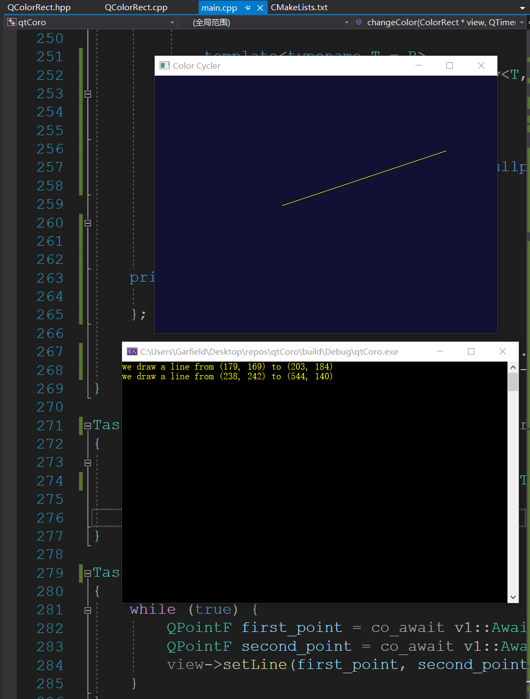

# 协程与Qt信号的整合实现


协程有助于将异步的代码以类似同步的方式书写,这在某些场景下非常有用,譬如一个程序具备线绘制功能,通常用`Qt`实现必然需要处理中间状态,类似如下:

```C++
bool got_first_point{false};//是否是获取第一个点
QPointF first_point;//第一个点

QObject::connect(&w, &MyWidget::click, [&](QPointF p) {
    //如果没有获取第一个点则点击进入新状态
    //否则绘制线然后继续进入第一个点选择
    if (got_first_point) {
        w.setLine(first_point, p);
        got_first_point = false;
    } else {
        first_point = p;
        got_first_point = true;
    }
});
```

那么是否有可能实现成如下形式?

```C++
QPointF first_point  = co_await AwaitableSignal(&w, &MyWidget::click);
QPointF second_point = co_await AwaitableSignal(&w, &MyWidget::click);
w.setLine(first_point, second_point);
```

这种写法无需引入中间状态,写起来也更加直接易懂.下面我们就根据[Qt and the Coroutines TS](http://jefftrull.github.io/qt/c++/coroutines/2018/07/21/coroutines-and-qt.html)中展示的这个示例,来一步步解析并实现这种写法,将协程和`Qt`的信号整合到一起.

## 业务场景

这里要用`Qt`实现具备如下功能的应用程序:

1. 定时修改窗体背景色
2. 用户点击两点可以绘制出一条黄色的线
3. 用户绘线完成后命令行输出消息

## 实现思路

首先建立开发环境,实现对应的窗体类,提供鼠标点击、线创建两个信号,以及改变颜色、绘制线两个槽.

然后提供协程的`Promise`-`Task`类型,用来作为协程的返回值.

之后针对定时修改背景色,提供简单的信号实现.

最后根据上一步简单的信号实现修改为满足`Qt`信号场景的完整实现.

## 开发环境及窗体类的实现

为了简单起见,直接使用支持`C++20`的`Visual Studio 16 2019`,`Qt`版本选择支持`Visual Studio 2015`的即可,`MSVC`在`MSVC2015`到`MSVC2019`保持二进制兼容.

假设窗体类实现为`QColorRect.hpp`和`QColorRect.cpp`,协程版信号和主程序均在`main.cpp`中,那么`CMakeLists.txt`内容如下:

```C++
cmake_minimum_required(VERSION 3.15)

project(qtCoro)

#设置C++标准为C++20
set(CMAKE_CXX_STANDARD 20)
set(CMAKE_CXX_STANDARD_REQUIRED ON)
set(CMAKE_CXX_EXTENSIONS OFF)

##如何使用CMake配置Qt参见以下链接
##https://doc.qt.io/qt-5/cmake-get-started.html
#list(APPEND CMAKE_PREFIX_PATH  "E:/external/deps_x64_140/qt5-src/msvc2015_64")
list(APPEND CMAKE_MODULE_PATH  ${CMAKE_CURRENT_SOURCE_DIR}/cmake)
include(DeployQtRuntime)

##解决方案采用文件夹组织
set_property(GLOBAL PROPERTY USE_FOLDERS ON)

#指定构建结果输出目录    
if(NOT DEFINED CMAKE_RUNTIME_OUTPUT_DIRECTORY)
    set(CMAKE_RUNTIME_OUTPUT_DIRECTORY "${CMAKE_BINARY_DIR}/$<CONFIG>")
endif()
if(NOT DEFINED CMAKE_LIBRARY_OUTPUT_DIRECTORY)
    set(CMAKE_LIBRARY_OUTPUT_DIRECTORY "${CMAKE_BINARY_DIR}/$<CONFIG>")
endif()

add_executable(qtCoro)
target_sources(qtCoro
    PRIVATE main.cpp
    QColorRect.hpp QColorRect.cpp 
)

set_target_properties(qtCoro PROPERTIES
    AUTOMOC ON
)

find_package(Qt5 COMPONENTS Widgets REQUIRED)
target_link_libraries(qtCoro
    PRIVATE Qt5::Widgets
)

#之前文章讲解过的Qt运行时部署函数
DeployQtRuntime(TARGET qtCoro)
```

其中`QColorRect.hpp`实现如下:

```C++
#pragma once

#include <optional>
#include <string>
#include <QWidget>
#include <QLine>

class ColorRect : public QWidget
{
    Q_OBJECT

public:
    ColorRect(QWidget* parent = 0);

public slots:
    void changeColor();
    void setLine(QPointF, QPointF);

signals:
    void click(QPointF);
    void lineCreated(QPointF, QPointF);

protected:
    void mousePressEvent(QMouseEvent*) override;
    void paintEvent(QPaintEvent* event) override;

private:
    void setColor(std::string const&);
    std::vector<std::string> colorList;
    std::size_t              curColor;
    std::optional<QLineF>    line;
};
```

`QColorRect.cpp`内容如下:

```C++
#include <QMouseEvent>
#include <QPainter>
#include "QColorRect.hpp"

ColorRect::ColorRect(QWidget* parent) :
    QWidget{ parent },
    colorList{ {"#111111", "#113311",
                "#111133", "#331111",
                "#333311", "#331133",
                "#661111", "#116611",
                "#111166", "#663311",
                "#661133", "#336611",
                "#331166", "#113366"} },
    curColor{ 0 }
{}

void ColorRect::setColor(std::string const& col)
{
    setStyleSheet(("background-color:" + col).c_str());
}

void ColorRect::changeColor()
{
    curColor++;
    if (curColor >= colorList.size())
    {
        curColor = 0;
    }
    setColor(colorList[curColor]);
}

void ColorRect::mousePressEvent(QMouseEvent* e)
{
    emit click(e->windowPos());
}

void ColorRect::paintEvent(QPaintEvent*)
{
    if (line) {
        QPainter painter(this);
        painter.setPen(QPen{ QColor{"yellow"} });
        painter.drawLine(*line);
    }
}

void ColorRect::setLine(QPointF p1, QPointF p2)
{
    line = QLineF{ p1, p2 };
    emit lineCreated(p1, p2);
}
```

## `Task`类型

协程的返回值比较特殊,概念上被称为`Promise`,考虑到目前的场景函数返回值均为`void`,根据`Promise`的要求简单实现如下:

```C++
//http://jefftrull.github.io/qt/c++/coroutines/2018/07/21/coroutines-and-qt.html
#include <coroutine>

struct Task {
    struct promise_type;

    Task(promise_type& p)
        :coro_(std::coroutine_handle<promise_type>::from_promise(p))
    {};

    Task(Task const&) = delete;
    Task(Task&& other) noexcept
        :coro_(std::exchange(other.coro_, nullptr))
    {};
	
    //注意析构时会销毁coro_,应在运行期间保证生命周期
    ~Task() noexcept {
        if (coro_) {
            coro_.destroy();
        }
    }

    struct promise_type
    {
        //在进入用户代码之前不suspend,直接进入
        auto initial_suspend() const noexcept {
            return std::suspend_never();
        }
        //用户代码执行完成之后不suspend,直接返回
        auto final_suspend() const noexcept {
            return std::suspend_never();
        }
        Task get_return_object() {
            return Task(*this);
        }
        //返回void,如果有返回值则写法有所不同,为return_value
        void return_void() const noexcept {};
        void unhandled_exception() {};
    };
private:
    std::coroutine_handle<promise_type> coro_;
};
```

关于`Promise`可以阅读文章[C++ Coroutines: Understanding the promise type](https://lewissbaker.github.io/2018/09/05/understanding-the-promise-type),或者参考库`cppcoro`的`task`等实现.

## 定时器信号

定时器信号比较简单,其实现思路如下:

1. 实现带有`QMetaObject::Connection`的`AwaitableSignal`类
2. 使用`QObject::connect`建立信号与槽,其中槽实现为:断开连接,重启`resume`执行.
3. 实现复合要求的`awaiter`.

首先看一下`AwaitableSignal`类的实现:

```C++
struct AwaitableSignal
{
    //以类实例,及类的成员方法(信号)来构造
    template<typename U, typename... Args>
    AwaitableSignal(U* obj, void(U::* m)(Args...))
    {
        //由于每次co_await都会构造该Signal,当信号被触发,
        //槽执行时,先断开连接,然后调用coro_的resume来
        //切换到当前函数体继续往下执行
        conn_ = QObject::connect(obj, m, [&]() {
            QObject::disconnect(conn_);
            coro_.resume();
            });
    };
	//TODO 
private:
    QMetaObject::Connection conn_;
    std::coroutine_handle<> coro_;
};
```

这里的`awaiter`也相对比较简单,需要实现以下三个函数:

1. `await_ready()->bool`:`awaiter`是否准备好,准备好则不需要暂停执行
2. `await_suspend()`:在进入暂停前要做的事情
3. `await_resume()`:在恢复执行后要做的事情

其实现如下:

```C++
struct AwaitableSignal
{
    //构造函数
    struct awaiter {
        awaiter(AwaitableSignal* arg)
            :awaitable_(arg) {};

        bool await_ready() const noexcept {
            //槽必须由信号触发才完成
            return false;
        }

        void await_suspend(std::coroutine_handle<> handler) noexcept {
            //记录一下当前的handle供后续resume使用
            awaitable_->coro_ = handler;
        }
		//无需处理
        void  await_resume() noexcept {};
    private:
        AwaitableSignal* awaitable_ = nullptr;
    };
	
    //co_await操作符重载
    awaiter operator co_await() {
        return awaiter{ this };
    }
private:
    //成员变量
    std::coroutine_handle<> coro_;
};
```

现在使用它来处理定时器事件,代码如下:

```C++
#include <QApplication>
#include <QTimer>
#include "QColorRect.hpp"

Task changeColor(ColorRect* view, QTimer* timer)
{
    while (true) {
        co_await AwaitableSignal(timer, &QTimer::timeout);
        view->changeColor();
    }
}
int main(int argc, char* argv[])
{
    QApplication app(argc, argv);
    ColorRect view;
    view.setWindowTitle("Color Cycler");
    view.show();
    QTimer* timer = new QTimer(&app);
    timer->start(500);
	
    //保持Task生命周期,否则信号触发时handle就无效了,导致崩溃
    auto t = changeColor(&view,timer);
    return app.exec();
}
```

## `Awaitable`信号的实现

上述展示的`AwaitableSignal`非常简单,但是只能解决信号无参数的场景,一旦有参数就会变得复杂.

这里根据信号参数分为以下场景:

1. 无参数
2. 有参数

在没有参数的情况下与上述实现一致,在有参数的情况下,一个参数则返回该参数即可,多个参数则用`std::tuple`将其保存并返回.

另外,`Qt`的信号有一些参数只是占位符,并不需要处理,例如`QTimer::timeout(QTimer::QPrivateSignal)`,这种场景下要移除掉,否则会影响到代码书写.

这里拆分为如下步骤来分别分析与实现:

1. `AwaitableSignal`不同返回结果情况下的槽实现
2. `AwaitableSignal`根据结果不同的基类实现
3. `AwaitableSignal`实现
4. 使用样例

### `AwaitableSignal`的槽实现

在之前,由于结果为空,比较简单,槽直接在`AwaitableSignal`类中提供:

```C++
struct AwaitableSignal
{
    //以类实例,及类的成员方法(信号)来构造
    template<typename U, typename... Args>
    AwaitableSignal(U* obj, void(U::* m)(Args...))
    {
        //由于每次co_await都会构造该Signal,当信号被触发,
        //槽执行时,先断开连接,然后调用coro_的resume来
        //切换到当前函数体继续往下执行
        conn_ = QObject::connect(obj, m, [&]() {
            QObject::disconnect(conn_);
            coro_.resume();
            });
    };
	//TODO 
private:
    QMetaObject::Connection conn_;
    std::coroutine_handle<> coro_;
};
```

而在这里有三种情况:

1. 信号无参数:结果为空
2. 信号1个参数:结果为该参数
3. 信号多个参数:结果为多个参数打包成的`std::tuple`

因而采用类模板特化/偏特化实现,首先定义类模板如下:

```C++
template<typename R, typename... Args>
struct AwaitableSignalSlot;
```

那么信号无参数,即结果`R`为`void`的场景特化模板实现为:

```C++
template<>
struct AwaitableSignalSlot<void>
{
    auto operator()(QMetaObject::Connection& conn,
        std::coroutine_handle<>& handle)
    {
        return [&conn, &handle]() {
            QObject::disconnect(conn);
            handle.resume();
        };
    };
};
```

信号具有1个参数,类型为`Arg`,则返回的结果`R`也为`Arg`,偏特化实现如下:

```C++
template<typename Arg>
struct AwaitableSignalSlot<Arg, Arg>
{
    auto operator()(QMetaObject::Connection& conn,
        Arg& result,
        std::coroutine_handle<>& handle)
    {
        return [&conn,&result, &handle](Arg arg) {
            QObject::disconnect(conn);
            result = arg;
            handle.resume();
        };
    };
};
```

信号具有多个参数,类型为`Args`,则返回的结果`R`为`std::tuple<Args>`,偏特化实现如下:

```C++
template<typename... Args>
struct AwaitableSignalSlot<std::tuple<Args...>, Args...>
{
    auto operator()(QMetaObject::Connection& conn,
        std::tuple<Args...>& result,
        std::coroutine_handle<>& handle)
    {
        return [&conn,&result, &handle](Args... args) {
            QObject::disconnect(conn);
            result = std::make_tuple(args...);
            handle.resume();
        };
    };
};
```

### `AwaitableSignal`的基类实现

对于`AwaitableSignal`来说,结果有两种情况:信号有参数,信号无参数. 我们实现有参数版本的类模板,然后特化无参数`void`版本. 基类实现如下:

```C++
template<typename R>
struct AwaitableSignalBase {
    template<typename U, typename... Args>
    AwaitableSignalBase(U* obj, void(U::* m)(Args...),
        std::coroutine_handle<>& handle)
    {
        conn_ = QObject::connect(obj, m,
            AwaitableSignalSlot<R, Args...>()(
                conn_,
                args_,
                handle
                ));
    };
protected:
    R  args_;
    QMetaObject::Connection conn_;
};
```

那么`R`为`void`的特化版本为:

```C++
template<>
struct AwaitableSignalBase<void> {
    template<typename U, typename... Args>
    AwaitableSignalBase(U* obj, void(U::* m)(Args...),
        std::coroutine_handle<>& handle)
    {
        conn_ = QObject::connect(obj, m,
            AwaitableSignalSlot<void>()(
                conn_,
                handle
                ));
    };
protected:
    QMetaObject::Connection conn_;
};
```

### `AwaitableSignal`实现

对于`AwaitableSignal`来说,最为复杂的是根据构造信息确定返回结果,再来回顾一下设计目标:

```C++
QPointF first_point = co_await AwaitableSignal(view, &ColorRect::click);
```

对于`AwaitableSignal`来说,只需要提供对象和对象类型的方法即可,要根据方法参数推导出结果.

首先,根据信号参数列表移除掉空类型,生成`std::tuple`:

```C++
//实现参考自以下链接
//https://stackoverflow.com/questions/18366398/filter-the-types-of-a-parameter-pack
template<typename...>
struct Filter;

template<>
struct Filter<> {
    using type = std::tuple<>;
};

template<typename, typename >
struct FilterHelpr;
template<typename T, typename ... Ts>
struct FilterHelpr<T, std::tuple<Ts...>>
{
    using type = std::tuple<T, Ts...>;
};

template<typename T, typename... Ts>
struct Filter<T, Ts...>
{
    //如果T不为空类型则使用FilterHelper拼接成std::tuple
    //否则跳过变量下一个
    using type = std::conditional_t<!std::is_empty_v<T>,
        typename FilterHelpr<T, typename Filter<Ts...>::type>::type,
        typename Filter<Ts...>::type>;
};
```

最终对于信号参数,无论多少个,生成的都是`std::tuple`,这时根据参数个数转换成真正的返回结果类型:

```C++
//默认用传递的类型
template<typename T>
struct ResultTypeImpl
{
    using type = T;
};

//如果是只有一个类型的tuple,则结果类型为T
template<typename T>
struct ResultTypeImpl<std::tuple<T>>
{
    using type = T;
};

//如果是没有类型的tuple,则结果为void
template<>
struct ResultTypeImpl<std::tuple<>>
{
    using type = void;
};
```

最终实现从类的成员函数获取信号结果类型的模板:

```C++
template<typename F>
struct Impl;

template<typename R, typename C, typename... Args>
struct Impl<R(C::*)(Args...)> {
    using type = typename ResultTypeImpl<typename Filter<Args...>::type>::type;
    using class_t = C;
};
```

现在准备动作已经完成,可以用来组合成`AwaitableSignal`:

```C++
template<typename F, typename R = typename Impl<F>::type>
struct AwaitableSignal :AwaitableSignalBase<R>
{
    template<typename U>
    AwaitableSignal(U* o, F m)
        :AwaitableSignalBase<R>(o, m, coro_)
    {};

    struct awaiter {
        //见下文
    };

    awaiter operator co_await() {
        return awaiter{ this };
    }
private:
    std::coroutine_handle<> coro_;
};
```

而`awaiter`实现与之前的稍微有些差别,即`await_resume`根据情况返回`void`或者结果:

```C++
struct awaiter {
    awaiter(AwaitableSignal* arg)
        :awaitable_(arg) {};

    bool await_ready() const noexcept {
        return false;
    }

    void await_suspend(std::coroutine_handle<> handler) noexcept {
        awaitable_->coro_ = handler;
    }
	
    //如果R为void,则什么也不做
    template<typename T = R>
    std::enable_if_t<std::is_same_v<T, void>, void>
        await_resume() noexcept {};
	
    //如果R不为void,则返回AwaitableSignal的args_
    template<typename T = R>
    std::enable_if_t<!std::is_same_v<T, void>, R>
        await_resume() noexcept {
        return awaitable_->args_;
    };
private:
    AwaitableSignal* awaitable_ = nullptr;
};
```

最后再使用`C++17`的`Class template argument deduction (CTAD) `来支持无模板参数直接构造`AwaitableSignal`:

```C++
template<typename T, typename U, typename... Args>
AwaitableSignal(T* o, void(U::*)(Args...))->AwaitableSignal<void(U::*)(Args...)>;
```

### 使用样例

```C++
#include <QApplication>
#include <QTimer>
#include <iostream>
#include "QColorRect.hpp"

//AwaitableSignal实现

Task changeColor(ColorRect* view, QTimer* timer)
{
    while (true) {
        co_await AwaitableSignal(timer, &QTimer::timeout);
        view->changeColor();
    }
}

Task drawLine(ColorRect* view)
{
    while (true) {
        QPointF first_point = co_await AwaitableSignal(view, &ColorRect::click);
        QPointF second_point = co_await AwaitableSignal(view, &ColorRect::click);
        view->setLine(first_point, second_point);
    }
}

Task report(ColorRect* view)
{
    while (true) {
        auto [p1, p2] = co_await AwaitableSignal(view, &ColorRect::lineCreated);
        std::cout << "we draw a line from (";
        std::cout << p1.x() << ", " << p1.y() << ") to (";
        std::cout << p2.x() << ", " << p2.y() << ")\n";
    }
}

int main(int argc, char* argv[])
{
    QApplication app(argc, argv);
    ColorRect view;
    view.setWindowTitle("Color Cycler");
    view.show();
    QTimer* timer = new QTimer(&app);
    timer->start(500);

    auto t1 = changeColor(&view,timer);
    auto t2 = drawLine(&view);
    auto t3 = report(&view);
    return app.exec();
}
```

运行效果如下:




