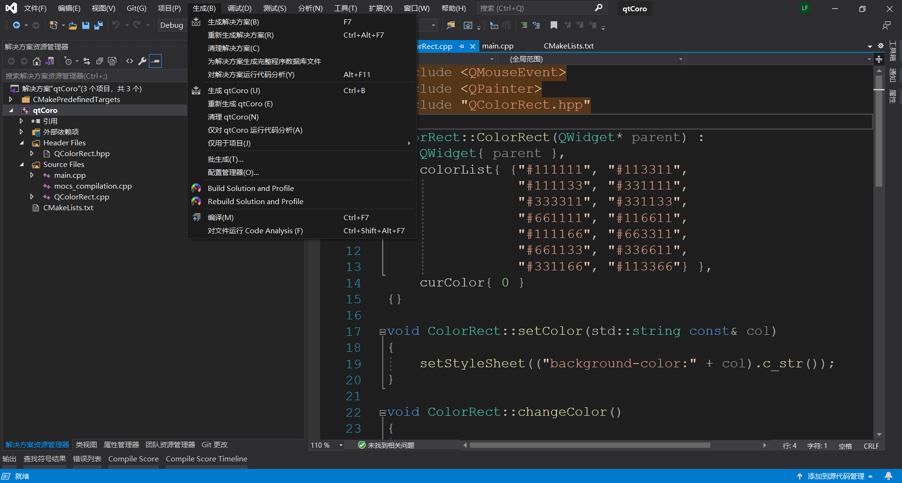
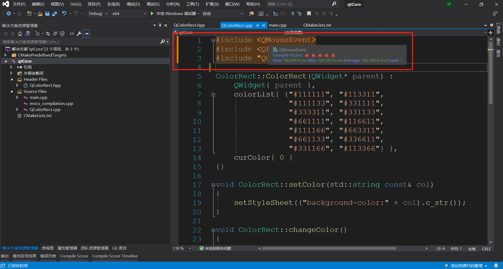
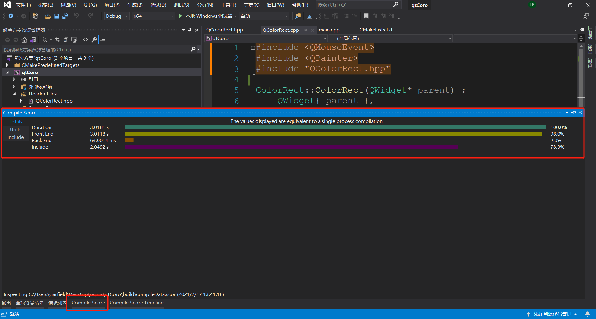
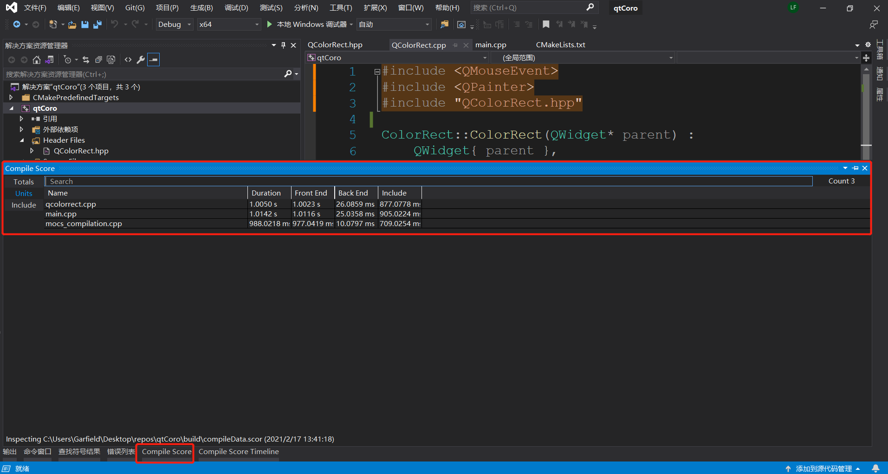
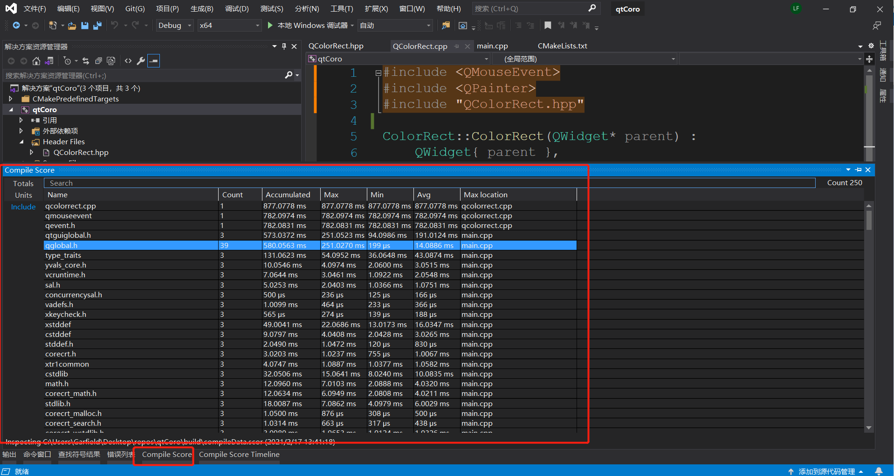
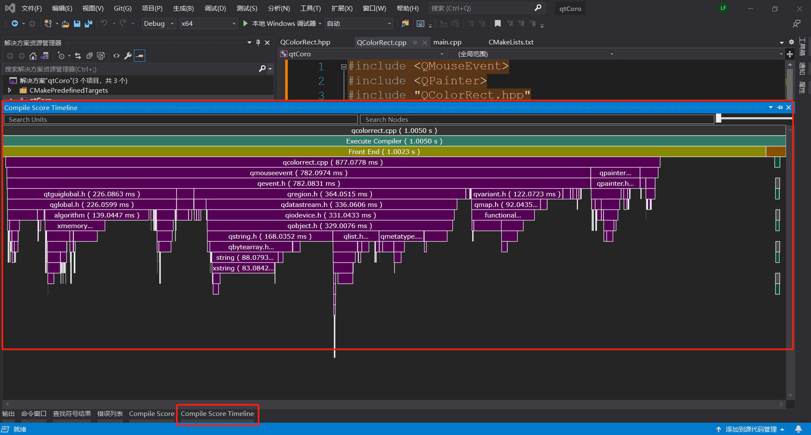

# 辅助编译效率可视化分析的插件Compile Score

对于`C++`开发者来讲,构建效率是个值得关注的问题.社区不断涌现一些工具用来分析,包括编译器都开始提供各种选项来输出这些信息,这里介绍一个`Visual Studio 2019`的插件,可以执行构建并可视化编译性能分析数据.

[Compile Score](https://marketplace.visualstudio.com/items?itemName=RamonViladomat.CompileScore)插件具备以下特性:

- 集成到生成菜单的解决方案构建和分析
- 源代码位置高亮头文件时间`cost`,鼠标悬浮显示耗时
- 整个工程级别的性能分析数据
- 单个编译单元的性能分析数据

这里简单介绍一下编译效率的分析:`C++`的构建以源代码为构建单元(即`TranslationUnit`),编译步骤分为前端`Front End`处理和后端`Back End`处理,其中前端处理负责预处理器处理等,最终生成抽象语法树`AST`,后端处理则是为了生成`.obj`文件,编译器优化即在后端.通常耗时最多的就是前端预处理器部分,即`C++`开发者熟知的头文件`include`. 在进行调整/优化时,务必搞清楚性能瓶颈或者优化点在哪里,有的放矢.

首先,在`生成`菜单下找到`Build Solution and Profile`或者`Rebuild Solution and Profile`来构建解决方案:

一旦构建完成,在源代码中即可看到头文件的`include`被高亮,鼠标悬浮会显示耗时等信息:

如果希望查看整个解决方案的信息(`耗时`、`前端`、`后端`、`include`耗时),找到`Compile Score`视图,其`Totals`页签即是:

要检视整个解决方案所有构建单元的信息可以切换到`Units`页签:

如果希望查看所有的头文件`include`耗时统计则切换到`Include`页签:

如果希望查看单个构建单元耗时,快捷方法是源代码中右键`Show Timeline`,也可以在`Compile Score`的`Units`视图双击对应单元,或者在`Compile Score Timeline`中输入名称查询:

