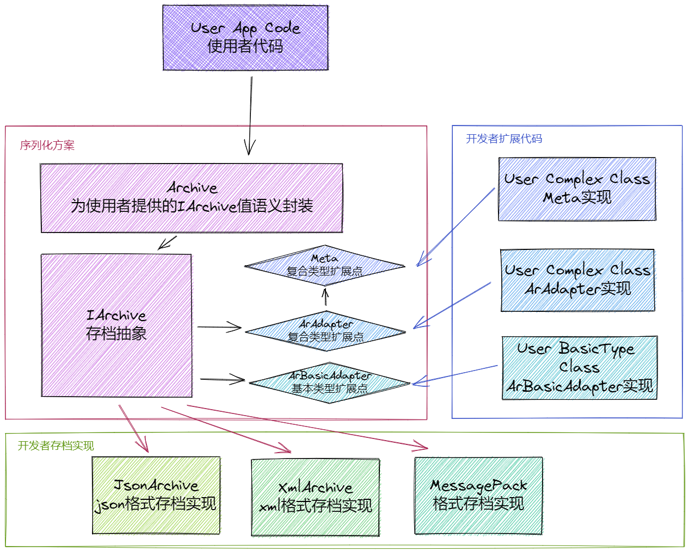

# 内存结构的序列化方案

在设计软件时不可避免地需要处理序列化问题,由于`C++`语言层面的反射机制尚未有标准,如果不采用数据库等已有方案,这个问题就变得很考验开发者的设计能力和技术水平.

通过对`Data-Oriented`设计与编程不断深入的认识,对`JSON`、`MessagePack`等对象序列化规格应用场景的不断了解,以及`C++`编译期与运行期技术的运用.我意识到,对于内存结构来讲,设计出在通用性、扩展性、开发者体验、性能表现等方面具备较好表现的方案是可行的.

接下来将会重点阐述以下内容:

- 对序列化场景的认识;
- 方案设计的目标(预期使用方式);
- 方案的基本结构;
- 方案采用的一些支撑技术.

后续将在合适时机,展示如何设计并实现每一部分.

## 序列化需求场景

开发者实际上对序列化的需求场景比较复杂,譬如:

- 能够序列化为`xml`、`json`等不同格式的数据;
- 能够针对特殊类型定制化处理;
- 尽可能少写代码;
- 尽可能不要侵入原有代码(譬如要求支持序列化的类型派生自某接口);
- 广泛的适用性;
- 性能表现.

确实,开发者选择方案时无外乎以下几点:

1. 是否满足业务需求;
2. 是否满足性能需求(时间、空间);
3. 使用难度;
4. 开发成本.

通常序列化方案都会或多或少在以上几点令人不太满意,譬如:

- 有一些序列化方案是要求开发者派生自类似于`ISerializable`的接口类:

  如果开发者要序列化的内容全部由自己把控,这倒是没什么问题,但是现实情况并非如此.为了正常使用,开发者封装了这些类型,从而导致项目中出现一些莫名其妙的`龟腚`:某些语言、库内置的类型不能使用,需要使用其它类型替代.

- 定制化支持弱:

  序列化的结果可能需要是`xml`格式,也可能是`json`格式,当结果占用空间较大时,又希望使用二进制或者某些压缩格式`MessagePack`,部分方案不能或者不容易支持;针对特殊类型,譬如颜色、时间戳等,它的序列化是要定制的,可能以整数或者字符串存储,如果采用类似反射的机制,它会与代码书写时的类型绑定,调整时并不容易.

- 开发成本较高:

  序列化时,不可避免地面临每一种类型都要书写代码实现,读写各提供一个函数定义及实现;`C++`、`Qt`都有自己的容器和词汇类型,如何支持也是问题.

- 不易用:

  实现序列化代码,就要进行读写操作,要使用哪些接口,有哪些注意事项,都会对开发者造成困扰;从内存结构生成序列化结果,或者解析序列化结构到内存结构,接口如何设计,怎么操作,也是在考验开发者.

以上这些问题,`json`库[JSON for Modern C++](https://json.nlohmann.me/)(`nlohmann/json`)解决得算是非常出色,值得学习和借鉴.

## 方案设计的预期目标

先看一个使用示例,例如开发者设计了两个类型:

```C++
struct MyObject
{
    bool bV;
    int iV;
    double dV;
    std::string sV;
    std::vector<int> iVs;
    std::map<int, std::string> kVs;
};

struct MyComplexObject
{
    MyObject oV;
    std::vector<double> dVs;
};
```

希望能够为这两种类型进行序列化支持,则开发者可以这样实现:

```C++
//类型偏特化,并使用辅助宏
template<>
struct Meta<MyObject> :std::true_type
{
    static constexpr auto Make() noexcept {
        return MAKE_META(MyObject, bV, iV, dV, sV, iVs, kVs);
    }
};

//对于反感宏的开发者,可以采用如下方式实现
template<>
struct Meta<MyComplexObject> :std::true_type
{
    static constexpr auto Make() noexcept {
        return MakeMeta("MyComplexObject",
            MakeMember("oV", &MyComplexObject::oV),
            MakeMember("dVs", &MyComplexObject::dVs)
        );
    }
};
```

然后,开发者就可以序列化到存档:

```C++
MyObject obj{};
//初始化obj
MyComplexObject obj1{};
//初始化obj1

//定义存档,要求格式为json
auto ar = Archive("json");

//存储内存对象
ar.write("MyObject", obj);
ar.write("MyComplexObject", obj1);

//调试用,转换为字符串
auto result = ar->to_string();
//保存到文件
ar->save("result.json");
```

从存档读取则类似如下:

```C++
//定义存档并从文件加载内容
auto ar = Archive("json");
ar->open("result.json");

//定义内存对象,并从存档加载
MyObject obj{};
ar.read("MyObject", obj);
MyComplexObject obj1{};
ar.read("MyComplexObject", obj1);
```

要更换存档格式,只需要构造文档时替换格式字符串:

```C++
auto ar = Archive("MessagePack");
ar.write("MyObject", obj);
ar.write("MyComplexObject", obj1);
ar->save("result.bin");
```

存档类`Archive`是接口类`IArchive`的值语义封装,使得开发者可以按照普通类型构造、复制:

```C++
void test_archive_clone(const Archive& other)
{
    //从other构造新的内容一致的存档
    Archive ar{ other };

    MyObject obj{};
    ar.read("MyObject", obj);
    MyComplexObject obj1{};
    ar.read("MyComplexObject", obj1);
}
```

### 序列化操作设计

对于开发者来讲,该序列化方案只提供`4`个`API`系列:

```C++
//数组形式的写入函数
template<typename T>
void write(const T& v);

//键值形式的写入函数
template<typename T>
void write(const char* member,const T& v);

//读取函数
template<typename T>
bool read(T& v);

//键值形式的读取函数
template<typename T>
bool read(const char* member,T& v);
```

任何内存结构从构成来讲都是一个结构树,因而,开发者使用上述`API`就可以满足其需求,无需其它复杂方式.

注意,文件`IO`、调试支持等附加`API`也会存在,但不属于核心、主要的使用需求.

另外,对于类型族,例如某个接口类的派生类,这套`API`也能应对,譬如:

```C++
class IInterface{
public:    
    virtual ~IInterface()=default;
    //接口定义
};

struct Class{
  	std::unique_ptr<IInterface> impl;  
};

template<>
struct Meta<Class> :std::true_type
{
    static constexpr auto Make() noexcept {
        return MAKE_META(Class, impl);
    }
};
```

当然,序列化方案并不清楚如何处理`IInterface`,因而需要开发者通过扩展机制提供`IInterface`与`IArchive`之间的处理.

### 序列化定制/扩展方式

考虑到现实场景,该方案提供了多种定制与扩展机制,来应对相应场景的需求:

1. 基本数据类型扩展点`ArBasicAdapter`
2. 复合数据类型扩展点`ArAdapter`
3. 类型`Meta`扩展点`Meta`

如果开发者设计的类型`T`,譬如颜色,希望以基本数据类型来序列化,则需要偏特化`ArBasicAdapter`:

```C++
struct Color{
    int iV;
};

template<>
struct ArBasicAdapter<Color>{
	//读取实现
    static bool read(IArchive& ar,Color& v){
        int iV{};
        if(ar.read(iV)){
            v.iV = iV;
            return true;
        }
        return false;
    }
	static bool read(IArchive& ar,const char* member,Color& v);//省略
    //写入实现
    static void write(IArchive& ar,const Color& v){
        ar.write(v.iV);
    }
	static void write(IArchive& ar,const char* member,const Color& v);//省略    
};
```

如果开发者设计的类型`T`,包含多个成员变量,则可以偏特化`ArAdapter`:

```C++
struct Object{};

template<>
struct ArAdapter<Object>{
  	//从存档读取,如果Object成员不公开,可以通过接口写入来修改Object
    static bool read(IArchive& ar,Object& v);  
    static void write(IArchive& ar,const Object& v);
};
```

如果开发者设计的某系列类型`Ts`,有特殊要求,则可以综合偏特化`Meta`及`ArAdapter`来应对:

```C++
template<typename T>
struct Meta<T,/*定制条件,筛选该系列类型*/>:public std::true_type{
    //提供特定的格式以支持ArAdapter
};

template<typename T>
struct ArAdapter<T,/*定制条件,筛选该系列类型*/>{
  	//根据这系列类型的meta信息来实现读写  
    static bool read(IArchive& ar,T& v);  
    static void write(IArchive& ar,const T& v);
};
```

### 格式扩充

当需要新增格式时,则需要派生自`IArchive`,提供实现并注册.`IArchive`要求支持以下基本类型:

- 布尔量`bool`
- 整数`int64_t`
- 无符号整数`uint64_t`
- 浮点数`double`
- 字符串`const char*/std::string`
- 字节流`std::vector<unsigned char>`
- 空值`nullptr_t`

并支持两种数据结构:数组`array`、字典`dict`,具体表现为上述基本类型的读写可以直接读写,也可以附加键`const char*`.

实现完成后的注册采用如下接口:

```C++
class IArchive :public IArReader
{
public:
    static void    Unregister(const char* format);
    //注册格式format的存档构造函数
    static bool    Register(const char* format, std::unique_ptr<IArchive>(*ctor)());
};    
```

## 方案的基本结构



## 一些支撑技术

- 编译期扩展点设计,以支持开发者定制自己的实现;
- 编译期类型分发,以支持`read/write`系列`API`的一致化实现;
- 可变参数模板,以支持`Meta`实现;
- 可变参数宏,以支持`Meta`实现易用性提升;
- 利用运行时行为(函数调用栈)消除堆内存申请,降低设计复杂度,提升性能表现;
- 工厂方法,以支持多种各种格式的存档实现;
- 值语义封装,以提升易用性.
