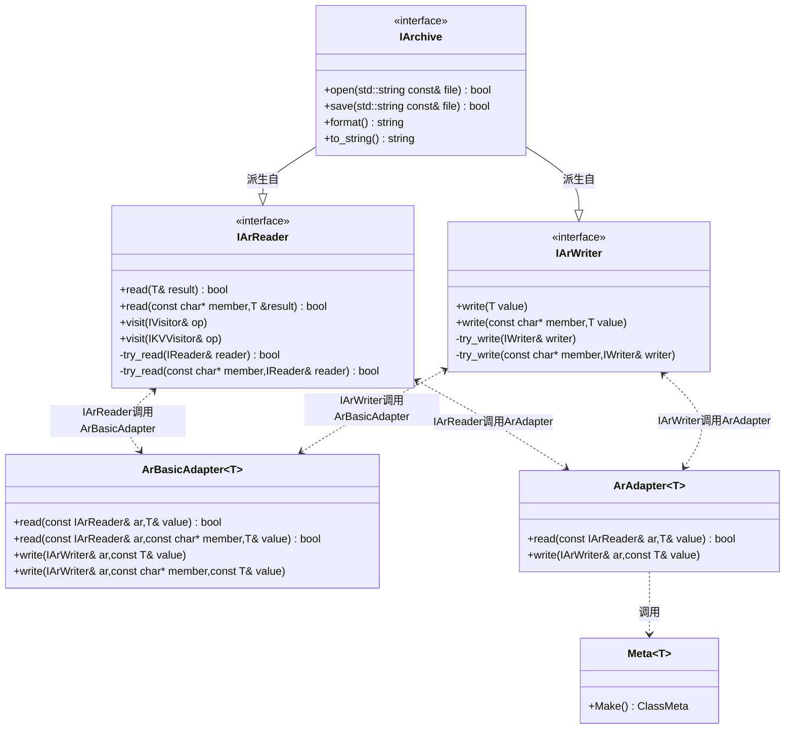
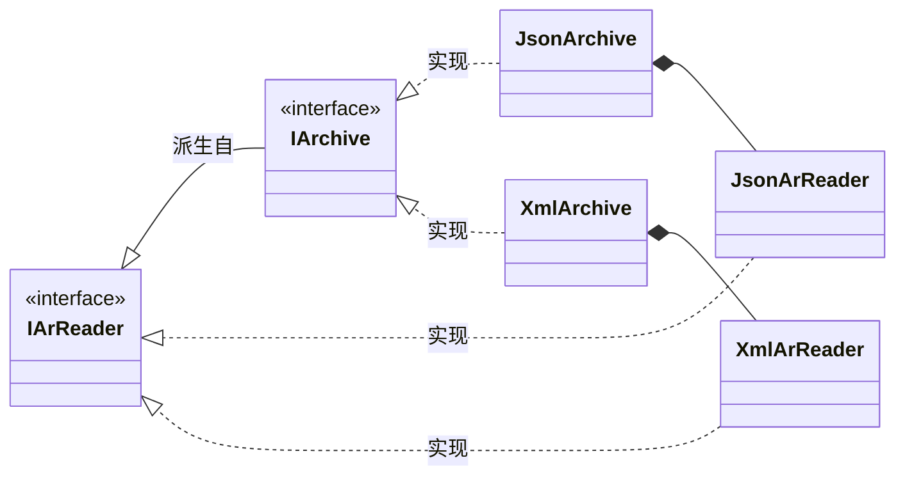
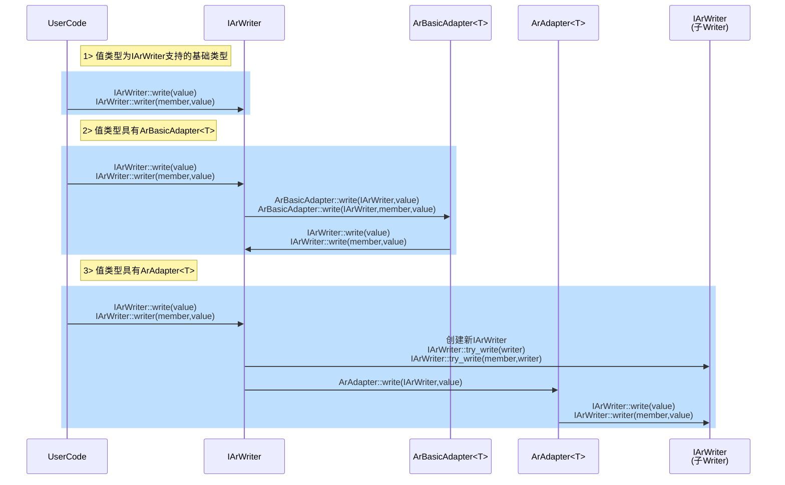
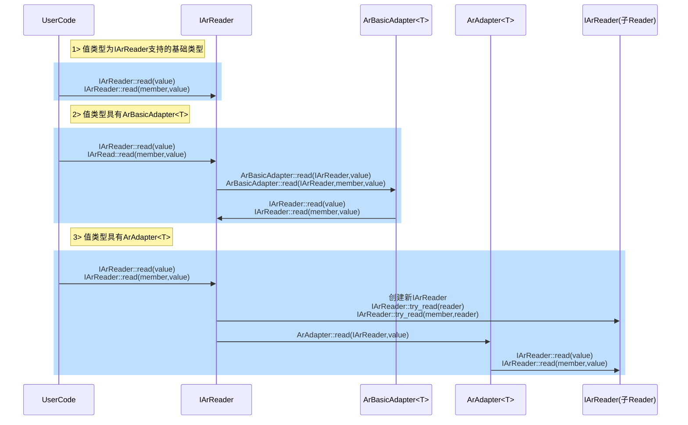

# 内存结构的序列化方案实现

在前文提供了方案设计的思路,这里展示一下实现以及具体的技术.

## 接口设计类图

由于内存结构本身存在嵌套情况,在读写过程中不可避免地要切换上下文,因而提供三个接口:

- 读接口`IArWriter`:读取值;
- 写接口`IArReader`:写入值;
- 存档接口`IArchive`:存档操作.

然后是三个扩展点设计:

- `ArBasicAdapter<T>`:基础类型的读写实现;
- `ArAdapter<T>`:复合类型的读写实现;
- `Meta<T>`:某类型的元信息获取,用来生成对应的`ArAdapter<T>`实现.

这些类及其关系如下:



## 接口实现类图

在序列化过程中使用者并不持有`IArWriter`,因而实现类可以通过切换上下文的方式来切换`IArWriter`,从而避免重复的`IArWriter`构造;但是序列化过程中必然面临查找`IArReader`,因而需要提供独立的`IArReader`实现.

也就是说,接口实现类必须提供两种实现:

- `IArReader`接口类实现:满足读取需求;
- `IArchive`接口类实现:满足读、写、存档操作需求.

下图展示了一种实现的示例类图:



## 值读写流程

值读写会根据值的特征进入不同的读写流程,但是其接口是一致的,这里共分为以下情况:

1. 值类型为`IArWriter`、`IArReader`所支持的基础类型;
2. 值类型具有`ArBasicAdapter<T>`特化或偏特化实现;
3. 值类型具有`ArAdapter<T>`特化或偏特化实现(通过`Meta<T>`提供的是偏特化实现,也属于此类).

具体的值写入流程如下:  



具体的值读取流程:



## 参考实现及示例代码

在[https://gitee.com/liff-engineer/articles/tree/master/20220504](https://gitee.com/liff-engineer/articles/tree/master/20220504)中包含了参考代码,`json`、`xml`、`messagepack`三种格式的实现,以及使用示例.

## 编译期扩展点设计

`IArReader`和`IArWriter`均采用了编译期扩展点技术,以支持开发者为特定类型提供定制实现,譬如在`read`接口中:

```C++
class IArReader {
public:
	//...

    template<typename T>
    bool  read(const char* member, T& v) const {
        //基础类型扩展点
        if constexpr (ArBasicAdapter<T>::value) {
            return ArBasicAdapter<T>::read(*this, member, v);
        }
        else {
            //复合类型扩展点
            return try_read(member, Reader<T>{ v });
        }
    }
    
    //...
};
```

它的设计与实现方式如下:

1. 模板类(前置模板类)定义:

   ```C++
   /// @brief 基本类型T的存档实现(直接映射为存档支持的基本类型)
   template<typename T, typename E = void>
   struct ArBasicAdapter :std::false_type {};
   ```

2. 约定模板类实现方式(以文档方式,或者`C++20`的`concept`):

   ```C++
   template<typename T>
   //1. 需要派生自std::true_type
   struct ArBasicAdapter<T> :std::true_type { 
       //2. 需要提供静态读取接口
       static bool read(const IArReader& ar, const char* member, T& v);
       static bool read(const IArReader& ar, T& v);
   	//3. 需要提供静态写入接口
       static void write(IArchive& ar, const char* member, const T& v);
       static void write(IArchive& ar, const T& v);
   };
   ```

3. 使用模板类:

   ```C++
   class IArReader {
   public:
   	//...
   
       template<typename T>
       bool  read(const char* member, T& v) const {
           //基础类型扩展点
           
           //1. 判断是否具有ArBasicAdapter实现
           if constexpr (ArBasicAdapter<T>::value) {
               //2.调用约定的ArBasicAdapter接口
               return ArBasicAdapter<T>::read(*this, member, v);
           }
           else {
               //复合类型扩展点
           }
       }
       
       template<typename T>
       bool  read(T& v) const {
           //基础类型扩展点
           
           //1. 判断是否具有ArBasicAdapter实现
           if constexpr (ArBasicAdapter<T>::value) {
               //2.调用约定的ArBasicAdapter接口
               return ArBasicAdapter<T>::read(*this, v);
           }
           else {
               //复合类型扩展点
           }
       }    
       //...
   };
   ```

然后就是针对具体类型进行模板特化了:

```C++
struct ArBasicAdapter<int> :std::true_type
{
    static uint64_t as(const int& v) { return static_cast<uint64_t>(v); }

    static bool read(const IArReader& ar, const char* member, int& v) {
        uint64_t rv{};
        if (ar.read(member, rv)) {
            v = static_cast<int>(rv);
            return true;
        }
        return false;
    }

    static bool read(const IArReader& ar, int& v) {
        uint64_t rv{};
        if (ar.read(rv)) {
            v = static_cast<int>(rv);
            return true;
        }
        return false;
    }

    static void write(IArchive& ar, const char* member, const int& v) {
        ar.write(member, as(v));
    }

    static void write(IArchive& ar, const int& v) {
        ar.write(as(v));
    }
};

```

对于满足某些特征,能够统一处理的类型,可以使用偏特化方式来实现,例如`std::vector`:

```C++
//针对map,且map的key类型是整数类型的情况进行处理
template<typename K, typename... Ts>
struct ArAdapter<std::map<K, Ts...>, std::enable_if_t<std::is_integral_v<K>>> {

    static void write(IArchive& ar, const std::map<K, Ts...>& items) {
        for (auto&& [k, v] : items) {
            ar.write(std::to_string(k).c_str(), v);
        }
    }

    static bool read(const IArReader& ar, std::map<K, Ts...>& items) {
        ar.visit([&](const char* key, const IArReader& o) {
            if constexpr (std::is_unsigned_v<K>) {
                K k = (K)std::stoull(key);
                o.read(items[k]);
            }
            else
            {
                K k = (K)std::stoll(key);
                o.read(items[k]);
            }
            });
        return true;
    }
};
```

## 编译期类型分发

读写值时,传入的参数类型不同,利用这一点以及`C++`中函数重载的优先级,可以设计出完全一致的接口,例如读取接口:

```C++
bool read(T& v);
bool read(const char* member,T& v);
```

当用户调用`IArReader::read`并提供不同参数类型时,可以采用类型分发定位到不同的处理代码:

- 优先级最高的是已实现的具体接口,譬如:

  ```C++
  bool read(int& v);
  bool read(const char* member,int& v);
  ```

- 然后是模板接口:

  ```C++
  template<typename T>
  bool read(T& v);
  
  template<typename T>
  bool read(const char* member,T& v);
  ```

通过这种技术设计的接口,就可以为用户提供完全一致化的使用体验.

## 可变参数模板与可变参数宏

对于结构体来讲, 序列化就是对成员变量的读写,只需要知道成员变量名称和地址即可,即:

```C++
/// @brief 类型T的成员变量信息
template<typename T,typename R>
struct Member {
    const char* name;
    R T::* mp;
};

/// @brief 创建成员变量信息辅助函数
template<typename T,typename R>
constexpr Member<T, R> MakeMember(const char* name, R T::* mp) {
    return { name,mp };
}
```

那么以`std::tuple`将`Member`存储起来,然后遍历,就可以完成结构体的读写实现.成员变量个数是可变的,这就需要用到可变参数模板:

```C++
template<typename... Args>
constexpr auto MakeMeta(const char* name, Args&&... args) {
    return std::make_pair(name, std::make_tuple(
        std::forward<Args>(args)...
    ));
}
```

混合使用`MakeMeta`和`MakeMember`就可以创建出结构体的完整信息:

```C++
struct MyObject
{
    bool bV;
    int iV;
    double dV;
    std::string sV;
    std::vector<int> iVs;
    std::map<int, std::string> kVs;
};

template<>
struct Meta<MyObject>:std::true_type
{
    static constexpr auto Make() noexcept {
        //使用可变参数模板构造类型信息
        return MakeMeta("MyObject",
            MakeMember("bV", &MyObject::bV),
            MakeMember("iV", &MyObject::iV),
            MakeMember("dV", &MyObject::dV),
            MakeMember("sV", &MyObject::sV),
            MakeMember("iVs", &MyObject::iVs),
            MakeMember("kVs", &MyObject::kVs)
            );
    }
};
```

而上述代码写起来比较啰嗦且容易出错,类名和成员变量名多次出现,且以不同形式出现,可以利用可变参数宏技术,将其调整为如下形式:

```C++
template<>
struct Meta<MyObject> :std::true_type
{
    static constexpr auto Make() noexcept {
        //使用可变参数宏简化书写
        return MAKE_META(MyObject, bV, iV, dV, sV, iVs, kVs);
    }
};
```

实现方式参见示例代码.

## 利用函数调用栈消除内存申请

在进行复杂类型的读写操作时,需要申请新的`IArReader`或`IArWriter`,通常接口是这样设计的:

```C++
std::unique_ptr<IArReader> AllocReader(const char* member);
std::unique_ptr<IArWriter> AllocWriter(const char* member);
```

这不可避免地需要堆内存申请,从来带来一定的效率损失.考虑到使用场景是获取`IArReader`来进行写入,可以考虑利用函数调用栈来消除掉堆内存申请:

1. 提供`IReader`来包装读取函数提供给`IArReader`;
2. `IArReader`提供实现类,在栈上构造,作为参数来调用`IReader`.

```C++
    //接收IArReader来读取类型T,其中IReader会穿过接口,而非IArReader
	struct IReader {
        virtual bool read(const IArReader&) = 0;
    };

    /// @brief 使用该实现来读取复杂类型对象信息
    template<typename T>
    struct Reader final :public IReader
    {
        T* obj{};
        explicit Reader(T& o) :obj(std::addressof(o)) {};
        bool read(const IArReader& ar) override {
            return ArAdapter<T>::read(ar, *obj);
        }
    };
	
	//try_read实现在内部函数栈上构造IArReader实现类实例,并调用reader完成读取操作
    virtual bool       try_read(const char* member, IReader& reader) const = 0;
    virtual bool       try_read(IReader& reader) const = 0;
```

## 值语义封装

由于`IArchive`是接口类,用户使用时需要用智能指针包裹,从而带来使用上的不变,这里可以为其实现值语义,让用户可以以普通值的方式操作它:

```C++
/// @brief IArchive的值语义封装
class Archive
{
    std::unique_ptr<IArchive> m_impl;
public:
    explicit Archive(std::unique_ptr<IArchive> ar)
        :m_impl(std::move(ar)) {};

    explicit Archive(const char* format);

    Archive(const Archive& other) {
        if (other) {
            m_impl = other->clone();
        }
    }

    Archive(Archive&& other) noexcept = default;

    Archive& operator=(const Archive& other) {
        if (this != std::addressof(other)) {
            if (other) {
                m_impl = other->clone();
            }
        }
        return *this;
    }

    Archive& operator=(Archive&& other) noexcept = default;

    explicit operator bool() const noexcept {
        return m_impl != nullptr;
    }

    IArchive* operator->() noexcept {
        return m_impl.get();
    }

    const IArchive* operator->() const noexcept {
        return m_impl.get();
    }

    IArchive* get() noexcept {
        return m_impl.get();
    }

    const IArchive* get() const noexcept {
        return m_impl.get();
    }

    template<typename T>
    void write(const char* member, T&& v) {
        m_impl->write(member, std::forward<T>(v));
    }

    template<typename T>
    void write(T&& v) {
        m_impl->write(std::forward<T>(v));
    }

    template<typename T>
    bool read(const char* member, T& v) {
        return m_impl->read(member, v);
    }

    template<typename T>
    bool read(T& v) {
        return m_impl->read(v);
    }
};
```

