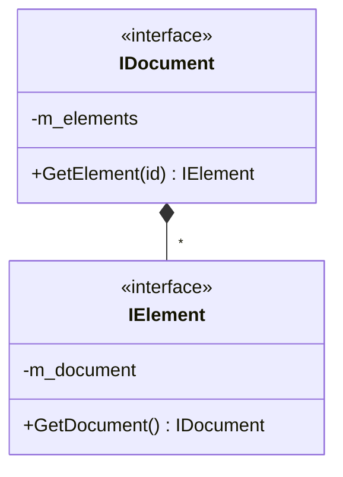
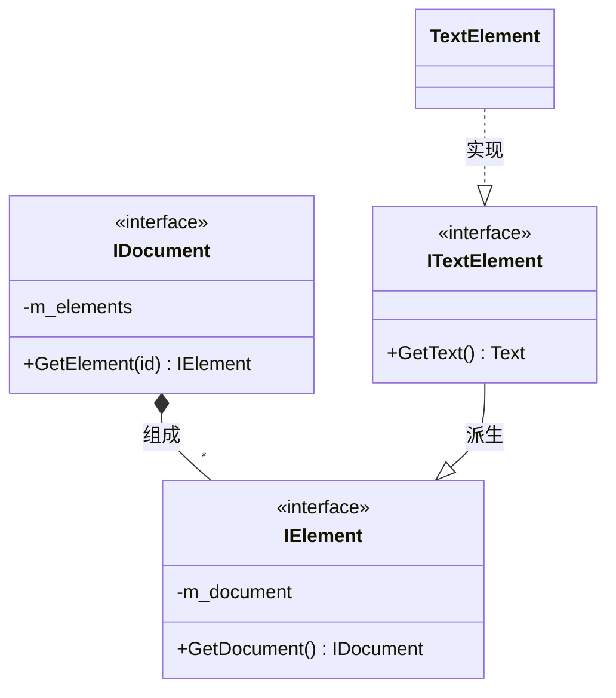
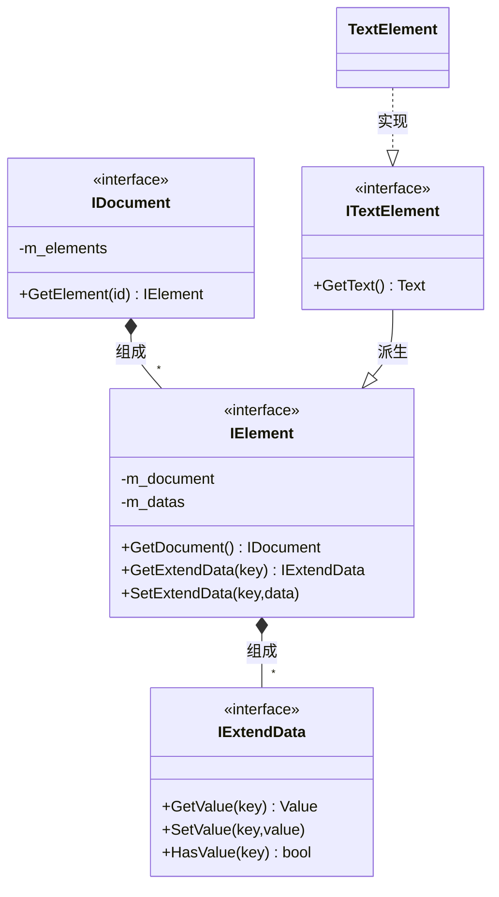
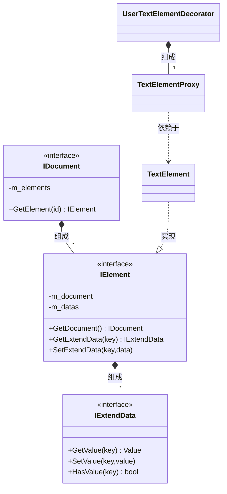

[TOC]

# 基于`Proxy`、`Decorator`设计模式的模型`API`一致性设计

复杂的建模类应用程序,其模型通常面临多种需求,难以设计出较为一致的`API`,导致存在多种风格的`API`、不易学习、难以使用.

这里展示一种常规的模型设计场景,以及其基于`Proxy`、`Decorator`模式的`API`设计方案.

## 示例场景

通常模型都可以用文档模型来表示,所有的模型派生自统一基类,然后存储到文档中,即:

| 类型        | 说明         |
| ----------- | ------------ |
| `IDocument` | 文档基类     |
| `IElement`  | 文档元素基类 |

类之间关系如下:



假设有一个文本元素`TextElement`,开发者可以派生自`IElement`提供实现,然后通过`dynamic_cast`使用. 考虑到不希望暴漏具体实现,有一些习惯良好的开发者会设计一个基类`ITextElement`,然后再提供实现类,并通过`Builder`、`Factory`的模式完成`TextElement`的创建,这时类图如下:



这样,模型`API`全部由接口类构成,虽然用了`dynamic_cast`这种不良实践,也不符合里氏替换原则,但是至少能交差了.不过还有一点特别设计的,如何应对`ITextElement`的扩展需求?

考虑到真实场景很复杂,`ITextElement`接口无法覆盖所有使用场景,因而开发者一般会搞一套扩展机制,例如提供另一个基类`IExtendData`,具备键值读写能力,作为`IElement`的组成部分.这时的类图如下:



至此,一套模型`API`雏形就完成了,它在完成基本需求的同时具备如下特点:

- 具体的模型类为了避免暴露内部实现,提供了接口类,例如`ITextElement`;
- 用户通过`IExtendData`扩展的数据,无法通过`ITextElement`直接访问,两套`API`共存.

那么,是否可以不提供`ITextElement`接口类? 用户通过`IExtendData`等机制扩展的数据,也能以类似成员函数的方式直接暴露,而非`KEY-VALUE`这种形式?

## `Proxy`、`Decorator`设计模式

在具体实现上,`Proxy`与`Decorator`可能并无二致,关键在于目的:

- `Proxy`意图在于**转发**操作给真实的处理类;
- `Decorator`意图在于**增强**处理类的能力.

对应上述的场景,可以通过提供`Proxy`来避免提供`ITextElement`这种接口类;在`Proxy`基础上通过`Decorator`使得用户操作扩展数据与操作`TextElement`内部数据的方式一致.

对应类图如下:



其中`IDocument`、`IElement`、`TextElementProxy`共同构成外部`API`,用户基于`TextElementProxy`提供`UserTextElementDecorator`(可以简写为`UserTextElement`),作为内部使用的定制`API`.

## 代码示例

例如模型元素基类为`IValue`:

```C++
class IValue {
public:
    virtual ~IValue() = default;
};
```

一种具体的模型实现为`MyObjectImpl`:

```C++
namespace impl {
    class MyObjectImpl :public IValue {
        int m_iV{};
        double m_dV{};
    public:
        int iV() const { return m_iV; }
        double dV() const { return m_dV; }
        void iV(int v) { m_iV = v; }
        void dV(double v) { m_dV = v; };
    };
}
```

这里提供一个`EntityProxy`基类对应`IValue`,以降低具体模型类`Proxy`编码量:

```C++
class EntityProxy {
public:
    EntityProxy() = default;
    explicit EntityProxy(IValue* value)
        :m_v(value)
    {}

    //虽然有虚函数,但是应用场景是有保证的,因而把5件套全实现了
    EntityProxy(const EntityProxy& other) = default;
    EntityProxy& operator=(const EntityProxy& other) = default;
    EntityProxy(EntityProxy&& other) noexcept = default;
    EntityProxy& operator=(EntityProxy && other) noexcept = default;
    virtual ~EntityProxy() = default;

    explicit  operator bool() const noexcept {
        return IsValidImpl();
    }
protected:
    IValue* m_v{};
    virtual bool IsValidImpl() const noexcept {
        return m_v != nullptr;
    }
};
```

然后就是`MyObjectProxy`:

```C++
class MyObjectProxy : public EntityProxy {
public:
    static impl::MyObjectImpl* To(IValue* v) {
        return dynamic_cast<impl::MyObjectImpl*>(v);
    }
    static bool Is(IValue* v) {
        return To(v) != nullptr;
    }
public:
    using EntityProxy::EntityProxy;
    MyObjectProxy() = default;
    explicit MyObjectProxy(IValue* v)
        :EntityProxy(v)
    {
        m_impl = To(v);
    }

    int iV() const {
        return m_impl->iV();
    }
    double dV() const {
        return m_impl->dV();
    }
    void iV(int v) {
        m_impl->iV(v);
    }
    void dV(double v) {
        m_impl->dV(v);
    }
protected:
    impl::MyObjectImpl* m_impl{};
    bool IsValidImpl() const noexcept override {
        return EntityProxy::IsValidImpl() && (m_impl != nullptr);
    }
};
```

然后提供`MyObjectAddApiDecorator `以扩展`MyObjectProxy`的接口:

```C++
class MyObjectAddApiDecorator {
    MyObjectProxy m_obj;
public:
    static bool Is(IValue* v) {
        return MyObjectProxy::Is(v);
    }
public:
    MyObjectAddApiDecorator() = default;

    explicit MyObjectAddApiDecorator(IValue* v)
        :m_obj(v) {};

    MyObjectProxy* operator ->() noexcept {
        return std::addressof(m_obj);
    }

    const MyObjectProxy* operator ->() const noexcept {
        return std::addressof(m_obj);
    }

    explicit operator bool() const noexcept {
        return m_obj.operator bool();
    }

    std::pair<int, double> Values() const {
        return std::make_pair(m_obj.iV(), m_obj.dV());
    }

    void setValues(int iv, double dv) {
        m_obj.iV(iv);
        m_obj.dV(dv);
    }
};
```

这里的`MyObjectAddApiDecorator`包含了`MyObjectProxy`,要访问原生`API`可以使用实例的`->`,使用扩展`API`则直接使用实例的`.`,以帮助开发者正确区分原生和扩展`API`.如果没有这种需求则可以全部采用派生方式,例如`MyObjectAddApiProxy`:

```C++
class MyObjectAddApiProxy :public  MyObjectProxy {
public:
    using MyObjectProxy::MyObjectProxy;

    std::pair<int,double> Values() const{
        return std::make_pair(iV(),dV());
    }

    void setValues(int iv, double dv) {
        iV(iv);
        dV(dv);
    }
};
```

