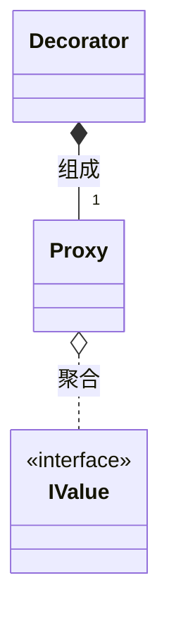

[TOC]

# 简化`Proxy`、`Decorator`设计模式实现的模板类`Proxy<T>`

在《基于`Proxy`、`Decorator`设计模式的模型`API`设计》中展示了如何综合利用两种设计模式来设计出满足封装及一致性需求的`API`.但是要实现较为完善的`Proxy`或`Decorator`并不容易,且存在重复代码,这里通过一个`Proxy<T>`模板类来简化实现.

## 基本假设

对于`Proxy`设计模式,假设其代理的为对象指针;对于`Decorator`设计模式,假设其修饰的对象为代理类`Proxy`.譬如:



即`Proxy`持有`IValue*`,而`Decorator`持有`Proxy`.

那么对于模板类`Proxy<T>`,当`T`为`IValue*`时,作为代理类`Proxy`使用;当`T`为代理类`Proxy`时,作为修饰器`Decorator`使用.

当然,这里并没有限制,开发者可以通过派生自`Proxy<T>`实现为代理类或者修饰器.

## 实现要求

希望`Proxy`支持如下能力:

- 支持代理指针类型、能够显式转换为`bool`类型的对象;
- 默认提供构造函数,以直接满足代理类需求;
- 提供可扩展的有效性判断机制;
- 可以通过`->`操作符访问代理对象成员函数;
- 可以通过`Get`或者`static_cast`获取代理对象;
- 提供默认的`==`、`!=`比较函数;
- 根据代理对象情况,提供`<`比较函数,以用于有序关联容器;
- [可选]提供`std::hash`支持,以用于`unordered`系列关联容器(未实现).

## 参考实现

```C++
#include <type_traits>

namespace abc
{
    /// @brief 类型T的代理类
    /// @tparam T 指针类型或者可以转换为bool的类型
    template<typename T>
    class Proxy {
        static_assert(std::is_pointer<T>::value
            || (std::is_constructible<bool, T>::value
                && !std::is_convertible<T, bool>::value
                ), "T should be pointer type or has `explicit operator bool()`!");
    public:
        //构造函数
        Proxy() = default;
        explicit Proxy(T obj) :m_obj(std::move(obj)) {};

        //rule of five
        Proxy(const Proxy& other) = default;
        Proxy& operator=(const Proxy& other) = default;
        Proxy(Proxy&& other) noexcept = default;
        Proxy& operator=(Proxy&& other) noexcept = default;

        virtual ~Proxy() = default;

        //->访问
        auto operator->() noexcept { return GetPointer(this); }
        auto operator->() const noexcept { return GetPointer(this); }

        //获取代理对象
        decltype(auto) Get() noexcept { return GetImpl(this); }
        decltype(auto) Get() const noexcept { return GetImpl(this); }

        //有效性判断
        explicit operator bool() const noexcept {
            if (!m_obj) return false;
            return IsValidImpl();
        }

        //类型转换
        explicit operator T() const noexcept{
            return m_obj;
        }

        //比较
        bool operator ==(Proxy const& other) const noexcept{
            return m_obj == other.m_obj;
        }

        bool operator !=(Proxy const& other) const noexcept {
            return !(*this == other);
        }
        
        // //只处理指针的情况
        // template<typename U = T>
        // std::enable_if_t<std::is_pointer<U>::value,bool> operator<(Proxy const& other) const noexcept{
        //     return m_obj < other.m_obj;
        // }      

        auto operator<(Proxy const& other) const noexcept
            ->decltype(std::declval<T>() < std::declval<T>())
        {
            return m_obj < other.m_obj;
        }
    protected:
        using Super = Proxy<T>;
        virtual bool IsValidImpl() const noexcept {
            return true;
        }
        T m_obj{};
    private:
        //保证获取正确的类型;
        //技术细节参见C++标准提案P0847(Deducing this)的"Motivation"章节
        template<typename U>
        static decltype(auto) GetImpl(U&& vp) {
            return vp->m_obj;
        }

        template<typename U>
        static decltype(auto) GetPointer(U&& vp) {
            return GetPointerImpl(std::forward<U>(vp), std::is_pointer<T>{});
        }

        template<typename U>
        static decltype(auto) GetPointerImpl(U&& vp, std::true_type) {
            return vp->m_obj;
        }

        template<typename U>
        static decltype(auto) GetPointerImpl(U&& vp, std::false_type) {
            return std::addressof(vp->m_obj);
        }
    };
}
```

## 使用示例

`impl::MyObjectImpl`的代理类`ObjectProxy`可以采用如下实现:

```C++
class ObjectProxy :public abc::Proxy<IValue*> {
public:
    static impl::MyObjectImpl* To(IValue* v) {
        return dynamic_cast<impl::MyObjectImpl*>(v);
    }
    static bool Is(IValue* v) {
        return To(v) != nullptr;
    }
public:
    using Super::Super;
    ObjectProxy() = default;
    explicit ObjectProxy(IValue* v)
        :Super(v), m_impl(To(v))
    {}

    int iV() const {
        return m_impl->iV();
    }
    double dV() const {
        return m_impl->dV();
    }

    void iV(int v) {
        m_impl->iV(v);
    }
    void dV(double v) {
        m_impl->dV(v);
    }
protected:
    impl::MyObjectImpl* m_impl{};
    bool IsValidImpl() const noexcept override {
        return Super::IsValidImpl() && (m_impl != nullptr);
    }
};
```

而`ObjectProxy`的修饰器实现如下:

```C++
class MyObjectAddApiDecorator :public abc::Proxy<ObjectProxy> {
public:
    static bool Is(IValue* v) {
        return ObjectProxy::Is(v);
    }
public:
    MyObjectAddApiDecorator() = default;
    explicit MyObjectAddApiDecorator(IValue* v)
        :Super(ObjectProxy(v)) {};

    std::pair<int, double> Values() const {
        return std::make_pair(m_obj.iV(), m_obj.dV());
    }

    void setValues(int iv, double dv) {
        m_obj.iV(iv);
        m_obj.dV(dv);
    }
};
```

使用测试参见示例[https://godbolt.org/z/o6fzxPecn](https://godbolt.org/z/o6fzxPecn).