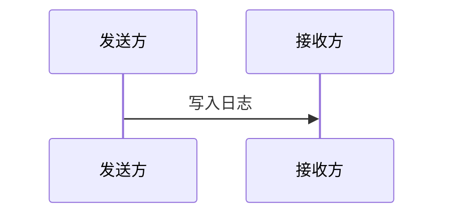
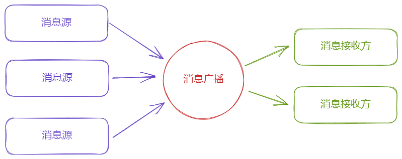

[TOC]

# 架构视角下的日志机制设计

通常软件设计都会提供日志机制，用来记录软件行为，以便后续追踪、调试及其它分析。有很多可选的日志库可以来使用，但从架构视角来看，这并不是简单地选择一个日志库，还需要考虑其它因素。

当然，选择一个日志库集成到系统中也能够应对需求，不过在进行设计时，架构人员不会止步于此，而是从深度、广度两个维度来进一步设计：

- 深度/垂直维度侧重于如何更好地满足日志需求，譬如：
  1. 更简洁易用，利用修饰、注解等技术降低对开发人员的干扰；
  2. 性能更好，采用异步、结构化日志等方式降低性能损耗；
  3. 解耦，以避免对特定日志库的依赖。
- 广度/水平维度侧重于识别类似场景，并提供更为抽象、通用的设计，譬如：
  1. 用户软件操作行为的记录；
  2. 界面通知机制；
  3. 操作回放。

这里根据日志机制需求，抽象出**消息广播**这种模式，以此来提供设计，同时在深度和广度方向提供更多可能。

## 场景分析

日志记录是单向的信息流动，通过日志接口写入日志，然后日志信息流动到其它地方，譬如文件、网络等等。也就是说，针对日志，有两种参与者：发送方、接收方，交互流程非常简单：



另外是日志信息的格式，通常是字符串，但是多数情况下日志写入时单独的字符串信息不够，需要键值对形式。即，键值对形式，且值能够接收多种数据类型，基本上可以满足绝大多数场景。

## 设计逻辑

既然日志逻辑上讲是单向的消息发送，那么其设计可以应用在类似场景下，在软件系统中可以有多个消息源，也可以有多个消息接收者，可以通过分配消息通道的方式集中到消息`广播站`上：



另外，消息源自身也可以为消息接收方，这样就能够对特定消息做处理后重新发送，从而提供丰富的组合和扩展支持。

这里为消息附加**主题Topic**信息，以对消息进行分类，可以形成如下消息构成：

| 构成          | 说明                         |
| ------------- | ---------------------------- |
| 主题`Topic`   | 用来对消息进行总的分类       |
| 标记`Tag`     | 表达消息源、或者消息体       |
| 负载`Payload` | 键值对形式，附加的消息体信息 |

注意，通常消息会存在一个来源/识别符，这里提供**标记Tag**来表达；如果不存在，可以直接作为消息体使用。

当然，可以通过抽象出统一的消息概念，从而支持更为丰富的消息类型，这里考虑到键值对通常够用，不再进行扩展设计。

## 如何使用

这里将日志接口的使用场景分为消息发送和消息接收，首先来看一下接口设计。

### 接口设计

接口设计集中在消息类上，通过消息类完成发送，而接收消息可以通过注册全局的消息处理函数来实现，设计如下：

```C++
struct Message{
using Key   = std::string;//仅作演示,后续性能部分有针对性设计
using Value = std::string;//通常为字符串,也可以用C++17的variant以承载多种类型
public:
    Key   topic;//主题
    Value tag;  //标记
    std::vector<std::pair<Key,Value>> payload;//可选负载
    
    //广播
    void Broadcast();
public:
    //注册消息处理
    static std::size_t RegisterHandler(Key topic,std::function<void(Message&)>&& handler);
    class HandlerStub;//消息处理存根，用来移除消息处理函数的辅助类
};
using MessageHandlerStub = Message::HandlerStub;
```

### 消息接收

消息接收也分为单主题和多主题，单主题非常简单，例如：

```	C++
std::vector<MessageHandlerStub> gHandlerStubs{};

void InstallMessageHandler(){
    //单个消息处理的演示
    gHandlerStubs.emplace_back(
        Message::RegisterHandler("Topic",[](auto& msg){
            std::cout<<msg.topic<<":"<<msg.tag<<"\n";
        })
    );
}
```

而多主题时可以以消息处理类为载体：

```C++
class MessageHandler final{
public:
    MessageHandler()
    {
        m_stubs.emplace_back(
            Message::RegisterHandler("TopicA",[&](auto& msg){
                this->handle_topic_a(msg);
            })
        );
        m_stubs.emplace_back(
            Message::RegisterHandler("TopicB",[&](auto& msg){ 
                this->handle_topic_b(msg);
            })
        );        
    }
    
    void handle_topic_a(Message& msg);
    void handle_topic_b(Message& msg);    
private:
    std::vector<MessageHandlerStub> m_stubs{};
};
```

在特定位置构造`MessageHandler`即可完成注册，析构时自动移除注册。

### 消息发送

消息发送则需要进行封装动作以方便开发者使用，譬如要记录某函数的执行情况，需要记录进入和退出，这就可以利用`RAII`提供辅助类完成：

```C++
class ExecuteRecorder{
public:
    ExecuteRecorder()=default;
    explicit ExecuteRecorder(std::string func)
        :m_func{std::move(func)}
    {
        Message{"Execute::Begin",m_func}.Broadcast();
    }
    
    ~ExecuteRecorder() 
    {
        if(!m_func.empty()){
        	Message{"Execute::End",m_func}.Broadcast();            
        }
    }
    //注意要禁止拷贝和赋值构造，移动拷贝和移动赋值则采用默认实现
private:
    std::string m_func{};
};
```

这样开发者仅需要在函数开头这样写，即可自动记录函数开始执行和结束执行的信息：

```C++
void example(){
    ExecuteRecorder{__FUNCSIG__};
}
```

其它场景也是类似，通过提供辅助类或接口，将键值对转换为类/结构体等用户友好的形式。

## 性能考虑

这种设计相比直接的日志接口，存在一定的性能损耗，原因在于：

- 频繁的字符串内存申请；
- 字符串比较；
- 遍历消息处理函数。

考虑到字符串的内存和比较操作较为经常，且消息的键基本不变，这里采用`Flyweight`设计模式，把消息的`Key`转换为整数，预先申请避免内存问题，字符串比较也会转换为整数比较：

```C++
class Key {
public:
    Key() = default;
    explicit Key(const char* literal);
    const char* c_str() const noexcept;
    auto operator<=>(const Key&)const = default;
private:
    std::size_t index{ 0 };
};
```

在内部维护一份字符串列表，用来进行索引与字符串内容的互相转换：

```C++
struct KeyRegistry{
	std::vector<std::string> elements;
    
    std::size_t at(const char* literal);//根据字符串找/创建索引
    const char* at(std::size_t index);//根据索引找字符串
};
```

然后利用全局（静态）变量的初始化特性，来定义主题等相对固定的内容：

```C++
Message::Key  gExecuteTopic{"Execute"};
Message::Key  gWarningLogTopic{"Log::Warning"};
Message::Key  gErrorLogTopic{"Log::Error"};

void logerr(std::string msg){
    //直接用全局的topic定义,避免内存申请
    Message{gErrorLogTopic,std::move(msg)};
}
```

另外是尽可能使用`std::vector`，同时避免移除消息处理函数，以减少内存变动的影响，相对也容易实现：

```C++
struct MessageHandlerRegistry{
    std::vector<std::pair<Message::Key,std::function<void(Message&)>>> elements;
    
    void Broadcast(Message& msg) const {
        //vector变量+整数比较:
        for(auto& e:elements){
            if(e.first == msg.topic && e.second){
                e.second(msg);
            }
        }
    }
    void remove(std::size_t index){
        if(index == 0 || index > elements.size()){
            return;
        }
        //仅清空内容,不移除,避免代码复杂化
        elements[index].first = Message::Key{};
        elements[index].second.reset();
    }
};
```

## 扩展设计

存在以下方向的扩展设计：

1. 可以表达更复杂的消息；
2. 消息处理扩展。

针对消息的复杂性，这里利用`C++17`的`variant`，以支持更多类型：

```C++
struct Message{
    using Value = std::variant<
        std::monostate,
        bool,
        std::int64_t,std::uint64_t,
        double,
        std::string
    >;    
};
```

而消息处理扩展，则可以基于主题实现多种模式：

- 消息附加负载；
- 消息转换；
- 消息汇总；
- 消息转发。

譬如消息附加负载，记录日志时附带上其它信息，诸如运行线程，时间戳等：

```C++
Message::Key gTimeStamp{"timestamp"};
void add_timestamp(Message& msg){
    auto timestamp = GetTimeStamp();
    msg.payload.emplace_back(gTimeStamp,timestamp);
}
```

在其它消息处理函数注册之前将添加事件戳的消息处理函数注册上，即可得到附带了事件戳的消息。


