# 基于`PlantUML`可视化软件设计

使用`PlantUML`不仅可以在较细颗粒度上使用`UML`表达设计,也可以利用`4+1`视图、`C4`等方式以各个视角展现设计全景.本文意在提供相应指南,帮助读者利用`PlantUML`来可视化软件设计.

## `PlantUML`基础

`PlantUML`具备基本的设计逻辑,用来表达各种`UML`图,以及其它场景.这里以示例展示其设计脉络,方便读者理解与使用.

### 建议环境

如果要按照本文方式运行示例,请确保具备以下环境:

1. `Visual Studio Code`
2. `PlantUML`插件

在安装完成之后,调整如下设置:

1. `Plantuml:Render`

   将该设置调整为`PlantUMLServer`,从而避免安装`JAVA`和`Graphviz`.

2. `Plantuml:Server`

   将该设置调整为官方服务器:`https://www.plantuml.com/plantuml`.

新建`.puml`文件,输入以下代码:

```code
@startuml 类图示例
interface ITask{
   void execute()
}
@enduml
```

使用快捷键`Alt+D`,预览效果如下:

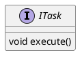

### 设计逻辑

在`PlantUML`中,最小表达单元为`element`,部分`element`能够嵌套,可以作为容器,而`element`之间可以形成连接.即,在`PlantUML`中由以下两种要素构成:

1. `element`:
   可以配置其几何形状,显示样式,内容.对于能够嵌套的`element`,则支持附加内容.
2. `arrow`:
   可以配置连接的方向,显示样式,文本内容.

接下来看一看`element`和`arrow`是如何声明及调整的.

### `element`

`element`由以下四部分构成:

1. 几何形状`type`
2. 显示样式`style`
3. 内容`description`
4. 可选的子`element`

#### 几何形状

在`PlantUML`中具备三十多种几何形状,展示几何形状如下:

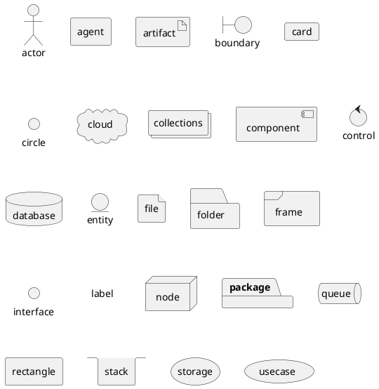

在声明`element`时可以以如下方式声明:

```code
shape  elementAlias
shape  "elementDescription" as elementAlias
shape  "elementDescription" as elementAlias <<stereotype>>
```

`shape`为几何形状,`elementAlias`为后续使用的别名,`elementDescription`为描述信息,`stereotype`则为`element`对应的逻辑信息,例如你要表达`customer`这种逻辑上的概念,这个`stereotype`能够显示在`element`之上.
譬如如下示例:

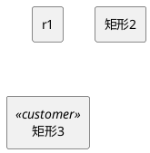

#### 显示样式

在`PlantUML`中可以以两种方式调整`element`的显示样式:

1. 通过几何形状,修改显示样式
   这种方式会影响到所有使用相同几何形状的`element`.
2. 通过几何形状及`stereotype`,修改显示样式
   这种方式会影响到所有使用相同几何形状及`stereotype`的`element`.

显示样式通过`skinparam`命令来调整,方式如下:

```code
skinparam shape {
   BackgroundColor black
}

skinparam shape<<stereotype>>{
   BackgroundColor white
}
```

例如如下示例:

```plantuml
@startuml
skinparam rectangle {
   FontColor #FFFFFF
   BackgroundColor blue
}

skinparam rectangle<<person>> {
    StereotypeFontColor #FFFFFF
    FontColor #FFFFFF
    BackgroundColor #08427B
    BorderColor #073B6F
}

rectangle r1
rectangle r2 <<person>>
@enduml
```

每种`shape`的显示选项基本都包含如下内容:

- `BackgroundColor`:背景色
- `BorderColor`:边界颜色
- `FontColor`:字体颜色
- `FontName`:字体名
- `FontSize`:字体大小
- `FontStyle`:字体样式
- `StereotypeFontColor`:`Stereotype`字体颜色
- `StereotypeFontName`:`Stereotype`字体名
- `StereotypeFontSize`:`Stereotype`字体大小
- `StereotypeFontStyle`:`Stereotype`字体样式

全部可用样式参数如下:

```plantuml
@startuml
help skinparams
@enduml
```

颜色可以使用标准颜色名或者`RGB`代号,标准颜色名如下:

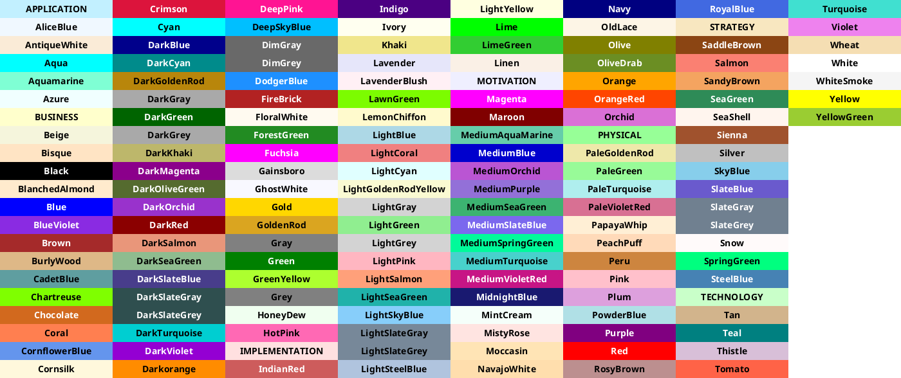

#### 内容

`element`的内容有可能很少也有可能很多,`PlantUML`为内容提供了丰富的支持,例如:

1. 标题
2. 分割线
3. 文字样式
4. 列表
5. 部分`HTML`
6. 其它

通常以如下方式声明`element`的内容:

```code
shape  "elementDescription" as elementAlias <<stereotype>>
shape  elementAlias <<stereotype>> {
   elementDescription
}
```

如果使用`""`填充内容,则换行必须使用`\n`.

需要注意的是以上声明样式根据`shape`的不同会有不同形态,如果不能使用可详细参阅`PlantUML`文档.

以下展示一些示例:

1. 标题

   ```plantuml
   @startuml
   usecase UC1 as "
   = Extra-large heading
   Some text
   == Large heading
   Other text
   === Medium heading
   Information
   ....
   ==== Small heading"
   @enduml
   ```

2. 分割线

   ```plantuml
   @startuml
   database DB1 as "
   You can have horizontal line
   ----
   Or double line
   ====
   Or strong line
   ____
   Or dotted line
   ..My title..
   Enjoy!
   "
   note right
   This is working also in notes
   You can also add title in all these lines
   ==Title==
   --Another title--
   end note
   @enduml
   ```

3. 文字样式

   ```plantuml
   @startuml
   Alice -> Bob : hello --there--
   ... Some ~~long delay~~ ...
   Bob -> Alice : ok
   note left
   This is **bold**
   This is //italics//
   This is ""monospaced""
   This is --stroked--
   This is __underlined__
   This is ~~waved~~
   end note
   @enduml
   ```

4. 列表

   ```plantuml
   @startuml
   object demo {
   * Bullet list
   * Second item
   }
   note left
   * Bullet list
   * Second item
   ** Sub item
   end note
   legend
   # Numbered list
   # Second item
   ## Sub item
   ## Another sub item
   # Third item
   end legend
   @enduml
   ```

#### 嵌套`element`

`element`嵌套使用如下方式:

```code
shape  elementAlias {
   shape nestElementAlias
}
```

只有部分几何形状支持嵌套,这些几何形状作为容器使用时,其内容必须采用如下形式包裹:

```code
shape "elementDescription" as elementAlias <<stereotype>> {

}
```

以下是可嵌套`element`:

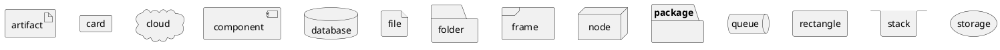

### `arrow`

连接的形式相对简单,其方式如下:

```code
elementAlias1 arrowStyle elementAlias2 : arrowDescription
```

可以配置连接的样式,描述以及辅助`element`定位.

#### 样式

1. 线型:`--`、`..`、`~~`、`==`表示实线、虚线及加粗,或者使用`[style]`

   ```plantuml
   @startuml
   node node1
   node node2
   node node3
   node node4
   node node5
   node1 -- node2 : label1
   node1 .. node3 : label2
   node1 ~~ node4 : label3
   node1 == node5

   node foo
   foo --> bar          : ∅
   foo -[bold]-> bar1   : bold
   foo -[dashed]-> bar2 : dashed
   foo -[dotted]-> bar3 : dotted
   foo -[hidden]-> bar4 : hidden
   foo -[plain]-> bar5  : plain
   @enduml
   ```

2. 箭头样式:`>`、`*`、`o`、`+`、`#`、`>>`、`0`、`^`、`(0`等

   ```plantuml
   @startuml
   artifact artifact1
   artifact artifact2
   artifact artifact3
   artifact artifact4
   artifact artifact5
   artifact artifact6
   artifact artifact7
   artifact artifact8
   artifact artifact9
   artifact artifact10
   artifact1 --> artifact2
   artifact1 --* artifact3
   artifact1 --o artifact4
   artifact1 --+ artifact5
   artifact1 --# artifact6
   artifact1 -->> artifact7
   artifact1 --0 artifact8
   artifact1 --^ artifact9
   artifact1 --(0 artifact10
   @enduml
   ```

3. 颜色:`[#color]`,可以和线型混合使用,方式为`[#color;style]`

   ```plantuml
   @startuml
   node foo
   foo --> bar
   foo -[#red;bold]-> bar1                  : <color:red>[#red;bold]
   foo -[#green;dashed]-> bar2              : <color:green>[#green;dashed]
   foo -[#blue;dotted]-> bar3               : <color:blue>[#blue;dotted]
   foo -[#blue;#yellow;#green;plain]-> bar4 : [#blue;#yellow;#green;plain]
   @enduml
   ```

### 使用逻辑

采用`PlantUML`绘制的大部分图均是以上述方式组成的,进行声明、内容及样式调整时均可以按图索骥.不过务必注意,具体的图类型有其特定的要求,特殊场景请参阅文档.

## 用 `C4`表达架构

[C4 model](https://c4model.com/)将软件设计的表示拆分为四个层级,从上到下为:

1. 边界图`Context diagrams`:围绕系统展示,阐述它们与用户、其它系统的关系
2. 容器图`Container diagrams`:将系统拆分为相互关联的容器,容器是可独立执行和部署的子系统
3. 组件图`Component diagrams`:将容器拆分为相互关联的组件,表达组件之间以及其与其它容器或者系统的关系
4. 代码图`Code diagrams`:可以映射到代码的软件设计细节,使用`UML`之类表示

对于前三个层次,`C4`拆分为以下基本要素:

1. 人`person`
2. 软件系统`software system`
3. 容器`container`
4. 组件`component`
5. 关系`relationship`

在`PlantUML`中可以直接使用内置的`C4`支持来表达,三个层次对应的库文件如下:

```code
@startuml
!include <C4/C4_Context>
!include <C4/C4_Container>
!include <C4/C4_Component>
@enduml
```

### `PlantUML`中的`C4`基本要素定义

对于`C4`基本要素,`PlantUML`中提供的定义如下:

| `C4`           | `PlantUML`            | 说明                                            |
| -------------- | --------------------- | ----------------------------------------------- | ----- | -------- |
| `person`       | `Person`              | `Person(alias,label,description)`               |
|                | `Person_Ext`          | 为区分内部人员和客户而提供                      |
| `system`       | `System`              | `System(alias,label,description)`               |
|                | `System_Ext`          | 为区分内部系统与外部系统而提供                  |
|                | `SystemDb`            | 表示数据库系统                                  |
|                | `SystemDb_Ext`        | 表示外部数据库系统                              |
| `container`    | `Container`           | `Container(alias,label,technology,description)` |
|                | `ContainerDb`         | 表示数据库容器                                  |
|                | `ContainerQueue`      | 表示队列类容器                                  |
| `component`    | `Component`           | `Component(alias,label,technology,description)` |
|                | `ComponentDb`         | 表示数据库组件                                  |
|                | `ComponentQueue`      | 表示队列类组件                                  |
| `relationship` | `Boundary`            | 边界`Boundary(alias,label,type)`                |
|                | `Enterprise_Boundary` | 企业边界                                        |
|                | `System_Boundary`     | 系统边界                                        |
|                | `Container_Boundary`  | 容器边界                                        |
|                | `Rel`                 | `Rel(from,to,label,technology)`                 |
|                | `Rel_Left             | Right                                           | Down` | 辅助布局 |

### 使用示例

系统上下文:

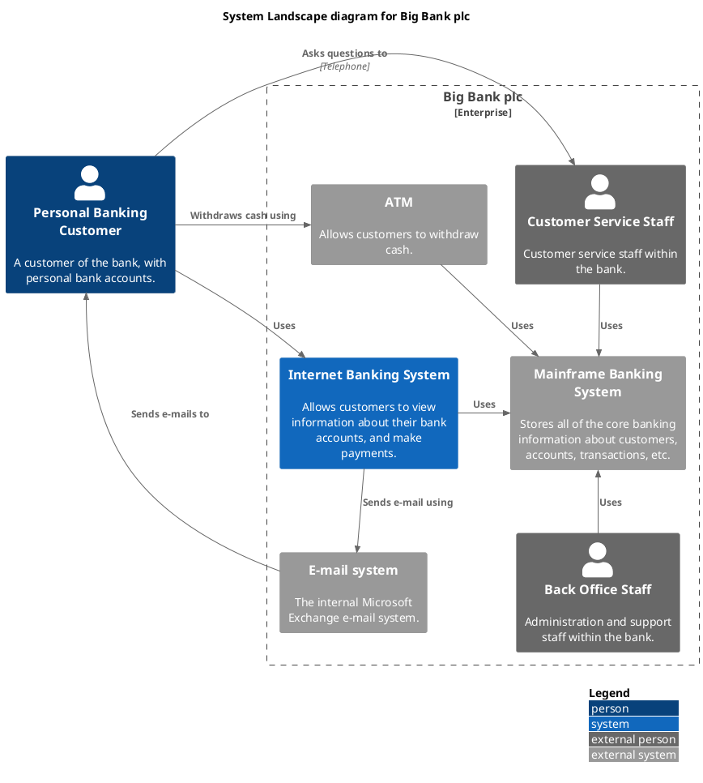

容器:

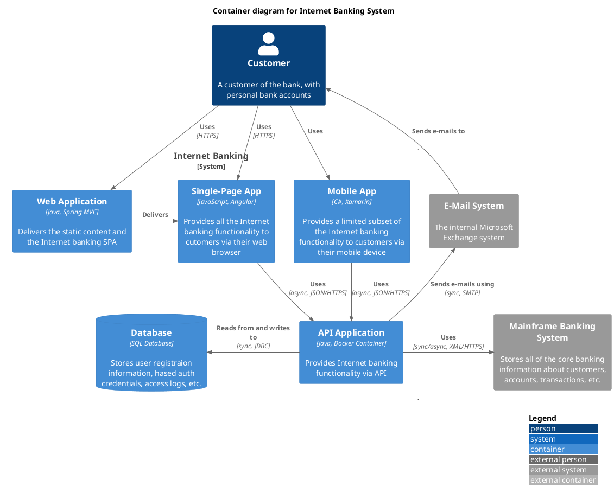

组件:

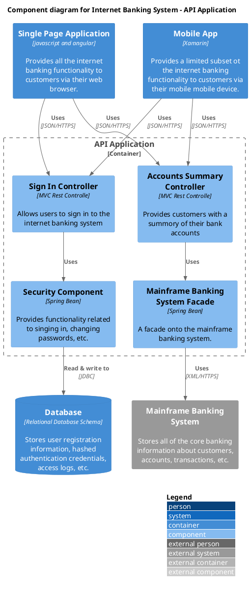

## 部分常见`UML`图

### 用例图

用例图包含以下基本要素:

1. 角色`actor`
2. 用例`usecase`
3. 包`package`
4. 连接(见前文)

示例如下:

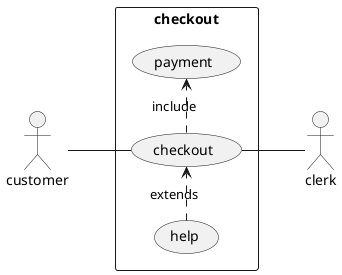

### 类图

类图包含以下基本要素:

1. 类`class`:`abstract`、`interface`、`entity`、`enum`
2. 关系:
   - 扩展:`<|--`
   - 组合:`*--`
   - 聚合:`o--`
3. 包`package`

示例如下:

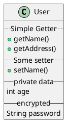

### 活动图

`PlantUML`活动图的语法相对特殊一点,请参阅[文档-活动图](https://plantuml.com/zh/activity-diagram-beta)实现.

示例如下:

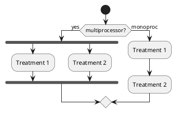

## 其它

`PlantUML`除了上述内容,还支持较多其它类型的图,例如:

- 时序图
- 对象图
- 组件图
- 部署图
- 状态图
- 定时图

而其它非`UML`图也提供了部分支持:

- `JSON`数据可视化
- 思维导图
- 实体关系图

例如`JSON`数据:

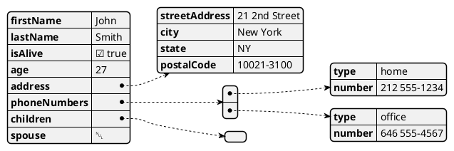

同时,`PlantUML`基于`skinparam`命令提供了样式调整能力,来支持对生成图形样式的调整.
